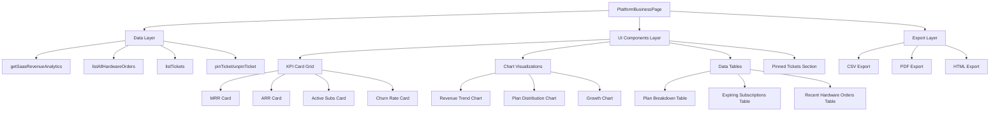
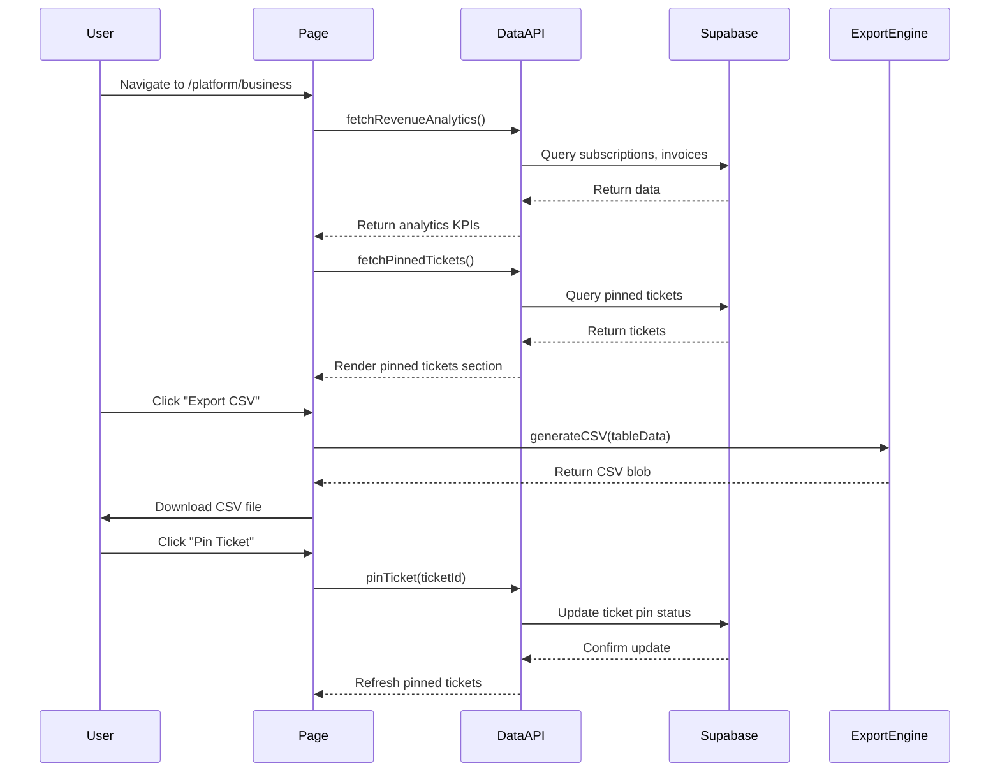

# Design Document: Super Admin Business Page Redesign

## Overview

The Super Admin Business Page redesign transforms the current subscription analytics page (`/platform/business`) into a modern, data-rich dashboard with professional analytics styling, comprehensive export capabilities, and pinned ticket management. The redesign eliminates excessive spacing, introduces data visualizations using charts, and provides export functionality for all tabular data in CSV, PDF, and HTML formats. Additionally, it integrates a pinned tickets feature allowing super admins to highlight critical incident tickets prominently on the business overview.

The design leverages the existing data infrastructure (`getSaasRevenueAnalytics()`, `listAllHardwareOrders()`, `listTickets()`) and enhances the user experience with modern UI components from shadcn/ui and chart visualizations using Recharts.

## Architecture

The redesign follows a component-based architecture with clear separation between data fetching, business logic, and presentation layers.



## Data Flow



## Components and Interfaces

### Component 1: PlatformBusinessPage

**Purpose**: Main page component orchestrating data fetching, state management, and rendering of all sub-components.

**Interface**:
```typescript
interface PlatformBusinessPage {
  // No props - route component
}

// Component manages these queries
interface BusinessPageQueries {
  revenueQ: UseQueryResult<RevenueAnalytics>
  ordersQ: UseQueryResult<HardwareOrders>
  pinnedTicketsQ: UseQueryResult<PinnedTickets>
}
```

**Responsibilities**:
- Fetch analytics data via TanStack Query
- Manage loading and error states
- Coordinate rendering of KPI cards, charts, tables, and pinned tickets
- Handle refresh intervals (60s for revenue, 30s for tickets)

### Component 2: AnalyticsCard

**Purpose**: Reusable card component for displaying individual KPI metrics with optional trend indicators.

**Interface**:
```typescript
interface AnalyticsCardProps {
  title: string
  value: string | number
  subtitle?: string
  trend?: {
    value: number
    direction: 'up' | 'down' | 'neutral'
    label: string
  }
  icon?: React.ReactNode
  variant?: 'default' | 'success' | 'warning' | 'danger'
}
```

**Responsibilities**:
- Display formatted KPI value with label
- Show optional trend indicator with percentage change
- Support color variants for different metric types
- Render optional icon for visual identification

### Component 3: RevenueChart

**Purpose**: Line chart visualization showing revenue trends over time using Recharts.

**Interface**:
```typescript
interface RevenueChartProps {
  data: Array<{
    month: string
    revenue: number
  }>
  currency: string
  height?: number
}
```

**Responsibilities**:
- Render line chart with monthly revenue data
- Format currency values on Y-axis
- Show tooltips on hover with formatted values
- Handle responsive sizing

### Component 4: PlanDistributionChart

**Purpose**: Pie or bar chart showing subscription plan distribution by MRR contribution.

**Interface**:
```typescript
interface PlanDistributionChartProps {
  data: Array<{
    plan: string
    mrr: number
    percentage: number
  }>
  currency: string
  chartType?: 'pie' | 'bar'
}
```

**Responsibilities**:
- Visualize plan breakdown by MRR contribution
- Display percentages and formatted currency values
- Support both pie and bar chart types
- Show legend with color coding

### Component 5: DataTable

**Purpose**: Enhanced table component with sorting, filtering, and export capabilities.

**Interface**:
```typescript
interface DataTableProps<T> {
  columns: Array<ColumnDef<T>>
  data: T[]
  title: string
  exportable?: boolean
  onExport?: (format: 'csv' | 'pdf' | 'html') => void
  emptyMessage?: string
}

interface ColumnDef<T> {
  id: string
  header: string
  accessorFn: (row: T) => any
  cell?: (value: any) => React.ReactNode
  sortable?: boolean
}
```

**Responsibilities**:
- Render tabular data with custom column definitions
- Provide export button group (CSV, PDF, HTML)
- Handle empty state messaging
- Support custom cell renderers for complex data

### Component 6: ExportButtonGroup

**Purpose**: Button group for triggering data exports in multiple formats.

**Interface**:
```typescript
interface ExportButtonGroupProps {
  onExportCSV: () => void
  onExportPDF: () => void
  onExportHTML: () => void
  disabled?: boolean
}
```

**Responsibilities**:
- Render three export format buttons
- Handle click events for each format
- Show loading states during export
- Disable buttons when no data available

### Component 7: PinnedTicketsSection

**Purpose**: Displays pinned high-priority tickets with pin/unpin functionality.

**Interface**:
```typescript
interface PinnedTicketsSectionProps {
  tickets: Array<PinnedTicket>
  onPin: (ticketId: string) => Promise<void>
  onUnpin: (ticketId: string) => Promise<void>
  onTicketClick: (ticketId: string) => void
}

interface PinnedTicket {
  id: string
  title: string
  priority: 'low' | 'medium' | 'high'
  status: 'open' | 'resolved' | 'closed'
  reporter_name: string
  created_at: string
  isPinned: boolean
}
```

**Responsibilities**:
- Display pinned tickets in prominent card layout
- Show ticket priority badges with color coding
- Provide pin/unpin toggle buttons
- Link to full ticket details page
- Show empty state when no tickets pinned

## Data Models

### Model 1: RevenueAnalytics

```typescript
interface RevenueAnalytics {
  kpis: {
    mrr: number
    arr: number
    totalRevenue: number
    activeCount: number
    trialCount: number
    cancelledCount: number
    expiringCount: number
    churnRate: number
  }
  revenueSeries: Array<{
    month: string
    revenue: number
  }>
  planSeries: Array<{
    plan: string
    mrr: number
  }>
  growth: Array<{
    month: string
    subscribers: number
  }>
  expiring: Array<{
    id: string
    admin_id: string
    plan_name: string
    end_date: string
    status: string
  }>
  recentInvoices: Array<{
    id: string
    admin_id: string
    amount: number
    currency: string
    status: string
    billing_date: string
    invoice_number: string
  }>
  currency: string
}
```

**Validation Rules**:
- `mrr`, `arr`, `totalRevenue` must be non-negative numbers
- `churnRate` must be between 0 and 100
- `currency` must be valid ISO currency code (e.g., 'PKR')
- Date strings must be valid ISO 8601 format

### Model 2: HardwareOrders

```typescript
interface HardwareOrders {
  orders: Array<{
    id: string
    admin_id: string
    plan_name: string
    hardware_quantity: number
    hardware_total: number
    currency: string
    status: 'pending' | 'confirmed' | 'shipped' | 'delivered' | 'cancelled'
    created_at: string
  }>
}
```

**Validation Rules**:
- `hardware_quantity` must be positive integer
- `hardware_total` must be non-negative number
- `status` must be one of defined enum values
- Orders with status 'cancelled' should be excluded from revenue calculations

### Model 3: PinnedTickets

```typescript
interface PinnedTickets {
  tickets: Array<{
    id: string
    admin_id: string
    title: string
    priority: 'low' | 'medium' | 'high'
    reporter_name: string
    reporter_role: 'admin' | 'manager' | 'technician'
    description: string
    status: 'open' | 'resolved' | 'closed'
    created_at: string
    isPinned: boolean
    admin_name?: string
    admin_email?: string
  }>
}
```

**Validation Rules**:
- `title` must be 3-200 characters
- `priority` must be one of defined enum values
- `isPinned` boolean flag indicates pin status
- Only super admins can modify pin status

### Model 4: ExportData

```typescript
interface ExportData {
  filename: string
  format: 'csv' | 'pdf' | 'html'
  headers: string[]
  rows: Array<Record<string, any>>
  metadata?: {
    title: string
    exportDate: string
    generatedBy: string
  }
}
```

**Validation Rules**:
- `filename` must be valid filename (alphanumeric, dashes, underscores)
- `format` must be one of supported export formats
- `headers` and `rows` must have consistent structure
- `exportDate` must be ISO 8601 format

## Export Functionality

### CSV Export

**Implementation Approach**:
- Use native JavaScript array manipulation to generate CSV string
- Properly escape commas, quotes, and newlines in cell values
- Include BOM (Byte Order Mark) for Excel compatibility
- Trigger browser download via blob URL

**Format**:
```csv
"Plan","Subscribers","MRR (PKR)","Share (%)"
"starter",45,450000,30
"professional",60,900000,60
"enterprise",15,150000,10
```

### PDF Export

**Implementation Approach**:
- Use `pdf-lib` library (already in dependencies)
- Create formatted table layout with headers and data rows
- Include metadata (title, export date, page numbers)
- Support multi-page tables for large datasets
- Apply consistent styling (fonts, colors, spacing)

**Features**:
- Professional header with title and date
- Formatted tables with alternating row colors
- Currency and number formatting
- Page breaks for long tables

### HTML Export

**Implementation Approach**:
- Generate clean, semantic HTML table structure
- Inline CSS for consistent styling across email clients and browsers
- Include metadata in header section
- Self-contained single file (no external dependencies)

**Format**:
```html
<!DOCTYPE html>
<html>
<head>
  <meta charset="UTF-8">
  <title>Plan Breakdown - Export</title>
  <style>
    /* Inline CSS for styling */
  </style>
</head>
<body>
  <div class="export-container">
    <header>
      <h1>Plan Breakdown</h1>
      <p>Exported on: 2025-02-14</p>
    </header>
    <table>
      <!-- Table content -->
    </table>
  </div>
</body>
</html>
```

## Pinned Tickets Feature

### Database Schema Extension

Add `pinned_by` and `pinned_at` columns to `field_tickets` table:

```sql
ALTER TABLE field_tickets
ADD COLUMN pinned_by UUID REFERENCES profiles(id),
ADD COLUMN pinned_at TIMESTAMPTZ;

CREATE INDEX idx_pinned_tickets ON field_tickets(pinned_by, pinned_at)
WHERE pinned_by IS NOT NULL;
```

### Server Functions

**pinTicket**:
```typescript
export const pinTicket = createServerFn({ method: "POST" })
  .middleware([requireSupabaseAuth])
  .inputValidator((d: unknown) => z.object({ id: z.string().uuid() }).parse(d))
  .handler(async ({ data, context }) => {
    // Verify super_admin role
    const role = await resolveRole(context.supabase, context.userId)
    if (role !== "super_admin") throw new Error("Only super admins can pin tickets")
    
    // Update ticket
    const { error } = await context.supabase
      .from("field_tickets")
      .update({ 
        pinned_by: context.userId,
        pinned_at: new Date().toISOString()
      })
      .eq("id", data.id)
    
    if (error) throw new Error(error.message)
    return { ok: true }
  })
```

**unpinTicket**:
```typescript
export const unpinTicket = createServerFn({ method: "POST" })
  .middleware([requireSupabaseAuth])
  .inputValidator((d: unknown) => z.object({ id: z.string().uuid() }).parse(d))
  .handler(async ({ data, context }) => {
    // Verify super_admin role
    const role = await resolveRole(context.supabase, context.userId)
    if (role !== "super_admin") throw new Error("Only super admins can unpin tickets")
    
    // Clear pin fields
    const { error } = await context.supabase
      .from("field_tickets")
      .update({ 
        pinned_by: null,
        pinned_at: null
      })
      .eq("id", data.id)
    
    if (error) throw new Error(error.message)
    return { ok: true }
  })
```

**listPinnedTickets**:
```typescript
export const listPinnedTickets = createServerFn({ method: "GET" })
  .middleware([requireSupabaseAuth])
  .handler(async ({ context }) => {
    const role = await resolveRole(context.supabase, context.userId)
    if (role !== "super_admin") throw new Error("Only super admins can view pinned tickets")
    
    const { data: tickets, error } = await context.supabase
      .from("field_tickets")
      .select("*")
      .not("pinned_by", "is", null)
      .order("pinned_at", { ascending: false })
      .limit(5)
    
    if (error) throw new Error(error.message)
    return { tickets: tickets ?? [] }
  })
```

## Layout Structure

The redesigned page follows a card-based grid layout optimized for data density and visual hierarchy:

```
┌─────────────────────────────────────────────────────────────┐
│ Page Header: "Business Analytics"                          │
│ Subtitle: "Revenue, subscriptions, and hardware sales"     │
└─────────────────────────────────────────────────────────────┘

┌──────────────┬──────────────┬──────────────┬──────────────┐
│ MRR Card     │ ARR Card     │ Active Subs  │ Churn Rate   │
│ PKR 2.5M     │ PKR 30M      │ 145          │ 2.3%         │
│ +12% vs LM   │ +12% vs LM   │ +8 this mo   │ -0.5% vs LM  │
└──────────────┴──────────────┴──────────────┴──────────────┘

┌──────────────────────────────┬──────────────────────────────┐
│ Revenue Trend Chart          │ Plan Distribution Chart      │
│ (Line chart - 12 months)     │ (Bar chart - by MRR)         │
│                              │                              │
└──────────────────────────────┴──────────────────────────────┘

┌─────────────────────────────────────────────────────────────┐
│ Pinned Tickets (if any)                                     │
│ ┌─────────────────┬─────────────────┬─────────────────┐    │
│ │ Ticket Card 1   │ Ticket Card 2   │ Ticket Card 3   │    │
│ └─────────────────┴─────────────────┴─────────────────┘    │
└─────────────────────────────────────────────────────────────┘

┌─────────────────────────────────────────────────────────────┐
│ Plan Breakdown Table                     [CSV][PDF][HTML]   │
│ ────────────────────────────────────────────────────────    │
│ Plan          Subscribers    MRR           Share %          │
│ Starter       45             PKR 450K      ████ 30%         │
│ Professional  60             PKR 900K      ████████ 60%     │
│ Enterprise    15             PKR 150K      ██ 10%           │
└─────────────────────────────────────────────────────────────┘

┌─────────────────────────────────────────────────────────────┐
│ Expiring Subscriptions (if any)          [CSV][PDF][HTML]   │
│ ────────────────────────────────────────────────────────    │
│ Plan              Expires                                    │
│ Professional      2025-02-18                                 │
│ Starter           2025-02-20                                 │
└─────────────────────────────────────────────────────────────┘

┌─────────────────────────────────────────────────────────────┐
│ Recent Hardware Orders                   [CSV][PDF][HTML]   │
│ ────────────────────────────────────────────────────────    │
│ Order ID    Admin        Quantity    Total        Status    │
│ #1234       john@...     10          PKR 150K     Delivered │
│ #1235       sara@...     5           PKR 75K      Shipped   │
└─────────────────────────────────────────────────────────────┘
```

## Styling and Visual Design

### Design Principles

1. **Data Density**: Maximize information displayed while maintaining readability
2. **Visual Hierarchy**: Use size, color, and spacing to guide user attention
3. **Professional Aesthetics**: Clean, modern styling inspired by analytics dashboards
4. **Consistent Spacing**: Use Tailwind's spacing scale (4, 5, 6 units)
5. **Color Semantics**: Green for positive metrics, red for warnings, blue for neutral

### Color Palette

```typescript
const colorTokens = {
  // Primary KPI cards
  card: {
    background: 'bg-white',
    border: 'border-slate-200',
    shadow: 'shadow-sm'
  },
  
  // Metric values
  metrics: {
    primary: 'text-slate-900',
    secondary: 'text-slate-600',
    label: 'text-slate-500'
  },
  
  // Trends
  trends: {
    positive: 'text-emerald-600',
    negative: 'text-red-600',
    neutral: 'text-slate-500'
  },
  
  // Charts
  charts: {
    primary: '#10b981', // emerald-500
    secondary: '#3b82f6', // blue-500
    accent: '#f59e0b', // amber-500
    danger: '#ef4444' // red-500
  },
  
  // Pinned tickets
  priority: {
    low: 'bg-slate-100 text-slate-700',
    medium: 'bg-amber-100 text-amber-700',
    high: 'bg-red-100 text-red-700'
  }
}
```

### Typography

```typescript
const typography = {
  kpiValue: 'text-3xl font-bold text-slate-900 tabular-nums',
  kpiLabel: 'text-xs font-medium text-slate-500 uppercase tracking-wider',
  cardTitle: 'text-sm font-semibold text-slate-700',
  tableHeader: 'text-xs font-medium text-slate-500 uppercase',
  bodyText: 'text-sm text-slate-700'
}
```

### Spacing

- Card padding: `p-6` (24px)
- Card gap: `gap-5` (20px)
- Grid columns: `grid-cols-1 md:grid-cols-2 lg:grid-cols-4`
- Table cell padding: `px-4 py-3`
- Section margin: `space-y-5`

## Error Handling

### Error Scenario 1: Data Fetch Failure

**Condition**: API request to `getSaasRevenueAnalytics()` or other server functions fails
**Response**: Display error toast notification with retry button, show skeleton loading states in place of data
**Recovery**: Provide manual refresh button, auto-retry after 10 seconds

### Error Scenario 2: Export Generation Failure

**Condition**: PDF or HTML export generation fails due to malformed data or library error
**Response**: Show error toast with specific error message, log error to console
**Recovery**: Allow user to retry export, fall back to CSV export if other formats fail

### Error Scenario 3: Pin/Unpin Operation Failure

**Condition**: Database update for pinning/unpinning ticket fails due to permissions or network error
**Response**: Show error toast, revert optimistic UI update
**Recovery**: Retry operation automatically once, provide manual retry button

### Error Scenario 4: Empty Data Sets

**Condition**: No subscriptions, hardware orders, or pinned tickets exist
**Response**: Display contextual empty state messages with helpful guidance
**Recovery**: Not applicable (intentional empty state)

## Testing Strategy

### Unit Testing Approach

**Component Tests**:
- Test AnalyticsCard renders correct values and trends
- Test DataTable handles empty data gracefully
- Test ExportButtonGroup disables when no data present
- Test PinnedTicketsSection displays pin/unpin buttons correctly

**Utility Tests**:
- Test CSV generation escapes special characters correctly
- Test PDF generation creates valid PDF documents
- Test HTML export generates valid, styled HTML
- Test currency formatting for PKR

**Mock Data**:
- Create fixture data for RevenueAnalytics with various scenarios
- Mock Supabase responses for tickets and hardware orders
- Test with edge cases (zero subscribers, negative churn, etc.)

### Integration Testing Approach

**Page Integration**:
- Test full page renders with real data from test database
- Verify TanStack Query hooks fetch and display data correctly
- Test export buttons trigger downloads with correct filenames
- Test pin/unpin operations update UI optimistically

**Server Function Integration**:
- Test `pinTicket` and `unpinTicket` with super admin credentials
- Verify role-based access control for pinned tickets endpoints
- Test concurrent pin/unpin operations handle race conditions
- Verify database constraints and indexes function correctly

## Performance Considerations

### Optimization Strategies

1. **Query Caching**: Use TanStack Query's caching to reduce redundant API calls
   - Cache revenue data for 60 seconds
   - Cache pinned tickets for 30 seconds
   - Invalidate cache on pin/unpin operations

2. **Lazy Loading**: Load charts and heavy components only when visible
   - Use React.lazy for chart components
   - Defer PDF library import until export triggered

3. **Memoization**: Memoize expensive calculations
   - Memoize chart data transformations
   - Memoize export data preparation

4. **Pagination**: Limit table rows to prevent DOM bloat
   - Show 20 rows per table by default
   - Implement "Load More" for large datasets

### Performance Targets

- Initial page load: < 2 seconds
- Data refresh: < 500ms
- CSV export: < 200ms
- PDF export: < 2 seconds (for 100 rows)
- HTML export: < 300ms

## Security Considerations

### Access Control

- All endpoints require super_admin role verification
- Pin/unpin operations restricted to super admins only
- Export functionality available only to authenticated super admins
- Ticket details filtered by admin_id for non-super-admins

### Data Sanitization

- Escape user-generated content in exports (ticket titles, descriptions)
- Validate file names to prevent path traversal attacks
- Sanitize HTML in HTML export to prevent XSS
- Validate ticket IDs against UUID format before database queries

### Rate Limiting

- Implement rate limiting on export endpoints (5 exports per minute)
- Throttle pin/unpin operations (10 per minute)
- Use TanStack Query to prevent request storms

## Dependencies

### Existing Dependencies
- `@tanstack/react-query` - Data fetching and caching
- `@tanstack/react-router` - Routing and navigation
- `@tanstack/react-start` - Server functions
- `@supabase/supabase-js` - Database client
- `recharts` - Chart visualizations
- `pdf-lib` - PDF generation
- `lucide-react` - Icons
- `shadcn/ui` components - UI primitives
- `zod` - Schema validation

### New Dependencies (if needed)
- `papaparse` - Robust CSV parsing/generation (alternative to manual CSV)
- `jspdf-autotable` - Enhanced PDF table generation (alternative to pdf-lib manual layout)

### Development Dependencies
- `@testing-library/react` - Component testing
- `vitest` - Test runner (already in project)
- `msw` - API mocking for integration tests

## Migration Notes

### Backward Compatibility

The redesign maintains backward compatibility with existing:
- Data structures returned by server functions
- Route paths (`/platform/business`)
- Role-based access control logic
- Currency formatting (PKR)

### Breaking Changes

None. The redesign is a visual and functional enhancement without API changes.

### Rollout Strategy

1. Implement new design on feature branch
2. Test with sample data in development
3. Deploy to staging for super admin review
4. Gather feedback and iterate
5. Deploy to production with feature flag (optional)
6. Monitor performance and user feedback

## Correctness Properties

*A property is a characteristic or behavior that should hold true across all valid executions of a system—essentially, a formal statement about what the system should do. Properties serve as the bridge between human-readable specifications and machine-verifiable correctness guarantees.*

### Property 1: Currency Formatting Consistency

*For any* revenue, MRR, ARR, or hardware total value, the system SHALL format it with PKR symbol and comma separators for thousands.

**Validates: Requirements 2.1, 2.2, 2.7, 5.4, 7.3, 9.6**

### Property 2: Integer Subscription Counts

*For any* displayed subscription count, the value SHALL be an integer with no decimal places.

**Validates: Requirements 2.3**

### Property 3: Percentage Format Consistency

*For any* churn rate value, the system SHALL display it as a percentage with exactly one decimal place in the format X.X%.

**Validates: Requirements 2.4**

### Property 4: Trend Indicator Color Coding

*For any* metric with a positive delta, the system SHALL display a green upward trend indicator, and *for any* metric with a negative delta, the system SHALL display a red downward trend indicator.

**Validates: Requirements 2.5, 2.6**

### Property 5: Subscriber Count Calculation Accuracy

*For any* subscription plan with MRR M and total platform MRR T, the displayed subscriber count SHALL equal round((M / T) × activeCount).

**Validates: Requirements 5.2**

### Property 6: Progress Bar Width Accuracy

*For any* plan with share percentage S%, the progress bar visualization width SHALL be set to S% of the container width.

**Validates: Requirements 5.3**

### Property 7: Plan Name Capitalization

*For any* plan name displayed in tables or charts, the first character SHALL be uppercase.

**Validates: Requirements 5.5**

### Property 8: Expiring Subscriptions Sort Order

*For any* list of expiring subscriptions, the items SHALL be sorted such that end_date[i] ≤ end_date[i+1] for all indices i.

**Validates: Requirements 6.4**

### Property 9: Date Formatting Consistency

*For any* date value displayed (expiration date, creation date), the system SHALL format it as a localized date string.

**Validates: Requirements 6.5**

### Property 10: Hardware Orders Status Filtering

*For any* displayed hardware order, the status SHALL NOT be 'cancelled' or 'pending_payment'.

**Validates: Requirements 7.2**

### Property 11: Order Status Badge Color Mapping

*For any* order status displayed, the system SHALL render a badge with an appropriate color class based on the status value.

**Validates: Requirements 7.4**

### Property 12: Email Truncation

*For any* admin email address longer than the maximum display length, the system SHALL truncate it with an ellipsis.

**Validates: Requirements 7.5**

### Property 13: Table Row Limiting

*For any* data table with more than 20 rows, the system SHALL display only the first 20 rows by default.

**Validates: Requirements 7.6**

### Property 14: CSV Special Character Escaping

*For any* cell value containing commas, quotes, or newlines, the CSV export SHALL properly escape these characters according to CSV RFC 4180 standard.

**Validates: Requirements 8.2**

### Property 15: CSV BOM Inclusion

*For any* CSV export, the file SHALL begin with the UTF-8 Byte Order Mark (EF BB BF) for Excel compatibility.

**Validates: Requirements 8.3**

### Property 16: Export Filename Format

*For any* export operation, the generated filename SHALL match the pattern `{table-name}-{YYYY-MM-DD}.{ext}` where ext is csv, pdf, or html.

**Validates: Requirements 8.4**

### Property 17: PDF Header Inclusion

*For any* PDF export, the document SHALL include a header section containing the table title and export date.

**Validates: Requirements 9.3**

### Property 18: PDF Alternating Row Colors

*For any* PDF export with multiple data rows, row background colors SHALL alternate between two colors for readability.

**Validates: Requirements 9.4**

### Property 19: PDF Multi-Page Support

*For any* dataset with more than 40 rows, the PDF export SHALL span multiple pages with appropriate page breaks.

**Validates: Requirements 9.5**

### Property 20: HTML Self-Contained Structure

*For any* HTML export, the document SHALL contain inline CSS with no external stylesheet references.

**Validates: Requirements 10.2**

### Property 21: HTML Content Sanitization

*For any* cell value containing HTML tags or script elements, the HTML export SHALL escape these as HTML entities to prevent XSS.

**Validates: Requirements 10.4**

### Property 22: HTML Style Tag Inclusion

*For any* HTML export, the document SHALL include a `<style>` tag with table formatting rules.

**Validates: Requirements 10.5**

### Property 23: Filename Path Traversal Prevention

*For any* generated export filename, the system SHALL reject or sanitize path traversal sequences (../, absolute paths).

**Validates: Requirements 10.6**

### Property 24: Pinned Ticket Display Completeness

*For any* pinned ticket displayed, the system SHALL render the ticket title, priority badge, reporter name, and created date.

**Validates: Requirements 11.3**

### Property 25: Pinned Tickets Display Limit

*For any* pinned tickets list with more than 5 items, the system SHALL display only the 5 most recently pinned tickets.

**Validates: Requirements 11.4**

### Property 26: Priority Badge Color Mapping

*For any* ticket with priority 'high', the system SHALL display a red badge; *for any* ticket with priority 'medium', an amber badge; *for any* ticket with priority 'low', a slate badge.

**Validates: Requirements 11.5, 11.6, 11.7**

### Property 27: Pin Operation User ID Storage

*For any* successful pin operation, the pinned_by field SHALL be set to the current super admin's user ID.

**Validates: Requirements 12.2**

### Property 28: Pin Operation Timestamp Storage

*For any* successful pin operation, the pinned_at field SHALL be set to a timestamp within 1 second of the operation time.

**Validates: Requirements 12.3**

### Property 29: Unpin Operation Field Clearing

*For any* successful unpin operation, both pinned_by and pinned_at fields SHALL be set to NULL.

**Validates: Requirements 13.1, 13.2, 13.3**

## Future Enhancements

- **Interactive Filters**: Filter tables by date range, plan, status
- **Customizable Dashboard**: Allow super admins to reorder/hide cards
- **Export Scheduling**: Schedule automated exports via email
- **Real-time Updates**: Use Supabase subscriptions for live data
- **Historical Comparison**: Compare current period to previous periods
- **Drill-down Details**: Click metrics to view detailed breakdowns
- **Mobile Optimization**: Responsive layout for tablet/mobile viewing
