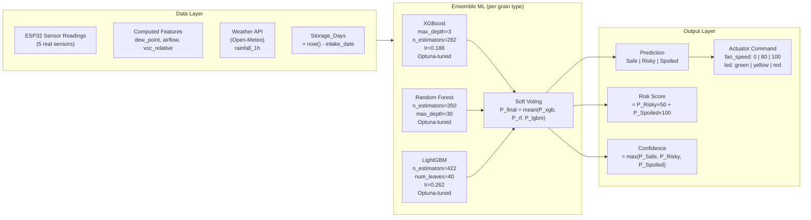
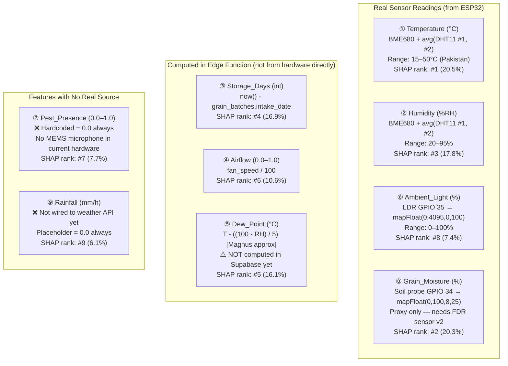
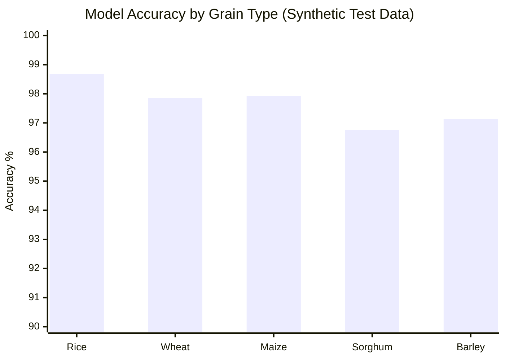
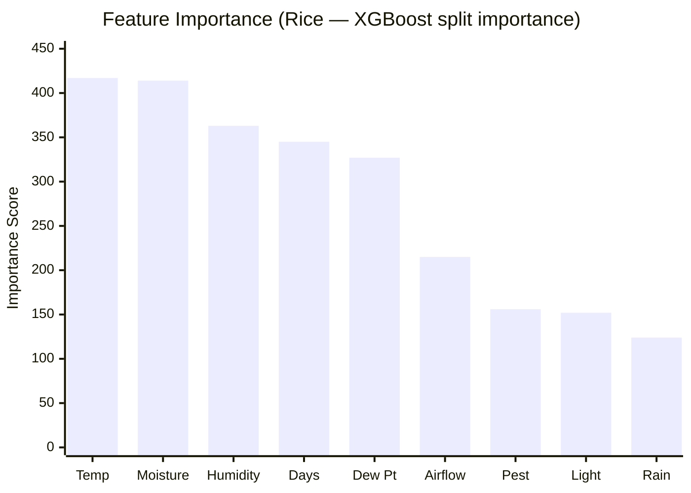
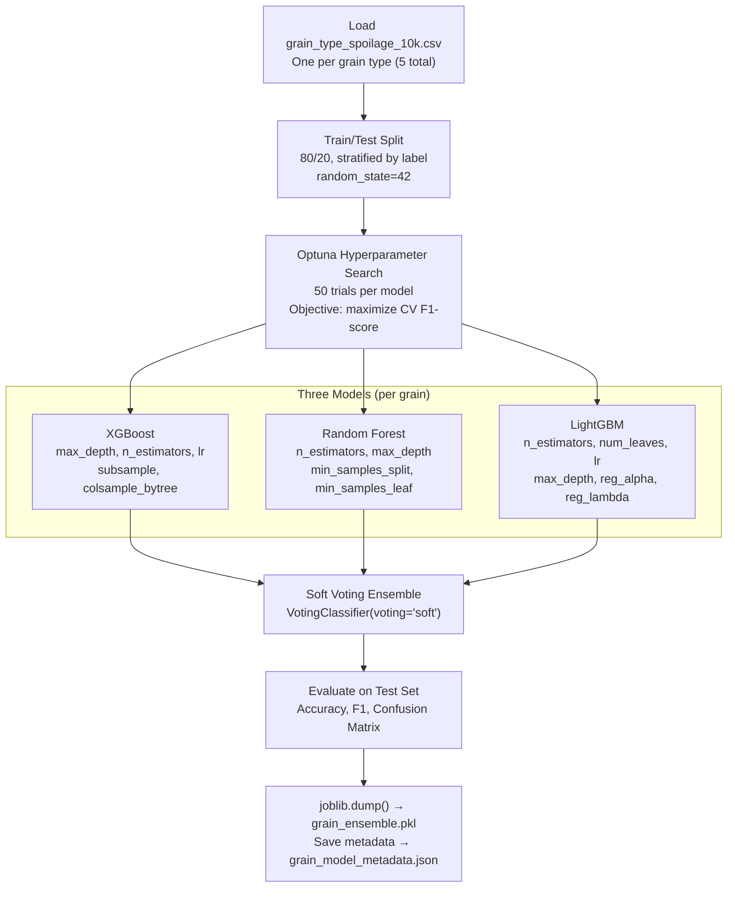
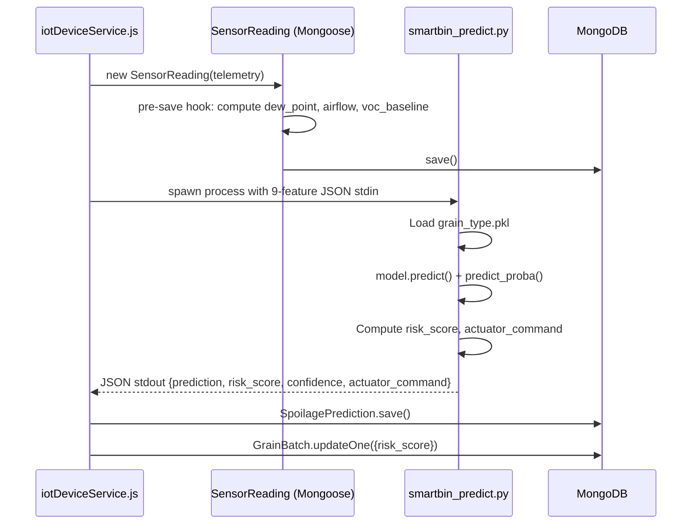
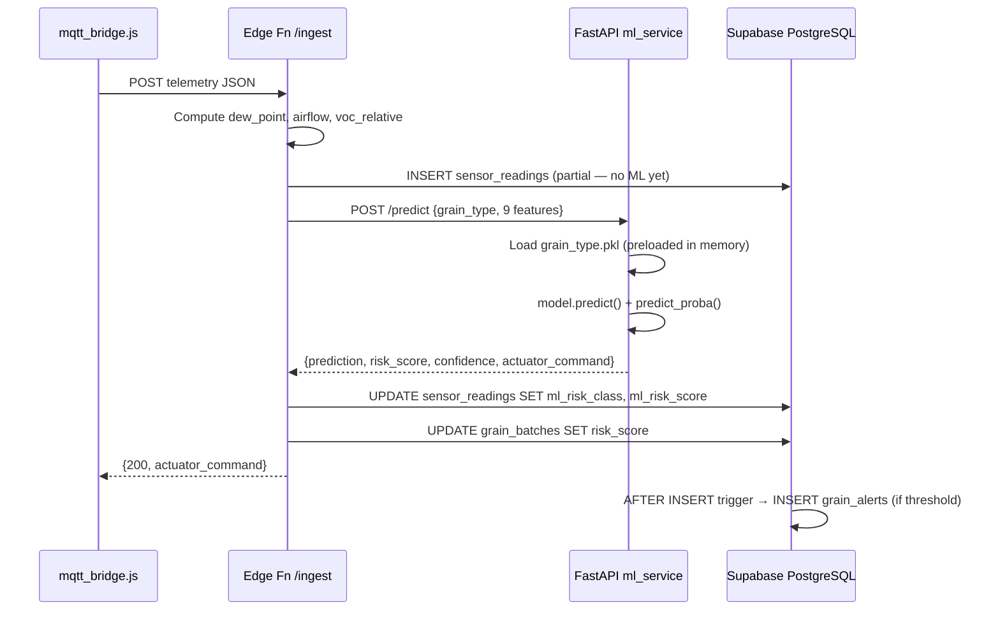
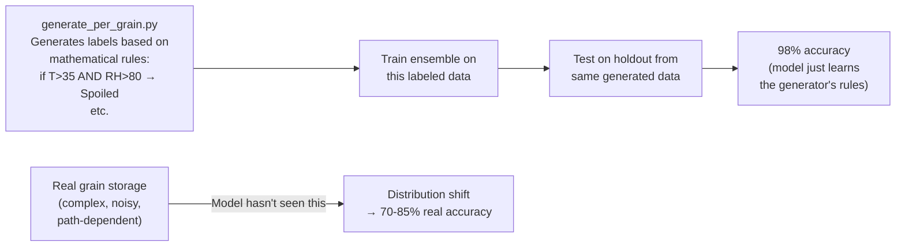
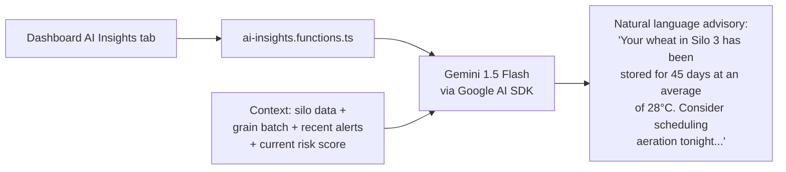

# GrainHero — AI/ML Architecture
## Ensemble Design · Feature Engineering · Training Pipeline · Inference · Deployment

> **Status**: Discovery only — no code modified  
> **Reference**: [00_MASTER_ANALYSIS.md](file:///c:/Users/Nexgen/Downloads/FYP/Grainhero/docs/00_MASTER_ANALYSIS.md)

---

## 1. ML System Overview



---

## 2. The 9-Feature Vector (Complete Specification)



### Feature Safety Ranges (per grain type)

| Feature | Wheat | Rice | Maize | Sorghum | Barley |
|---|---|---|---|---|---|
| Temperature | ≤ 25°C | ≤ 28°C | ≤ 27°C | ≤ 27°C | ≤ 20°C |
| Humidity | ≤ 65% | ≤ 70% | ≤ 70% | ≤ 65% | ≤ 65% |
| Grain Moisture | ≤ 14.0% | ≤ 13.5% | ≤ 13.5% | ≤ 13.0% | ≤ 14.5% |
| Storage Days | ≤ 365 | ≤ 180 | ≤ 270 | ≤ 365 | ≤ 365 |
| CO2 (future) | < 600 ppm | < 800 ppm | < 600 ppm | < 600 ppm | < 600 ppm |

---

## 3. Model Performance (From [ml/rice_model_metadata.json](file:///c:/Users/Nexgen/Downloads/FYP/Grainhero/farmHomeBackend-main/ml/))



### Detailed Performance Table (Rice — Best Documented)

| Model | Train Accuracy | Test Accuracy | CV Mean (5-fold) | CV Std |
|---|---|---|---|---|
| XGBoost | 99.81% | 98.68% | 98.57% | ±0.32% |
| Random Forest | 100% | 96.20% | 96.23% | ±0.41% |
| LightGBM | 99.91% | **99.15%** | 98.57% | ±0.13% |
| **Ensemble (soft vote)** | — | **98.68%** | **98.36%** | ±0.24% |

> ⚠️ **Critical caveat**: These figures are on **synthetic test data** generated by the same algorithm that created training data. Expected real-world accuracy: **70–85%** due to distribution shift. Do not use 97–99% in customer-facing claims.

---

## 4. Feature Importance (Rice Ensemble — SHAP values from [ml/shap_explain.py](file:///c:/Users/Nexgen/Downloads/FYP/Grainhero/farmHomeBackend-main/ml/shap_explain.py))



| Rank | Feature | Score | SHAP% | Action |
|---|---|---|---|---|
| 1 | Temperature | 417.4 | 20.5% | Real sensor ✅ BME680 |
| 2 | Grain_Moisture | 413.8 | 20.3% | ⚠️ Soil probe proxy — calibrate |
| 3 | Humidity | 363.4 | 17.8% | Real sensor ✅ BME680 |
| 4 | Storage_Days | 344.8 | 16.9% | Computed from DB ✅ |
| 5 | Dew_Point | 327.4 | 16.1% | ⚠️ Not computed in Supabase yet |
| 6 | Airflow | 215.4 | 10.6% | Computed from actuator state ✅ |
| 7 | Pest_Presence | 156.4 | 7.7% | ❌ Always 0 — no sensor |
| 8 | Ambient_Light | 151.7 | 7.4% | Real sensor ✅ LDR |
| 9 | Rainfall | 123.5 | 6.1% | ❌ Always 0 — not wired |

**Feature engineering fix priority**: Dew_Point (#5) is most impactful fix — takes 2 hours and requires no hardware. Pest_Presence (#7) requires hardware change (v2 MEMS mic).

---

## 5. Training Pipeline ([ml/ensemble_train.py](file:///c:/Users/Nexgen/Downloads/FYP/Grainhero/farmHomeBackend-main/ml/))



### Dataset Columns (from [ml/generate_per_grain.py](file:///c:/Users/Nexgen/Downloads/FYP/Grainhero/farmHomeBackend-main/ml/))

```
Temperature, Humidity, Storage_Days, Airflow, Dew_Point,
Ambient_Light, Pest_Presence, Grain_Moisture, Rainfall,
Spoilage_Risk  ← label: Safe | Risky | Spoiled
```

---

## 6. Inference Pipeline (Current — Original Stack Working)



## 7. Inference Pipeline (Target — Supabase + FastAPI)



---

## 8. Known ML Problems & Fixes

### Problem 1: Synthetic Data Bias



**Fix**: Instrument pilot silo, collect 6 months of real labeled data (weekly human inspections), retrain [ml/ensemble_train.py](file:///c:/Users/Nexgen/Downloads/FYP/Grainhero/farmHomeBackend-main/ml/ensemble_train.py) with augmented dataset.

### Problem 2: Pest_Presence Feature = 0 Always

| Short-term (no hardware change) | Long-term (hardware v2) |
|---|---|
| VOC proxy: `pest_presence = min(1.0, voc_relative * 0.5)` — when VOC spikes, assume potential pest activity | Add SPH0645 MEMS microphone ($2) to I2S GPIO on ESP32 → 1D CNN TFLite inference on-device |

### Problem 3: Feature Temporal Context Missing

Current model treats each reading independently. However, grain spoilage is a **path-dependent process** — a 3-day trend matters more than a single reading.

**Fix (roadmap)**: Add rolling-window features to `ml/ensemble_train.py`:
```python
# Add to feature engineering in ensemble_train.py
df['temp_mean_24h'] = df.groupby('silo_id')['Temperature'].transform(
    lambda x: x.rolling(window=288, min_periods=1).mean()  # 288 × 5min = 24h
)
df['temp_delta_6h'] = df['Temperature'] - df['temp_mean_24h']
df['humidity_trend'] = df.groupby('silo_id')['Humidity'].transform(
    lambda x: x.rolling(window=72).apply(lambda y: np.polyfit(range(len(y)), y, 1)[0])
)
```

### Problem 4: SHAP Never Called in Production

**File**: [ml/shap_explain.py](file:///c:/Users/Nexgen/Downloads/FYP/Grainhero/farmHomeBackend-main/ml/shap_explain.py) — the code exists but is never called.

**Fix**: Add SHAP computation to `ml_service/main.py`:
```python
import shap
explainer = shap.TreeExplainer(xgb_model)
shap_values = explainer.shap_values(feature_vector)
```
Return SHAP values in `/predict` response → display in "Why is my grain risky?" UI.

---

## 9. Gemini LLM Integration (Currently Working)



**File**: [src/lib/ai-insights.functions.ts](file:///c:/Users/Nexgen/Downloads/FYP/Grainhero/grainhero-main%20(Supabase)/grainhero-main/src/lib/ai-insights.functions.ts)

**Current limitation**: Gemini receives rule-based JS heuristic risk scores as context, not real ML predictions.  
**After Sprint 2**: Gemini will receive real `ml_risk_class` + `ml_risk_score` + `shap_values` → much more accurate and specific advisories.

---

## 10. ML Roadmap (Beyond Current)

| Phase | Feature | Technical Approach | Timeline |
|---|---|---|---|
| Now | Fix 2 missing features (Pest, Rainfall) | VOC proxy + Open-Meteo API | Sprint 1–4 |
| Month 3 | Real data collection | Instrument pilot silo; label weekly | Month 3–9 |
| Month 4 | Acoustic pest detection | MEMS mic + 1D CNN TFLite on ESP32 | Hardware v2 |
| Month 6 | Retrain with real data | Augment synthetic with real; run Optuna again | Month 6 |
| Month 9 | Temporal ML model | LSTM or TCN for sequence-based prediction | Research sprint |
| Year 2 | Federated learning | Flower framework — train across multiple silos without sharing raw data | Advanced feature |
| Year 2 | Aflatoxin detection | NIR spectroscopy module + CNN | Premium hardware |
| Year 2 | Reinforcement learning fan control | DQN policy: minimize spoilage risk × energy cost | Research sprint |

---

*Generated 2026-07-10 from complete reading of [ml/smartbin_predict.py](file:///c:/Users/Nexgen/Downloads/FYP/Grainhero/farmHomeBackend-main/ml/smartbin_predict.py), [ml/ensemble_train.py](file:///c:/Users/Nexgen/Downloads/FYP/Grainhero/farmHomeBackend-main/ml/ensemble_train.py), [ml/generate_per_grain.py](file:///c:/Users/Nexgen/Downloads/FYP/Grainhero/farmHomeBackend-main/ml/generate_per_grain.py), and all 5 model metadata JSON files.*
