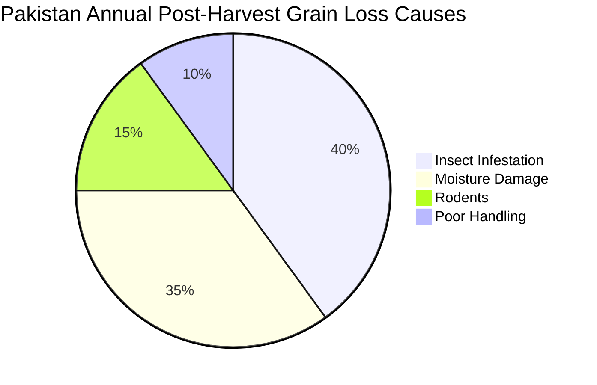
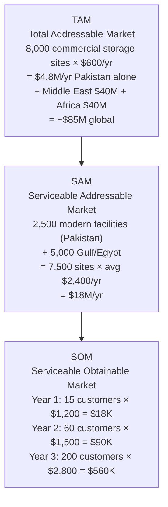
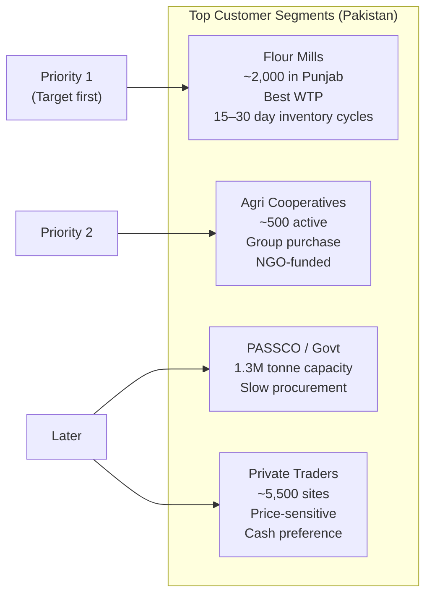
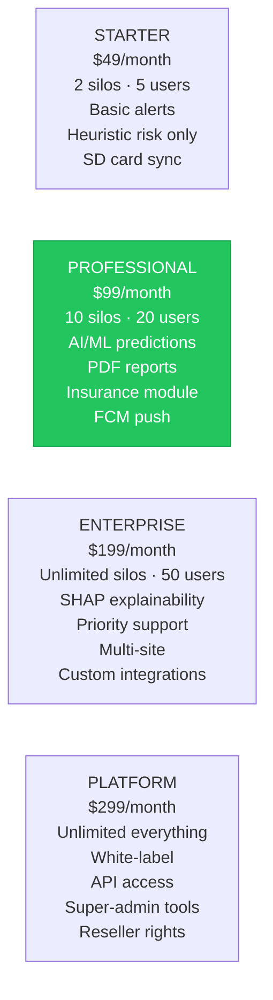
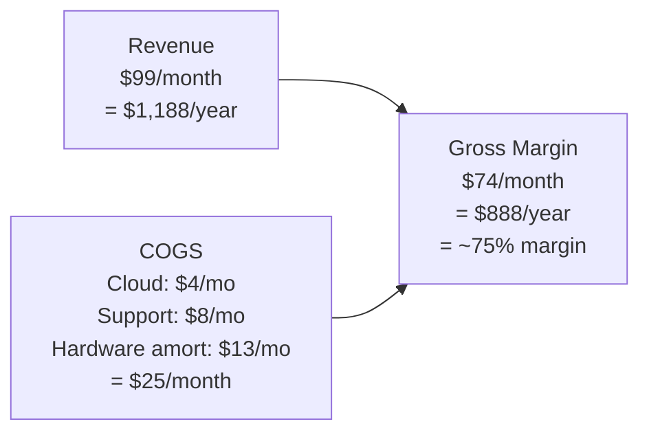
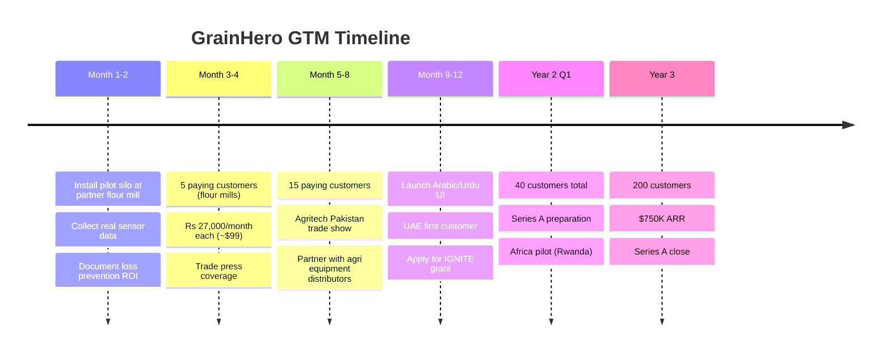
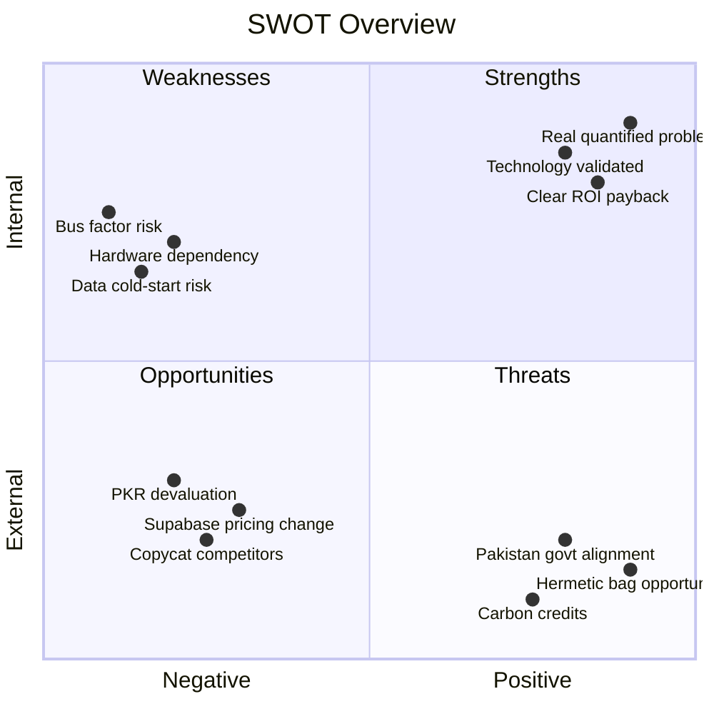

# GrainHero — Business Feasibility Analysis
## Pakistan · Middle East · Africa · Global Market Assessment

> **Status**: Discovery only — no code modified  
> **Reference**: [00_MASTER_ANALYSIS.md](file:///c:/Users/Nexgen/Downloads/FYP/Grainhero/docs/00_MASTER_ANALYSIS.md)

---

## 1. The Core Problem (Market Opportunity)



| Stat | Value | Source |
|---|---|---|
| Pakistan wheat production | 27–30 million tonnes/year | USDA GAIN 2025 |
| Post-harvest loss rate | **15–25%** | FAO FLW Database |
| Annual loss in tonnes | 4.5–7.5 million tonnes | Calculated |
| Economic loss (PKR) | **PKR 250–350 billion** | ~$1.1B USD |
| Current modern storage coverage | **3.2% of total capacity** | PBC Research 2024 |
| Flour mills (Punjab, registered) | ~2,000 facilities | PFMA |
| Commercial storage sites (>500 tonne) | ~2,500 sites | PASSCO data |

---

## 2. Market Sizing: TAM / SAM / SOM



---

## 3. Three-Region Market Analysis

### 3.1 Pakistan (Year 1–2 Focus)



| Factor | Detail |
|---|---|
| **TAM** | $4.8M/yr |
| **Primary target** | Urban flour mills (Lahore, Faisalabad, Karachi) |
| **WTP** | Rs. 15,000–30,000/month ($54–107) for proven ROI |
| **Key challenge** | Price sensitivity, loadshedding, Urdu UI required |
| **Key advantage** | Only solution designed for Pakistan climate + loadshedding |
| **Payment method** | Easypaisa/JazzCash + bank transfer (Stripe alone insufficient) |
| **Regulatory alignment** | Punjab Agricultural Emergency program, PSQCA standards |

### 3.2 Middle East (Year 2–3 Expansion)

| Country | Key Grain | Storage Context | GrainHero Opportunity | Est. ARPU |
|---|---|---|---|---|
| Saudi Arabia | Wheat import (3M t) | SAGO govt silos + private | Vision 2030 smart-agri alignment | $8,000/yr |
| UAE | All grains (re-export hub) | JAFZA warehouses | EU export compliance, HACCP | $12,000/yr |
| Egypt | Wheat (10M+ t import) | GASC govt + 1,000 private | Largest wheat importer globally | $5,000/yr |
| Qatar | All staples | Greenfield investment post-2017 | High budget, food security mandate | $15,000/yr |
| Jordan | Wheat + barley | SME private silos | English-speaking operators | $4,000/yr |

### 3.3 Africa (Year 3+ via NGO/Donor Channel)

| Country | Loss Rate | Strategy | Revenue Model |
|---|---|---|---|
| Nigeria | 25–40% | Aflatoxin crisis → high urgency | Direct + USAID grant |
| Kenya | 20–30% | Tech-savvy, premium market | SaaS direct |
| Ethiopia | 30–40% | Govt storage expansion | Government tender |
| Rwanda | 15–25% | Strong govt, high tech trust | SaaS direct |
| Tanzania | 25–35% | Donor-funded programs | NGO channel |

---

## 4. Subscription Tier Pricing



**Hardware bundles:**
- **Starter Kit** (4 pods + gateway): $300 one-time
- **Professional Kit** (8 pods + gateway + relay): $600 one-time  
- **Enterprise Kit** (20 pods + 2 gateways + UPS): $1,200 one-time

---

## 5. Competitive Landscape

```mermaid
quadrantChart
    title Price vs. AI Capability
    x-axis Low Cost --> High Cost
    y-axis Basic Monitoring --> Full AI + Actuation
    quadrant-1 Premium AI (Best)
    quadrant-2 Expensive AI
    quadrant-3 Commodity
    quadrant-4 Expensive Basic
    GrainHero: [0.15, 0.92]
    Bin-Sense Canada: [0.88, 0.35]
    SiloBoss Australia: [0.92, 0.28]
    StorMax India: [0.30, 0.22]
    Conservis USA: [0.72, 0.12]
    GrainPro Philippines: [0.22, 0.06]
    TTN LoRa DIY: [0.05, 0.08]
```

| Competitor | Geography | Pricing | AI? | Offline? | Local Language? | GrainHero Edge |
|---|---|---|---|---|---|---|
| Bin-Sense (Canada) | North America | $10K–40K/bin | ❌ | ❌ | ❌ | 15× cheaper, AI included |
| SiloBoss (Australia) | AU/NZ | $8K–25K/silo | ❌ | ❌ | ❌ | Frugal design, developing market |
| StorMax (India) | India/SE Asia | $200–500/yr | ❌ | ❌ | Hindi | ML actuation, Pakistan-specific |
| GrainPro (PH) | SE Asia/Africa | Bags only | ❌ | N/A | ❌ | Inside-bag IoT monitoring |
| Conservis (USA) | USA | $1K+/yr | ❌ | ❌ | ❌ | Real IoT sensors + actuation |
| **GrainHero** | **PK → Global** | **$49–299/mo** | **✅** | **✅** | **✅ Urdu** | **All 6 unique advantages** |

**GrainHero's 6 Unique Differentiators (no competitor has all):**
1. ✅ AI ensemble prediction — grain-type specific (5 grain types)
2. ✅ Frugal hardware — $75/pod vs. $500+/node competitors
3. ✅ Hermetic bag IoT monitoring — **only product in the world**
4. ✅ Offline-first architecture — loadshedding resilient
5. ✅ Urdu + Arabic language support
6. ✅ Insurance claim integration

---

## 6. Unit Economics

### Per-Customer Financial Model (Professional Tier)



| Metric | Value |
|---|---|
| Monthly recurring revenue (MRR/customer) | $99 |
| Annual recurring revenue (ARR/customer) | $1,188 |
| Hardware kit one-time revenue | $300 |
| Year-1 total per customer | **$1,488** |
| Hardware COGS | $150 |
| Cloud cost/month | $3–5 |
| Support cost/month | $5–10 |
| Total COGS/year | **~$270** |
| **Gross margin** | **~82%** |
| CAC (Pakistan direct) | $150–400 |
| LTV (3-year, 85% renewal) | **$3,018** |
| **LTV/CAC ratio** | **7–20×** |
| **Break-even customers** | **11** |

### Revenue Projections

| Year | Region | Customers | Avg ARPU | ARR | Hardware | **Total** |
|---|---|---|---|---|---|---|
| Year 1 | Pakistan | 15 | $1,200 | $18K | $4.5K | **$22.5K** |
| Year 2 | PK + UAE | 70 | $2,500 | $175K | $21K | **$196K** |
| Year 3 | PK + ME + Africa | 200 | $3,500 | $700K | $50K | **$750K** |

---

## 7. Cost Structure

| Cost | Year 1/mo | Year 2/mo | Year 3/mo |
|---|---|---|---|
| Engineering (2 engineers, Pakistan rates) | $1,000 | $2,500 | $5,000 |
| Cloud infrastructure (Supabase Pro + Fly.io) | $57 | $150 | $400 |
| Hardware inventory buffer | $500 | $1,500 | $3,000 |
| Marketing + sales | $200 | $1,000 | $3,000 |
| Legal + compliance | $100 | $300 | $500 |
| **Total fixed costs** | **$1,857** | **$5,450** | **$11,900** |
| **Break-even MRR needed** | **$1,857** | **$5,450** | **$11,900** |
| **Break-even customers (Pro tier)** | **19** | **55** | **120** |

---

## 8. Go-to-Market Strategy



### Channel Strategy

| Channel | Target | Cost | Expected CAC | Timeline |
|---|---|---|---|---|
| Direct sales (field visits) | Flour mills, Punjab | $200/visit | $300–400 | Month 1–6 |
| Equipment distributor partner | Agri dealers who sell fans/conveyors | Rev-share | $150–200 | Month 4–9 |
| USAID/WFP NGO channel | Cooperatives, Africa | Free | $50–100 | Year 2+ |
| Agritech Pakistan trade show | All segments | $1,000/booth | $200–300 | Annual |
| Referral program | Existing customers | 2 months free | $0 | Month 6+ |

---

## 9. Funding Strategy

### Bootstrap Path (Recommended)

| Stage | Milestone | Cost | Source |
|---|---|---|---|
| Now → 5 customers | Pilot + product | ~$3,000 | Self-fund / FYP resources |
| 5 → 20 customers | Marketing + hardware stock | Revenue-funded | $495/mo from 5 customers |
| 20 → 50 customers | Team expansion | Seed round | $100K–$200K (angel) |
| 50 → 200 customers | ME expansion + product | Series A | $500K–$1M |

### Non-Dilutive Grants Available

| Grant | Amount | Eligibility | Deadline |
|---|---|---|---|
| **IGNITE Pakistan** (ICT R&D Fund) | $10K–100K | Pakistani tech startup | Rolling |
| **USAID AgriTech Challenge** | $25K–250K | Developing market food security | Annual |
| **Gates Foundation AgDev** | $50K–500K | Food loss reduction in Africa | Competitive |
| **FAO Innovation Lab** | $10K–50K | Post-harvest loss solutions | Annual |
| **World Bank IFC Agrifin** | $25K–200K | Agricultural fintech | Rolling |

---

## 10. SWOT Analysis



---

## 11. Open Business Decisions

| # | Decision | Options | Recommendation |
|---|---|---|---|
| 1 | First pilot partner | Flour mill vs. cooperative vs. PASSCO | **Flour mill** — fastest decision, highest WTP |
| 2 | Pakistan pricing currency | PKR vs. USD | **PKR** — removes FX risk for SME customers |
| 3 | Hardware sales vs. rental | Sell once vs. $40/month rental | **Sell + annual sub** — simpler cash flow |
| 4 | Payment gateway | Stripe only vs. + Easypaisa | **Both** — Stripe for Gulf, Easypaisa for Pakistan |
| 5 | Africa entry point | Rwanda vs. Kenya | **Rwanda** — strong govt, clear tech procurement |
| 6 | Hermetic pod variant | Build now vs. post-launch | **Post-launch** — prove core product first |

---

*Document generated 2026-07-10. Sources: FAOSTAT, USDA GAIN, PBC Research, FAO FLW Database, field analysis.*
