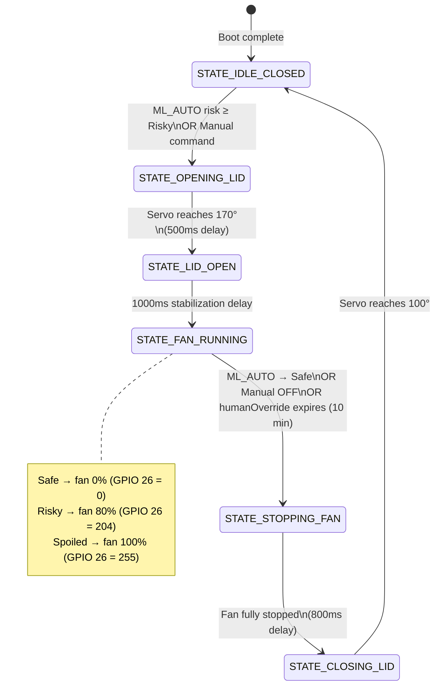
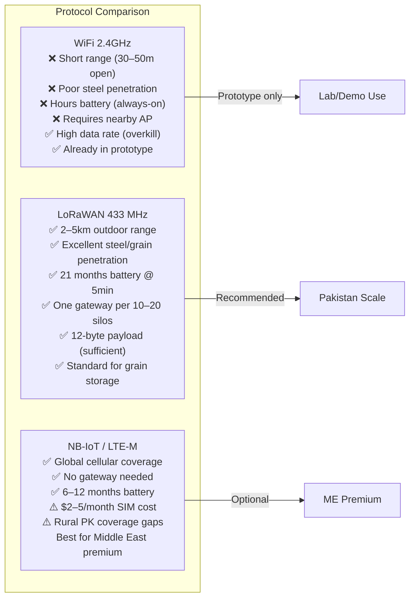
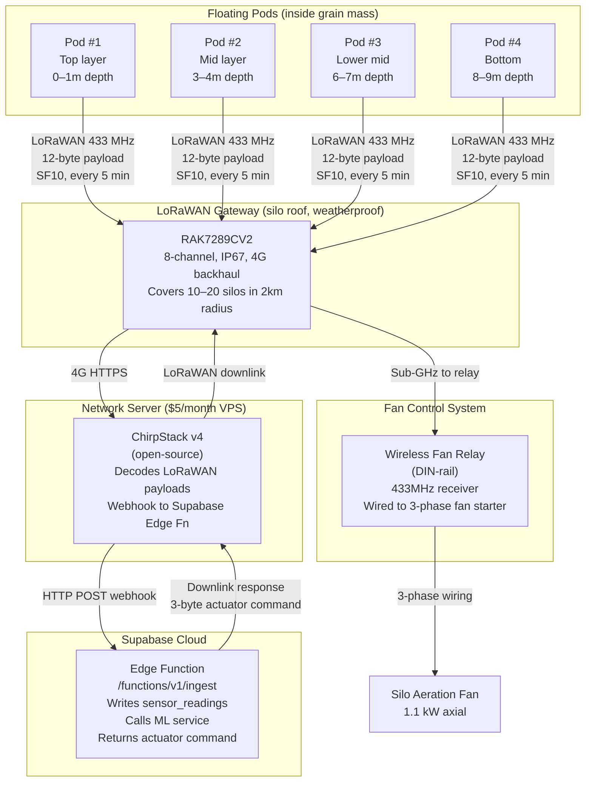
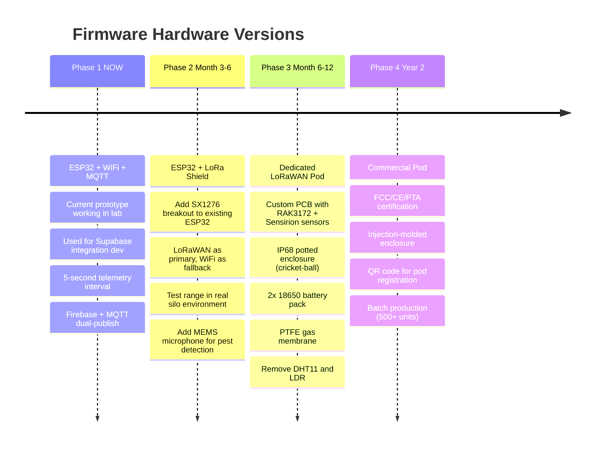

# GrainHero — IoT & Wireless Architecture
## Current ESP32 Design · LoRaWAN Floating Pod · Protocol Comparison · Firmware Map

> **Status**: Discovery only — no code modified  
> **Reference**: [00_MASTER_ANALYSIS.md](file:///c:/Users/Nexgen/Downloads/FYP/Grainhero/docs/00_MASTER_ANALYSIS.md)

---

## 1. Current IoT System (Working Prototype)

### 1.1 Hardware Architecture

```mermaid
graph TB
    subgraph ESP32["ESP32 WROOM-32 (MCU)"]
        WIFI["WiFi 2.4GHz\nWPA2 Station"]
        I2C_BUS["I2C Bus"]
        GPIO_IN["Analog Inputs"]
        GPIO_OUT["Digital Outputs"]
        SPI_BUS["SPI Bus"]
    end

    subgraph SENSORS["Sensors"]
        BME["Bosch BME680\n(I2C)\nTemp ±1°C\nHumidity ±3%\nPressure ±1 hPa\nVOC (total)"]
        DHT1["DHT11 #1\n(GPIO 15)\nTemp ±2°C\nHumidity ±5%"]
        DHT2["DHT11 #2\n(GPIO 13)\nBackup / redundancy"]
        LDR["LDR Photoresistor\n(GPIO 35, analog)\nAmbient light %"]
        SOIL["Capacitive soil probe\n(GPIO 34, analog)\nGrain moisture proxy\n0→100% soil mapped\nto 8→25% grain moisture"]
    end

    subgraph ACTUATORS["Actuators"]
        SERVO["Servo Motor\n(GPIO 27, PWM)\n100°=closed\n170°=open\nLid control"]
        FAN_H["MOSFET PWM Fan\n(GPIO 26)\n0–255 duty cycle\n0%=off 80%=risky 100%=spoiled"]
        LED_G["Green LED (GPIO 12)\nSafe status"]
        LED_Y["Yellow LED (GPIO 14)\nRisky status"]
        LED_R["Red LED (GPIO 25)\nSpoiled status"]
    end

    subgraph STORAGE["Offline Storage"]
        SD["MicroSD Card\n(SPI: CS=5 SCK=18 MISO=19 MOSI=23)\nCSV log when WiFi unavailable"]
    end

    I2C_BUS --- BME
    GPIO_IN --- DHT1 & DHT2 & LDR & SOIL
    GPIO_OUT --- SERVO & FAN_H & LED_G & LED_Y & LED_R
    SPI_BUS --- SD

    WIFI -->|"MQTT port 1883\ntopic: grainhero/devices/{id}/telemetry\nevery 5 seconds"| MQTT_B["Mosquitto\n192.168.100.229"]
    WIFI -->|"HTTPS\n/devices/{id}/latest"| FB["Firebase RTDB\nsmart-silo-8ce12"]
    WIFI -->|"NTP sync\npool.ntp.org"| NTP["Time Server"]
    MQTT_B -->|"MQTT subscribe\ntopic: grainhero/actuators/{id}/control"| WIFI
```



### 1.2 Firmware State Machine ([grainhero_main_final.ino L68–94](file:///c:/Users/Nexgen/Downloads/FYP/Grainhero/grainhero_main_final.ino))



### 1.3 MQTT Communication Protocol

| Direction | Topic | Payload | Frequency |
|---|---|---|---|
| ESP32 → Broker | `grainhero/devices/{deviceId}/telemetry` | Full JSON (12 fields) | Every 5 seconds |
| ESP32 → Broker | `grainhero/devices/{deviceId}/heartbeat` | `{"status":"online","uptime":N}` | Every 60 seconds |
| ESP32 → Broker | `grainhero/offline/{deviceId}/buffer` | SD card replay JSON-L | On reconnect |
| Broker → ESP32 | `grainhero/actuators/{deviceId}/control` | `{led2,led3,led4,ai_fan,ai_fan_speed}` | On ML prediction |

**Full telemetry payload** (published every 5 seconds):
```json
{
  "device_id": "GH-ESP32-01",
  "temperature": 28.4,
  "humidity": 62.1,
  "pressure": 1011.5,
  "gas_resistance": 125000,
  "voc_index": 110,
  "grain_moisture": 13.8,
  "ambient_light": 35.2,
  "pest_presence": 0.0,
  "fan_speed": 0,
  "lid_open": false,
  "timestamp": "2026-07-10T16:00:00Z"
}
```

### 1.4 Key Firmware Functions

| Function | Lines | Description |
|---|---|---|
| `mapFloat()` | [L21–24](file:///c:/Users/Nexgen/Downloads/FYP/Grainhero/grainhero_main_final.ino) | Maps soil probe % to grain moisture % (8–25%) |
| `getDateTimeString()` | [L26–34](file:///c:/Users/Nexgen/Downloads/FYP/Grainhero/grainhero_main_final.ino) | NTP-synced timestamp for payload |
| `connectToWiFi()` | ~L140 | Retry × 3, 2-second delay between attempts |
| `updateSensorReadings()` | ~L300 | BME680 + DHT11×2 averaging + soil probe |
| `publishTelemetry()` | ~L450 | Build JSON + MQTT publish + Firebase write |
| `handleActuatorCommand()` | ~L600 | Parse incoming MQTT command, apply LED/fan/lid |
| `checkHumanOverride()` | ~L680 | 10-minute auto-release timeout logic |
| `logToSDCard()` | ~L750 | Append CSV row when MQTT unavailable |

---

## 2. Known Issues with Current Hardware

| Issue | Risk | Mitigation |
|---|---|---|
| WiFi-only — signal loss through steel silo walls | HIGH | LoRaWAN migration (sub-GHz penetrates steel) |
| Mains power only — data gap during loadshedding | HIGH | UPS on router + SD card offline buffer |
| Single sensor point — cannot detect temperature gradient | HIGH | 4 floating pods at different depths |
| Soil probe as grain moisture proxy — inaccurate | MEDIUM | Calibrate vs. lab tests; replace with FDR sensor |
| BME680 VOC = total VOC — cannot fingerprint pathogens | MEDIUM | SEN55 module in v2 (VOC + NOx + PM) |
| DHT11 accuracy ±2°C | LOW | Use BME680 as primary; remove DHT11 in v2 |
| Human override lost on reboot (RAM only) | MEDIUM | Store in ESP32 NVS (non-volatile storage) |
| SD card SPI bus conflicts | LOW | Add SD chip-select debounce in firmware |
| MQTT broker IP hardcoded [L36](file:///c:/Users/Nexgen/Downloads/FYP/Grainhero/grainhero_main_final.ino) | MEDIUM | [update-ip.ps1](file:///c:/Users/Nexgen/Downloads/FYP/Grainhero/update-ip.ps1) script partially solves this; use mDNS |

---

## 3. Target Architecture: LoRaWAN Floating Pods

### 3.1 Why LoRaWAN over WiFi



### 3.2 Floating Pod Bill of Materials

| Component | Model | Supplier | Unit Cost (USD) | Notes |
|---|---|---|---|---|
| MCU + LoRa Radio | RAK3172-SiP | RAKwireless | $12 | nRF52840 + SX1262; LoRaWAN Class A |
| Temp + Humidity | Sensirion SHT45 | Digi-Key | $8 | ±0.1°C — 10× better than DHT11 |
| CO2 sensor | Sensirion SCD40 | Digi-Key | $15 | Photoacoustic NDIR; ±50 ppm |
| VOC + NOx + PM | Sensirion SEN55 | Digi-Key | $25 | All-in-one; replaces BME680 gas |
| Battery | 2× 18650 Li-ion (Samsung) | Local | $5 | 6,000 mAh total |
| BMS circuit | TP4056 module | Local | $1 | Overcharge/overdischarge protection |
| Enclosure | IP68 ABS sphere (60mm) | Local molder | $4 | Cricket-ball size; drop in grain |
| Gas membrane | PTFE patch (Parker) | Import | $2 | Phosphine-resistant; allows VOC ingress |
| Custom PCB | 2-layer, 50×50mm | JLCPCB | $2.50 | 5-day China turnaround |
| **Pod Total** | | | **~$74.50** | Selling price: $200–250 |

### 3.3 LoRaWAN Network Stack



### 3.4 Compact Binary Payload Format (12 bytes)

```
Byte 0–1:  Temperature × 100  (int16, e.g., 2840 = 28.40°C)
Byte 2–3:  Humidity × 100     (int16, e.g., 6210 = 62.10%)
Byte 4–5:  VOC (uint16, ppb, 0–65535)
Byte 6–7:  CO2 (uint16, ppm, 0–65535)
Byte 8:    Grain moisture × 2 (uint8, e.g., 28 = 14.0%)
Byte 9:    Fan speed 0–100%   (uint8)
Byte 10:   Status flags (bitfield):
             bit 0: lid_open
             bit 1: alarm_active
             bit 2: battery_low (<20%)
             bit 3: co2_sensor_present
             bit 4: voc_sensor_present
             bit 5: pest_detected
Byte 11:   Battery level 0–100% (uint8)
```

### 3.5 Actuator Downlink (3 bytes)

```
Byte 0: Fan speed 0–100%
Byte 1: Lid command (0=close, 1=open, 255=no change)
Byte 2: Alarm (0=off, 1=buzzer on)
```

### 3.6 Battery Life Calculation

| Interval | Active Time/cycle | Sleep Time/cycle | Energy/day | Battery Life |
|---|---|---|---|---|
| 5 min | 2s @ 50mA = 100mAs | 298s @ 2µA ≈ 0.6mAs | 8.0 mAh | **21 months** |
| 10 min | 2s @ 50mA = 100mAs | 598s @ 2µA ≈ 1.2mAs | 4.0 mAh | **42 months** |
| 15 min | 2s @ 50mA = 100mAs | 898s @ 2µA ≈ 1.8mAs | 2.7 mAh | **60 months** |

*Battery: 2× 18650 Samsung, 6,000 mAh total, 85% usable = 5,100 mAh*

---

## 4. Firmware Evolution Roadmap



---

## 5. Security Architecture

### Current Security Issues

| Issue | Risk Level | File |
|---|---|---|
| MQTT broker: no authentication (open port 1883) | **HIGH** | [farmHomeBackend-main/.env](file:///c:/Users/Nexgen/Downloads/FYP/Grainhero/farmHomeBackend-main/.env) |
| Device secret hardcoded in firmware | MEDIUM | [grainhero_main_final.ino](file:///c:/Users/Nexgen/Downloads/FYP/Grainhero/grainhero_main_final.ino) |
| No TLS on MQTT (plaintext) | MEDIUM | Mosquitto config |
| Firebase RTDB rules permissive (dev mode) | **HIGH** | Firebase console |

### Security Fix Plan

| Fix | How | Sprint |
|---|---|---|
| MQTT authentication | Add `password_file` to mosquitto.conf | Sprint 1 |
| MQTT over TLS (port 8883) | Let's Encrypt cert + `cafile` in ESP32 WiFiClientSecure | Phase 2 hardware |
| Device API key per pod | Generate UUID on firmware flash, store in Supabase Vault | Sprint 1 |
| Firebase RTDB rules | Lock to specific device UID paths (`/devices/{uid}`) | Sprint 1 |
| Edge Function rate limiting | Max 2 requests/second per `device_id` | Sprint 1 |

---

*Generated 2026-07-10 from complete reading of [grainhero_main_final.ino](file:///c:/Users/Nexgen/Downloads/FYP/Grainhero/grainhero_main_final.ino) (1,871 lines, 57KB).*
