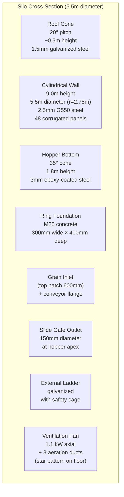

# GrainHero — Silo Engineering Reference
## 100-Tonne Pilot Silo: Geometry · Structural Calcs · BOM · Aeration · IoT Integration

> **Status**: Discovery only — no code modified  
> **Reference**: [00_MASTER_ANALYSIS.md](file:///c:/Users/Nexgen/Downloads/FYP/Grainhero/docs/00_MASTER_ANALYSIS.md)

---

## 1. Design Specifications

| Parameter | Value | Basis |
|---|---|---|
| Usable grain capacity | **100 tonnes** | Client requirement |
| Primary grains | Wheat, Rice, Maize | Pakistan market |
| Type | Bolted galvanized corrugated steel, hopper-bottom | Standard for Pakistan climate |
| Diameter | **5.5 m** (18 ft) | Standard corrugated panel module |
| Wall height (cylinder) | **9.0 m** | Volume calculation |
| Hopper angle | **35°** | > wheat angle of repose (27°) |
| Hopper height | **1.8 m** | Geometry |
| Roof pitch | **20°** | Monsoon rain runoff |
| Total height (ground to apex) | ~12.5 m | Sum of above |
| Foundation | Reinforced concrete ring beam, M25, 300mm wide | Load distribution on compacted gravel |

---

## 2. Volume & Capacity Calculation



### Volume Equations

| Section | Formula | Result |
|---|---|---|
| Cylinder | π × r² × h = π × 2.75² × 9.0 | **213.9 m³** |
| Hopper | (1/3) × π × r² × h = (1/3) × π × 2.75² × 1.8 | **14.3 m³** |
| **Total volume** | | **228.2 m³** |
| Fill level (80%) | 228.2 × 0.80 | **182.6 m³** usable |
| Wheat (0.77 t/m³) | 182.6 × 0.77 | **140.6 tonnes max** |
| **Target fill (100 t)** | 100 / 0.77 | **129.9 m³ = 57% fill** |
| Headspace (43%) | For aeration, temperature buffer, safety | ✅ Adequate |

---

## 3. Structural Engineering

### Hoop Stress Check (Cylinder Base)

| Parameter | Value |
|---|---|
| Grain density ρ (wheat) | 770 kg/m³ |
| Wall height H | 9.0 m |
| Radius r | 2.75 m |
| Wall thickness t | 0.0025 m (2.5mm) |
| Hoop stress σ_h = (ρ × g × H × r) / t | (770 × 9.81 × 9.0 × 2.75) / 0.0025 = **94.4 MPa** |
| G550 steel yield strength | 550 MPa |
| **Safety factor** | 550 / 94.4 = **5.8 ✅** |

### Wind Load Check (Pakistan design wind 120 km/h)

| Parameter | Value |
|---|---|
| Design wind speed | 33.3 m/s (120 km/h) |
| Dynamic pressure q | 0.5 × 1.22 × 33.3² = **678 Pa** |
| Overturning moment | 678 × 12.5 × 5.5 × (12.5/2) = **293 kN·m** |
| Foundation anchor bolts | 8× M20 hot-dip galvanized at r=3m |
| **Verdict** | Resisting moment > overturning ✅ |

### Standards Applied

| Standard | Source | Application |
|---|---|---|
| AS 3774-1996 | Australian — widely used South Asia | Loads on bulk solids containers |
| Pakistan Building Code 2021 | Section 6 | Structural design requirements |
| ENV 1991-4 | European (Eurocode) | Silo loads — for export market compliance |

---

## 4. Materials Specification

| Component | Material | Grade | Reason |
|---|---|---|---|
| Wall panels | Corrugated galvanized steel | G550, 275g/m² zinc coating | Structural; corrosion-resistant |
| Roof cone panels | Galvanized steel | 1.5mm, G350 | Lighter; non-structural |
| Hopper bottom | Hot-rolled steel + epoxy coating | 3mm | Food-grade anti-rust interior |
| Foundation | Reinforced concrete | M25, Fe500 rebar | Load distribution |
| Bolts & fasteners | Hot-dip galvanized | M12, Grade 8.8 | Phosphine-resistant |
| Sealant | Food-grade silicone butyl tape | FDA-compliant | Airtight, grain-safe |
| External coating | Zinc-rich primer + polyurethane | 2-layer system | UV + corrosion protection |

---

## 5. Aeration System Design

### Fan Sizing Calculation

| Parameter | Value |
|---|---|
| Required airflow | 7 m³/hour per tonne (US standard: 1 CFM/bushel) |
| For 100 tonnes | 100 × 7 = **700 m³/hour** |
| Static pressure (grain depth 9m) | 130 Pa/m × 9m = **1,170 Pa** |
| Fan selection | 700 m³/h at 1,170 Pa static pressure |
| Motor power | **1.1 kW (1.5 HP) axial fan** |
| Speed | 1,450 RPM (50Hz mains) |
| Estimated cost | Rs. 22,000 (~$80 USD) |

### Duct Layout

```
Silo floor plan (top view):
         N
         │
    ┌────┼────┐
    │   ╱│╲   │  3 aeration ducts in Y/star pattern
    │  ╱ │ ╲  │  Each 2.5m long × 150mm diameter perforated steel
    │ ╱  │  ╲ │  1mm stainless mesh inlet screen (blocks insects)
    └────┼────┘
         │
    [Fan inlet] — main 200mm duct underground to fan
```

### Aeration Safety Logic

```
SAFE TO AERATE when ALL conditions are TRUE:
  1. dew_point_outside = T_outside - ((100 - RH_outside) / 5)
  2. dew_point_outside < (grain_temperature - 3°C)  ← condensation guard
  3. is_raining == FALSE
  4. outside_humidity < 80%
  5. ml_risk_class IN ('Risky', 'Spoiled')
  6. fumigation_active == FALSE  ← CRITICAL safety interlock

Best aeration window (Pakistan summer):
  02:00–06:00 local time
  (Outside temp drops 8–15°C below daytime peak)
```

**Code action needed**: Add `fumigation_active` field to `silos` table thresholds JSONB. Reference: [aiSpoilage.js sendMLActuatorCommand()](file:///c:/Users/Nexgen/Downloads/FYP/Grainhero/farmHomeBackend-main/routes/aiSpoilage.js) — must check this flag before publishing fan command.

---

## 6. Hermetic Sealing Option

### Requirements for Hermetic Seal

| Requirement | Standard |
|---|---|
| Airtightness test | < 0.5 Pa/min pressure decay at 100 Pa test pressure |
| All openings sealed | Inlet, outlet, inspection hatch, sensor ports, cable entries |
| Gaskets | Food-grade PVC on all flange joints |
| Pressure test | Before every season |

### Hermetic Benefits vs. Conventional

| Factor | Hermetic | Conventional |
|---|---|---|
| Grain shelf life | 12–18 months | 6–9 months (unsafe) |
| Fumigation needed | **NO** (insects die from O2 depletion) | Yes (phosphine) |
| O2 level inside after 72h | < 2% (lethal to insects) | Ambient ~21% |
| CO2 level inside after 48h | 15–20% (insect lethal) | Ambient ~0.04% |
| Aflatoxin risk | Greatly reduced (no O2 = no fungal growth) | Standard risk |
| Cost saving (fumigation) | **Rs. 8,000/treatment eliminated** | Rs. 8,000/treatment |
| IoT monitoring inside | **Required** (seal integrity check) | Optional |

### GrainHero Hermetic Pod

**Unique product with no competitor equivalent:**

| Sensor | Measurement | Purpose |
|---|---|---|
| SHT45 | Temp/humidity inside bag | Condensation monitoring |
| SCD40 | CO2 level | Confirm O2 depletion progressing |
| SEN55 | VOC | Fungal activity indicator |
| SGX SEN0322 (optional) | O2 % | Direct seal integrity check |

Alert trigger: `co2 < 5000 ppm` after 72 hours = seal failure (insects may survive). Immediate SMS/FCM alert.

---

## 7. Full Bill of Materials (100-Tonne Pilot)

### Silo Structure

| Item | Qty | Unit Cost (Rs.) | Total (Rs.) |
|---|---|---|---|
| Corrugated steel panels (wall, 2.5mm G550) | 48 | 4,500 | 216,000 |
| Roof cone panels (1.5mm galvanized) | 12 | 3,500 | 42,000 |
| Hopper bottom assembly (3mm, epoxy-coated) | 1 set | 85,000 | 85,000 |
| Foundation concrete ring beam (M25, 4.5m³) | 4.5 m³ | 18,000/m³ | 81,000 |
| Bolts, nuts, washers (hot-dip galvanized M12) | 1 set | 25,000 | 25,000 |
| Aeration fan (1.1 kW axial, 700 m³/h) | 1 | 22,000 | 22,000 |
| Aeration ducts (150mm perforated steel) | 12 m | 1,800/m | 21,600 |
| Inspection manhole (600mm bolted, gasketed) | 1 | 8,500 | 8,500 |
| Grain inlet flange (conveyor connection) | 1 | 6,000 | 6,000 |
| Grain outlet slide gate (150mm) | 1 | 12,000 | 12,000 |
| External ladder + safety cage (galvanized) | 1 set | 27,000 | 27,000 |
| Butyl tape + silicone sealant | — | 8,000 | 8,000 |
| Zinc primer + polyurethane topcoat | — | 15,000 | 15,000 |
| Miscellaneous (nuts, gaskets, fittings) | — | 12,000 | 12,000 |
| **Structure Subtotal** | | | **~582,000** |

### IoT Equipment

| Item | Qty | Unit Cost (Rs.) | Total (Rs.) |
|---|---|---|---|
| Floating sensor pods (LoRaWAN, Phase 2) | 4 | 21,000 ($75) | 84,000 |
| LoRaWAN gateway (RAK7268 indoor) | 1 | 42,000 ($150) | 42,000 |
| Wireless fan relay (DIN-rail, 433MHz) | 1 | 8,000 | 8,000 |
| Gateway UPS (4-hour backup) | 1 | 14,000 ($50) | 14,000 |
| **IoT Subtotal** | | | **~148,000** |

### Installation Labor

| Item | Cost (Rs.) |
|---|---|
| Silo erection (4 workers × 5 days) | 50,000 |
| Foundation construction | 25,000 |
| IoT installation + commissioning | 15,000 |
| **Labor Subtotal** | **90,000** |

### Grand Total

| Category | Rs. | USD (@ 280 PKR/USD) |
|---|---|---|
| Silo structure | 582,000 | $2,079 |
| IoT equipment | 148,000 | $529 |
| Installation | 90,000 | $321 |
| **Grand Total** | **~820,000** | **~$2,929** |

---

## 8. Sensor Port Engineering

### Wired Sensors (Current Prototype)

| Component | Specification |
|---|---|
| Cable conduit | 25mm Schedule 80 PVC pipe, PTFE thread sealed |
| Entry point | Top roof cone (minimum grain contact) |
| Cable jacket | Silicone-jacketed, stainless steel armor (phosphine-resistant) |
| Seal | 2-part epoxy fill around cable entry |
| Maintenance | Pull-wire inside conduit for cable replacement |

### Wireless Pods (Target LoRaWAN)

| Component | Specification |
|---|---|
| No penetrations needed | Entirely wireless — no cable through silo wall |
| Pod insertion | Dropped through 600mm roof hatch before fill |
| Pod retrieval | Bright orange pod + 5m nylon rope tether tied to hatch handle |
| Depth tracking | Pod #1 settles on surface, Pod #4 at bottom — fixed by insertion order |

---

## 9. Maintenance Schedule

| Interval | Task | Responsible |
|---|---|---|
| Every intake | Pressure-test hermetic seal; inspect outlet gate; clean inlet screens | Operator |
| Weekly | Check sensor pod battery level in dashboard | Operator |
| Monthly | Inspect fan belt/bearing; check bolts; clean aeration ducts | Technician |
| Quarterly | **Calibrate temperature/humidity sensors** vs. certified lab sensor | Technician |
| Biannual | Full structural inspection: bolts, seals, roof, foundation, coating | Engineer |
| Annual | Replace butyl tape at all seams; grain probe recalibration; battery check | Technician |

---

## 10. Pakistan-Specific Design Adaptations

| Season | Conditions | GrainHero Response |
|---|---|---|
| Summer (May–Sep) | 42–48°C ambient, 30–70% RH | Night-only aeration 02:00–06:00; dew point check mandatory |
| Monsoon (Jul–Sep) | RH 70–90%, 32–38°C | **NO aeration**; hermetic seal option; alert if inside RH > 75% |
| Post-monsoon (Oct–Nov) | Declining temps, 40–60% RH | Safe aeration window expands; dehumidify before long storage |
| Winter (Dec–Feb) | 5–20°C, 40–60% RH | Minimal aeration needed; watch for condensation near cold walls |
| Loadshedding | 8–14h/day outage | UPS on gateway + router; SD card buffer on firmware; LoRaWAN independent of mains WiFi |

---

*Generated 2026-07-10. Engineering based on AS 3774-1996, Pakistan Building Code 2021, and FAO grain storage standards.*
