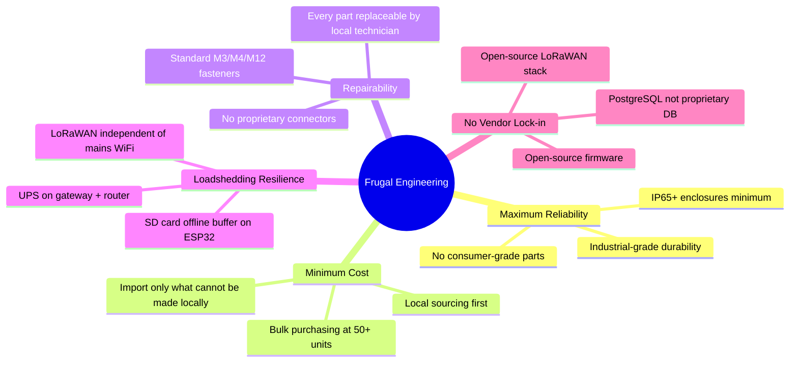
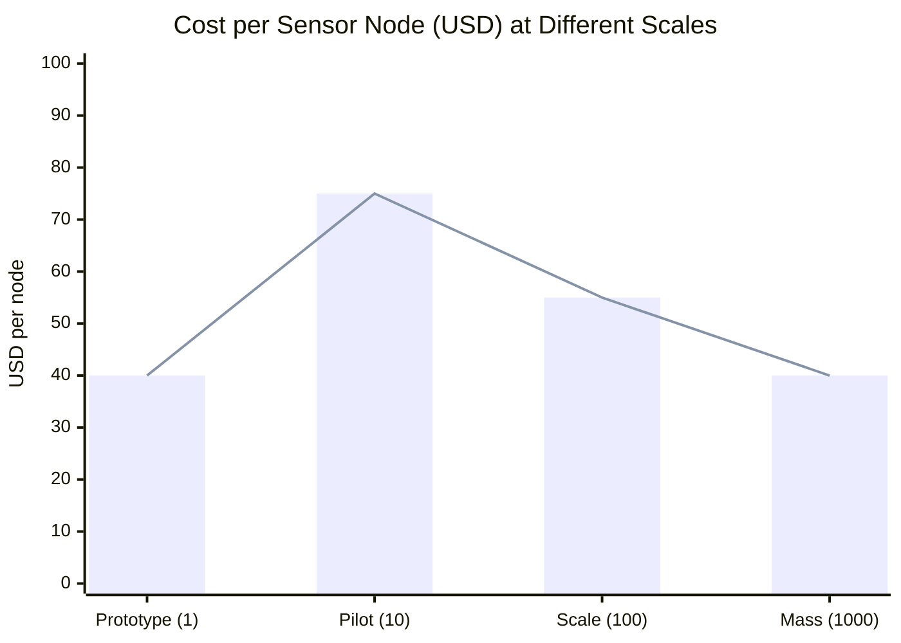
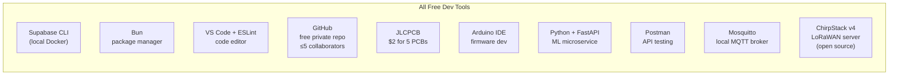
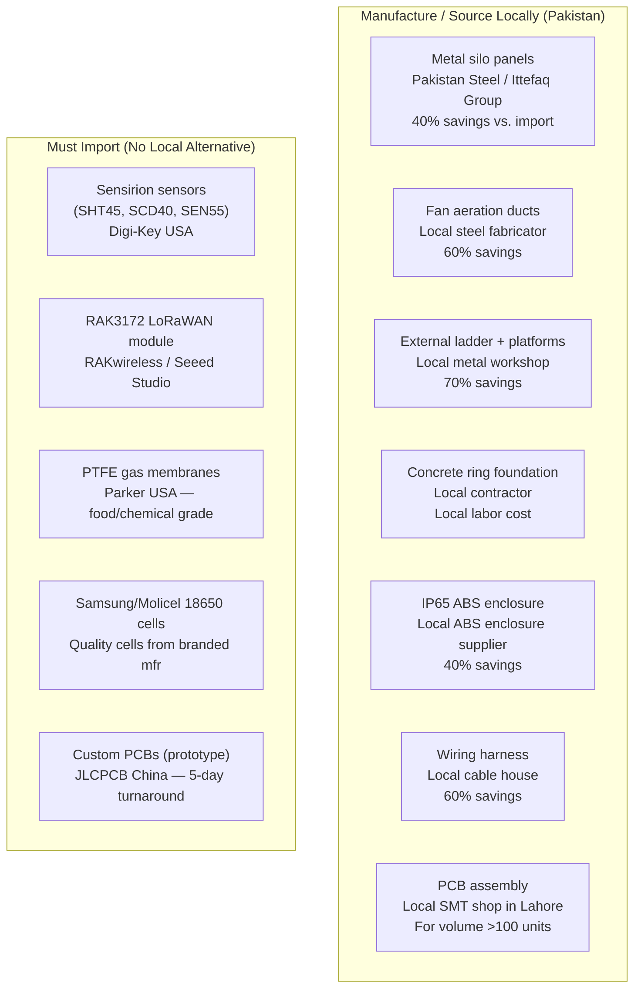
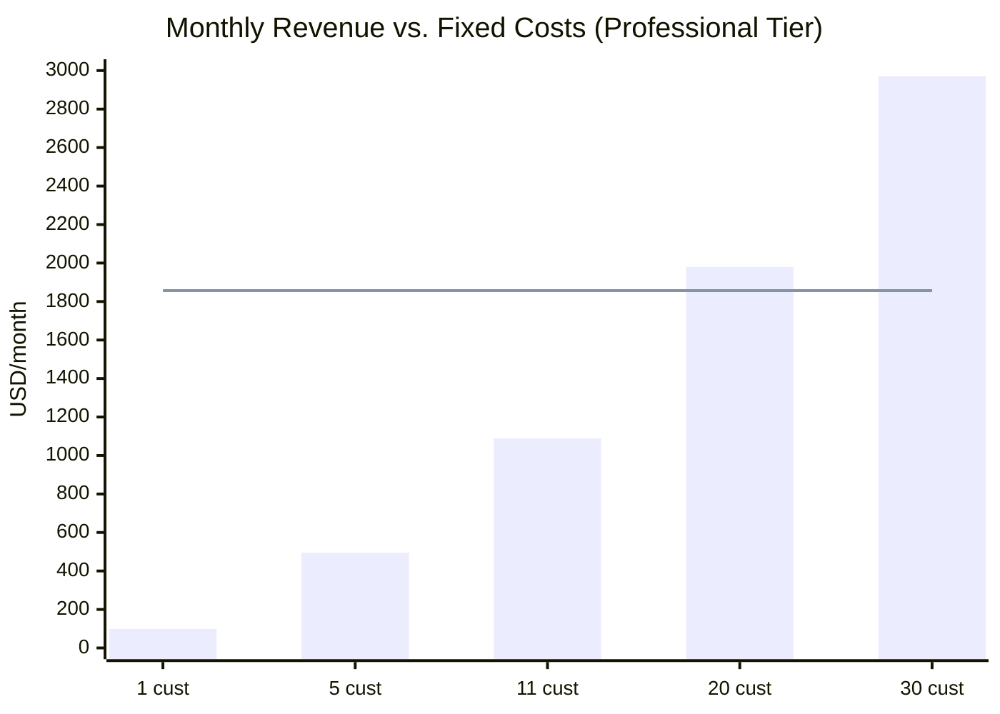

# GrainHero — Frugal Engineering Strategy
## Cost Reduction · Local Sourcing · Unit Economics · BoM Optimization

> **Status**: Discovery only — no code modified  
> **Reference**: [00_MASTER_ANALYSIS.md](file:///c:/Users/Nexgen/Downloads/FYP/Grainhero/docs/00_MASTER_ANALYSIS.md)

---

## 1. Philosophy

---

## 2. Hardware Cost Comparison: Prototype → Target Pod

### 2.1 Current ESP32 Prototype BOM

| Component | Supplier | Unit Cost (Rs.) | Unit Cost (USD) | Notes |
|---|---|---|---|---|
| ESP32 WROOM-32 | Unique Technologies, Lahore | 1,400 | $5 | General purpose MCU |
| BME680 breakout | Import (AliExpress) | 2,240 | $8 | Temp/Humidity/VOC/Pressure |
| DHT11 × 2 | Local electronics, Bolton Market | 560 | $2 | ±2°C — low accuracy |
| LDR + circuit | Local | 140 | $0.50 | Ambient light |
| Soil moisture probe | Local | 840 | $3 | Grain moisture proxy |
| 9g servo motor | Local | 840 | $3 | Lid open/close |
| MOSFET fan controller | Local (IRF540N = Rs.50) | 1,120 | $4 | PWM fan control |
| MicroSD SPI module | Local | 280 | $1 | Offline data logging |
| 5V/2A SMPS power supply | Local | 1,400 | $5 | Mains power |
| ABS enclosure (generic) | Local | 1,400 | $5 | Not IP-rated |
| Miscellaneous (wire, connectors) | Local | 560 | $2 | — |
| **Prototype Total** | | **~10,780** | **~$38.50** | |

### 2.2 Target LoRaWAN Floating Pod BOM

| Component | Supplier | Unit Cost (Rs.) | Unit Cost (USD) | Notes |
|---|---|---|---|---|
| RAK3172-SiP (nRF52840 + SX1262) | RAKwireless / Seeed Studio | 3,360 | $12 | LoRaWAN Class A, ARM Cortex-M4 |
| Sensirion SHT45 (Temp/RH) | Digi-Key (import) | 2,240 | $8 | ±0.1°C, ±0.8% RH — best in class |
| Sensirion SCD40 (CO2 NDIR) | Digi-Key (import) | 4,200 | $15 | ±50 ppm — photoacoustic |
| Sensirion SEN55 (VOC+NOx+PM2.5) | Digi-Key (import) | 7,000 | $25 | All-in-one gas/particle module |
| 2× 18650 Li-ion (Samsung/Molicel) | Local (Lahore electronics) | 1,400 | $5 | 6,000 mAh total |
| 18650 holder + BMS | Local | 560 | $2 | Over-discharge protection |
| IP68 ABS sphere enclosure (60mm) | Local injection molder, Lahore | 1,120 | $4 | Cricket-ball form factor |
| PTFE gas membrane patch | Parker (import) | 560 | $2 | Phosphine-resistant, gas-permeable |
| Custom 2-layer PCB | JLCPCB (shipped from China) | 700 | $2.50 | 5-day turnaround |
| LoRa antenna (PCB trace or stub) | On-PCB | 0 | $0 | Integrated in RAK3172 |
| Miscellaneous (epoxy, connectors) | Local | 560 | $2 | Potting compound, JST connectors |
| **Target Pod Total** | | **~21,700** | **~$77.50** | |

---

## 3. LoRaWAN Gateway Cost Comparison

| Gateway | Model | Cost (USD) | Channels | IP Rating | Backhaul | Notes |
|---|---|---|---|---|---|---|
| **Recommended** | RAK7289CV2 | $300 | 8 | IP67 | 4G LTE | Best quality, weatherproof |
| Budget option | RAK7268 | $150 | 8 | Indoor | Ethernet/WiFi | Use for covered facilities |
| Ultra-budget | Dragino LIG16 | $100 | 4 | Indoor | Ethernet | Less reliable |
| **DIY (most frugal)** | RPi Zero 2W + RAK2245 | **$95** | 8 | None | USB 4G dongle | Assemble yourself; pilot use |

**DIY Gateway assembly:**
- Raspberry Pi Zero 2W: $15 (from local stock)
- RAK2245 LoRaWAN concentrator HAT: $60 (import)
- 4G USB dongle (Jazz/Zong): $20 (local)
- Install ChirpStack v4 (free, open-source)
- **Total: $95 vs. $150–300 commercial**

---

## 4. Software Stack — Zero Cost Dev Tools

### Cloud Running Costs

| Service | Plan | Monthly Cost | Notes |
|---|---|---|---|
| Supabase Cloud | Free tier | $0 | 500MB DB, 2GB storage, 50K MAU |
| Supabase Cloud | **Pro (needed for production)** | **$25** | Upgrade when >5 paying customers |
| Python ML service | Render free tier | $0 | ⚠️ 30-sec cold start — acceptable for pilot |
| Python ML service | **Fly.io Hobby** | **$5–7** | Recommended for production |
| MQTT Mosquitto | Local PC / Raspberry Pi | $0 | Already running in codebase |
| MQTT Mosquitto | VPS (Hostinger Pakistan) | $5 | If cloud-hosted needed |
| LoRaWAN (ChirpStack) | Self-hosted VPS | $5 | Shared with MQTT broker |
| OpenWeather API | Free tier | $0 | 60 calls/min — sufficient |
| Open-Meteo API | Unlimited | $0 | No API key required |
| Firebase FCM | Spark (free) | $0 | Push notifications |
| Domain + SSL | Cloudflare | ~$1/mo | Annual $10 |
| **Total (pilot, 1–10 customers)** | | **$32–43/mo** | |
| **Total (production, 10–50 customers)** | | **$57–75/mo** | |

---

## 5. What to Manufacture Locally vs. Import

### Local Sourcing Directory

| Category | Supplier | Location | Notes |
|---|---|---|---|
| Electronic components (general) | Al-Badar Electronics | Karachi, Bolton Market | DHT11, LDR, MOSFET, resistors |
| Electronic components (advanced) | Unique Technologies | Lahore, Hafeez Centre | ESP32, Arduino, shields |
| Electronic components (advanced) | EvoTech | Lahore | Imported modules, LoRa |
| Steel panels (galvanized) | Pakistan Steel | Karachi | G550 grade panels |
| Steel pipes + ducts | Ittefaq Group | Lahore | Seamless pipes, angles |
| Concrete + civil | Local contractor | Any city | Ring beam, apron, flooring |
| Welding/fabrication | Local metal workshop | Any industrial area | Ladder, platforms, brackets |
| PCB manufacturing (China, fast) | JLCPCB | China (shipped 5 days) | $2 for 5 PCBs, minimum order |
| 4G SIMs for IoT | Jazz / Zong | Pakistan | Best rural 4G coverage |
| Courier + customs clearance | DHL Express | Pakistan | Fastest customs for electronics |
| 18650 batteries | Local electronics stores | Lahore/Karachi | Verify are genuine Samsung/Molicel |

---

## 6. Sensors — Replace vs. Keep vs. Upgrade

| Current Sensor | Current Use | Decision | Replacement / Action | Cost Impact |
|---|---|---|---|---|
| DHT11 × 2 | Temp + humidity backup | **ELIMINATE in v2** | BME680 already covers both; DHT11 is ±2°C accuracy | Save $2/pod |
| LDR | Ambient light % | **ELIMINATE in v2** | Lowest SHAP importance (6.1%); negligible prediction value | Save $0.50/pod |
| Soil moisture probe | Grain moisture proxy | **UPGRADE** | Replace with capacitive FDR grain probe for better accuracy | +$10/pod |
| BME680 (total VOC) | VOC detection | **UPGRADE in v3** | Sensirion SEN55: VOC + NOx + PM2.5 — much more specific | +$20/pod |
| BME680 CO2 (estimated) | — | **ADD SCD40 in v2** | BME680 does NOT measure CO2. Add Sensirion SCD40 photoacoustic CO2 | +$15/pod |

### Sensors to Add (Roadmap)

| Sensor | Purpose | Cost | Priority | Timeline |
|---|---|---|---|---|
| Sensirion SCD40 (CO2 NDIR) | Fungal bloom + insect respiration indicator | $15 | **HIGH** | v2 hardware |
| SPH0645 MEMS microphone (I2S) | Acoustic insect detection on ESP32 | $3 | Medium | v2 hardware |
| SGX SEN0322 O2 sensor | Hermetic bag O2 depletion monitoring | $25 | Medium | Hermetic variant |
| DS18B20 temperature string × 3 | Multi-depth temperature profiling in grain | $3 each | Low | v3 hardware |
| NIR spectroscopy module (miniature) | Aflatoxin detection via near-infrared | $200+ | Long-term | Year 2+ |

---

## 7. Unit Economics at Scale

| Scale | # Silos | Pod Cost | Gateway Cost | SW Cost/site/mo | Hardware COGS/site | Monthly SW Rev | Gross Margin |
|---|---|---|---|---|---|---|---|
| Prototype | 1 | $40 (ESP32) | $150 (indoor) | $0 | $190 | $0 | — |
| Pilot | 10 | $75 (LoRa pod) | $150 | $3.20 | $450 | $99 | 75% |
| Scale | 100 | $55 (bulk) | $120 | $1.50 | $340 | $99 | 83% |
| Mass | 1,000 | $40 (own PCB) | $90 | $0.50 | $250 | $99 | 87% |

### Break-Even Analysis

- **Fixed monthly costs (Year 1)**: $1,857 (2 engineers + cloud + hardware buffer)
- **Revenue per customer**: $99/month
- **Break-even**: ⌈1857 / 99⌉ = **19 customers** (using conservative engineer salaries; lower if self-funded)
- **Profitable at**: 25 customers → $2,475/month = $618 net margin

---

## 8. Customs & Import Notes (Pakistan)

| Item Category | Import Duty | GST | Strategy |
|---|---|---|---|
| Electronic components (<$100 shipment) | 5–10% | 17% | DHL Express — fastest clearance |
| LoRaWAN gateway | May need PTA approval | 17% | Import as "industrial monitoring equipment" |
| Li-ion batteries | Hazardous goods surcharge | 17% | Ship by sea; DHL for small quantities |
| Complete assembled PCBs | 15–20% | 17% | Classify as "printed circuit board" not "device" |

**Duty-free threshold**: Under PKR 45,000 ($160) per shipment via courier — declare individual component values separately.

---

## 9. Total System Cost per Silo (Production-Grade)

| Component | Qty | Unit Cost | Total (USD) |
|---|---|---|---|
| LoRaWAN floating pods | 4 | $77.50 | $310 |
| LoRaWAN gateway (RAK7268 indoor) | 1 | $150 | $150 |
| Fan wireless relay | 1 | $30 | $30 |
| Gateway UPS (4-hour battery) | 1 | $50 | $50 |
| Installation + commissioning | — | — | $100 |
| **IoT hardware total** | | | **$640** |
| **Software (Professional, Year 1)** | 12 months | $99/mo | **$1,188** |
| **Silo structure (100-tonne)** | — | — | **$2,861** |
| **Grand total (Year 1, with silo)** | | | **$4,689** |
| **Grand total (Year 1, IoT only)** | | | **$1,828** |

**Customer payback period** (IoT + software only, at 10% loss prevention):
- Customer stores 100 tonnes of wheat
- 10% loss prevention = 10 tonnes saved = Rs. 100,000 ($357) at Rs. 10,000/tonne
- IoT Year 1 cost: $1,828
- Break-even: **~5 seasons** (realistic for 10% savings; faster at 15–20% savings)
- At 20% savings: break-even in **2–3 seasons** ✅

---

*Generated 2026-07-10. All costs are estimates based on Pakistan market as of July 2026.*  
*Hardware costs do not include import duties. Add 25–35% for landed cost.*
