# GrainHero — Master Analysis & Migration Strategy
## Executive Overview · Architecture · Gap Analysis · Roadmap · Datasets

> **Prepared:** 2026-07-10 | **Analyst roles:** Full-Stack Architect · AI/ML Engineer · IoT Systems Engineer · Edge Computing Engineer · Database Architect · Supabase Expert · Cloud Infrastructure Engineer · Silo Engineering Consultant · Frugal Engineering Consultant · Embedded Systems Engineer · Research Scientist · Business & Product Strategist · Risk Analyst  
> **Constraint:** DISCOVERY ONLY — no code modified  
> **Replaces:** All prior docs in `GrainHero_Docs/` and `docs/` folders

---

## Part 1 — Project Architecture

### 1.1 Full System Architecture

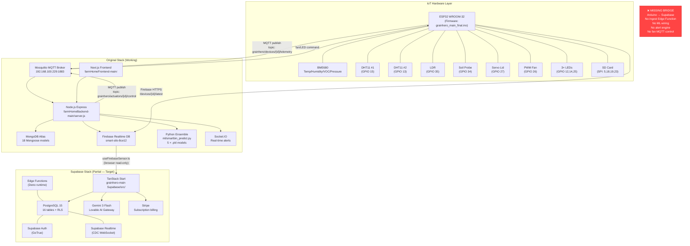

### 1.2 IoT Data Flow — Original vs. Target

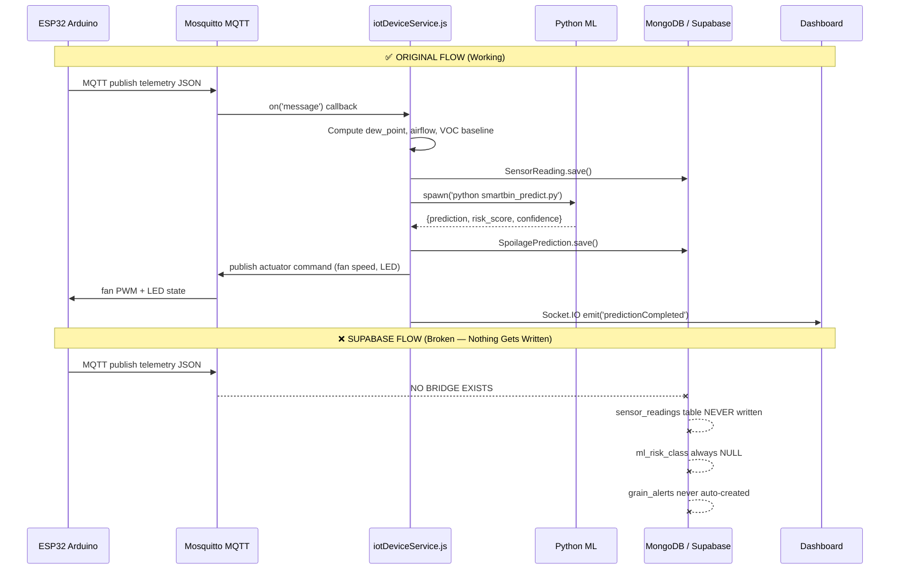

### 1.3 Target Supabase Data Flow (After Migration)

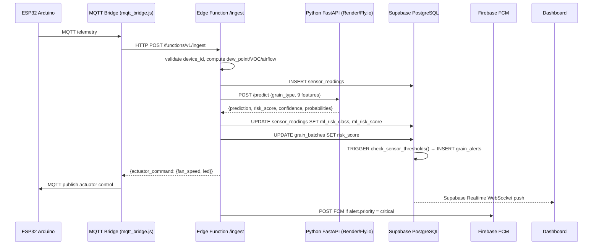

---

## Part 2 — Codebase File Map (Both Stacks)

### 2.1 Original Backend — Critical Files

| File | Lines | Purpose | Migration Status |
|---|---|---|---|
| [server.js](file:///c:/Users/Nexgen/Downloads/FYP/Grainhero/farmHomeBackend-main/server.js) | ~300 | App entry, starts 5 background services | Reference only |
| [routes/aiSpoilage.js](file:///c:/Users/Nexgen/Downloads/FYP/Grainhero/farmHomeBackend-main/routes/aiSpoilage.js) | **1,990** | ML prediction, fan control, SHAP, advisories | ❌ NOT PORTED |
| [routes/iot.js](file:///c:/Users/Nexgen/Downloads/FYP/Grainhero/farmHomeBackend-main/routes/iot.js) | 805 | MQTT bridge, Firebase sync, telemetry cache | ❌ NOT PORTED |
| [services/iotDeviceService.js](file:///c:/Users/Nexgen/Downloads/FYP/Grainhero/farmHomeBackend-main/services/iotDeviceService.js) | ~400 | MQTT subscriber loop | ❌ MISSING in Supabase |
| [services/aiSpoilageService.js](file:///c:/Users/Nexgen/Downloads/FYP/Grainhero/farmHomeBackend-main/services/aiSpoilageService.js) | ~600 | Python subprocess orchestration | ❌ MISSING in Supabase |
| [services/alertService.js](file:///c:/Users/Nexgen/Downloads/FYP/Grainhero/farmHomeBackend-main/services/alertService.js) | ~300 | Threshold alert engine | ❌ MISSING in Supabase |
| [services/deviceHealthService.js](file:///c:/Users/Nexgen/Downloads/FYP/Grainhero/farmHomeBackend-main/services/deviceHealthService.js) | ~200 | Heartbeat watchdog, cron | ❌ MISSING in Supabase |
| [models/SensorReading.js](file:///c:/Users/Nexgen/Downloads/FYP/Grainhero/farmHomeBackend-main/models/SensorReading.js) | ~500 | IoT schema + pre-save hook (dew point, VOC) | ⚠️ Schema ported, hook missing |
| [ml/smartbin_predict.py](file:///c:/Users/Nexgen/Downloads/FYP/Grainhero/farmHomeBackend-main/ml/smartbin_predict.py) | ~150 | Inference runner (9-feature) | ❌ Not deployed for Supabase |
| [ml/ensemble_train.py](file:///c:/Users/Nexgen/Downloads/FYP/Grainhero/farmHomeBackend-main/ml/ensemble_train.py) | ~300 | XGB+RF+LGBM training with Optuna | Reference |
| [ml/generate_per_grain.py](file:///c:/Users/Nexgen/Downloads/FYP/Grainhero/farmHomeBackend-main/ml/generate_per_grain.py) | ~200 | Synthetic dataset generator | Reference |
| [ml/shap_explain.py](file:///c:/Users/Nexgen/Downloads/FYP/Grainhero/farmHomeBackend-main/ml/shap_explain.py) | ~100 | SHAP explainability (never called in prod) | ❌ NOT wired |
| [configs/risk-thresholds.js](file:///c:/Users/Nexgen/Downloads/FYP/Grainhero/farmHomeBackend-main/configs/risk-thresholds.js) | ~50 | Grain-specific threshold config | Must port to Supabase |
| [.env](file:///c:/Users/Nexgen/Downloads/FYP/Grainhero/farmHomeBackend-main/.env) | ~30 | MongoDB, Firebase, Stripe, MQTT keys | Reference for Supabase secrets |

### 2.2 Original Frontend — Critical Files

| File | Purpose | Status |
|---|---|---|
| [app/\[locale\]/dashboard/page.tsx](file:///c:/Users/Nexgen/Downloads/FYP/Grainhero/farmHomeFrontend-main/) | Main KPI dashboard | Superseded by TanStack version |
| [app/\[locale\]/ai-predictions/page.tsx](file:///c:/Users/Nexgen/Downloads/FYP/Grainhero/farmHomeFrontend-main/) | ML predictions UI | Superseded |
| [app/\[locale\]/grain-alerts/page.tsx](file:///c:/Users/Nexgen/Downloads/FYP/Grainhero/farmHomeFrontend-main/) | Alert center | Superseded |

### 2.3 Supabase Stack — Critical Files

| File | Lines | Purpose | Critical Issues |
|---|---|---|---|
| [src/lib/analytics.functions.ts](file:///c:/Users/Nexgen/Downloads/FYP/Grainhero/grainhero-main%20(Supabase)/grainhero-main/src/lib/analytics.functions.ts) | 286 | KPI aggregations, JS risk heuristic | **BUG L209**: `current_stock_kg` → should be `current_occupancy_kg` |
| [src/lib/operations.functions.ts](file:///c:/Users/Nexgen/Downloads/FYP/Grainhero/grainhero-main%20(Supabase)/grainhero-main/src/lib/operations.functions.ts) | 985 | CRUD for all entities | Missing IoT ingest path |
| [src/lib/ai-insights.functions.ts](file:///c:/Users/Nexgen/Downloads/FYP/Grainhero/grainhero-main%20(Supabase)/grainhero-main/src/lib/ai-insights.functions.ts) | ~200 | Gemini LLM insights | No real ML — LLM only |
| [src/lib/monitoring.functions.ts](file:///c:/Users/Nexgen/Downloads/FYP/Grainhero/grainhero-main%20(Supabase)/grainhero-main/src/lib/monitoring.functions.ts) | ~300 | Alerts, incidents | Alert creation never triggered |
| [src/hooks/useFirebaseSensor.ts](file:///c:/Users/Nexgen/Downloads/FYP/Grainhero/grainhero-main%20(Supabase)/grainhero-main/src/hooks/useFirebaseSensor.ts) | ~100 | Firebase RTDB read (browser-only) | Read only; nothing writes to Supabase |
| [src/hooks/useRealtimeInvalidate.ts](file:///c:/Users/Nexgen/Downloads/FYP/Grainhero/grainhero-main%20(Supabase)/grainhero-main/src/hooks/useRealtimeInvalidate.ts) | ~50 | React Query invalidation on Realtime | Works, but nothing triggers it from IoT |
| [supabase/migrations/20260707180839_*.sql](file:///c:/Users/Nexgen/Downloads/FYP/Grainhero/grainhero-main%20(Supabase)/grainhero-main/supabase/migrations/) | ~700 | Core 16-table schema + RLS policies | Complete and correct |
| [src/lib/firebase-admin.server.ts](file:///c:/Users/Nexgen/Downloads/FYP/Grainhero/grainhero-main%20(Supabase)/grainhero-main/src/lib/firebase-admin.server.ts) | ~80 | Firebase Admin SDK (skeleton) | FCM tokens stored but NEVER sent to |

### 2.4 Arduino Firmware — Critical Sections

| Section | Lines | Notes |
|---|---|---|
| [MQTT config](file:///c:/Users/Nexgen/Downloads/FYP/Grainhero/grainhero_main_final.ino#L36-L39) | 36–39 | Broker IP hardcoded: `192.168.100.229:1883` |
| [Sensor pins](file:///c:/Users/Nexgen/Downloads/FYP/Grainhero/grainhero_main_final.ino#L106-L125) | 106–125 | DHT11×2, LDR, Soil, Servo, PWM, LEDs |
| [LidFanState machine](file:///c:/Users/Nexgen/Downloads/FYP/Grainhero/grainhero_main_final.ino#L68-L77) | 68–77 | STATE_IDLE_CLOSED → … → STATE_CLOSING_LID |
| [Human override](file:///c:/Users/Nexgen/Downloads/FYP/Grainhero/grainhero_main_final.ino#L60-L94) | 60–94 | 10-min auto-release timeout |
| [Soil→grain moisture](file:///c:/Users/Nexgen/Downloads/FYP/Grainhero/grainhero_main_final.ino#L21-L24) | 21–24 | `mapFloat(soil%, 0,100, 8.0,25.0)` |

---

## Part 3 — Feature Gap Analysis

### 3.1 Gap Summary by Priority

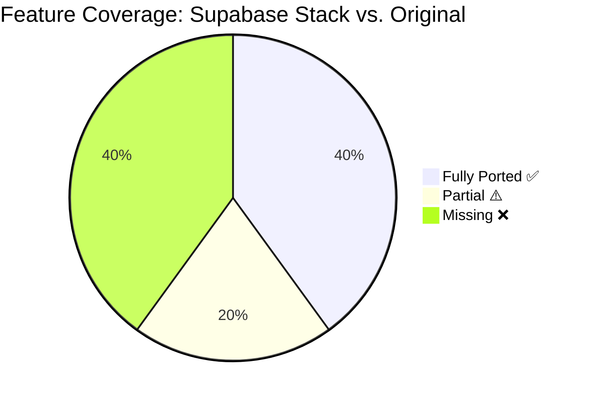

### 3.2 P0 Blockers (System Non-Functional Without These)

| # | Gap | Original Location | Supabase Location | Fix Required |
|---|---|---|---|---|
| P0-1 | **IoT ingest path** — Arduino data never reaches Supabase | [iotDeviceService.js](file:///c:/Users/Nexgen/Downloads/FYP/Grainhero/farmHomeBackend-main/services/iotDeviceService.js) | ❌ Does not exist | Create `supabase/functions/ingest/index.ts` |
| P0-2 | **ML predictions never run** — `ml_risk_class` always NULL | [aiSpoilageService.js](file:///c:/Users/Nexgen/Downloads/FYP/Grainhero/farmHomeBackend-main/services/aiSpoilageService.js) | [analytics.functions.ts](file:///c:/Users/Nexgen/Downloads/FYP/Grainhero/grainhero-main%20(Supabase)/grainhero-main/src/lib/analytics.functions.ts) | Deploy Python FastAPI + wire from Edge Function |
| P0-3 | **Alerts never auto-created** | [alertService.js](file:///c:/Users/Nexgen/Downloads/FYP/Grainhero/farmHomeBackend-main/services/alertService.js) | ❌ Does not exist | Add `AFTER INSERT` trigger on `sensor_readings` |
| P0-4 | **Schema bug — runtime crash** | N/A | [analytics.functions.ts L209](file:///c:/Users/Nexgen/Downloads/FYP/Grainhero/grainhero-main%20(Supabase)/grainhero-main/src/lib/analytics.functions.ts) | `current_stock_kg` → `current_occupancy_kg` |

### 3.3 P1 Core Features

| # | Gap | Original Location | Fix |
|---|---|---|---|
| P1-1 | Fan/actuator control (no MQTT publish from Supabase) | [aiSpoilage.js#sendMLActuatorCommand](file:///c:/Users/Nexgen/Downloads/FYP/Grainhero/farmHomeBackend-main/routes/aiSpoilage.js) | Return actuator_command from Edge Function → bridge publishes |
| P1-2 | Dew point computation missing | [SensorReading.js pre-save hook](file:///c:/Users/Nexgen/Downloads/FYP/Grainhero/farmHomeBackend-main/models/SensorReading.js) | Compute in Edge Function: `T - ((100-RH)/5)` |
| P1-3 | VOC rolling baseline missing | [SensorReading.js pre-save hook](file:///c:/Users/Nexgen/Downloads/FYP/Grainhero/farmHomeBackend-main/models/SensorReading.js) | Postgres function `compute_voc_baseline(silo_id, hours)` |
| P1-4 | Device heartbeat watchdog missing | [deviceHealthService.js](file:///c:/Users/Nexgen/Downloads/FYP/Grainhero/farmHomeBackend-main/services/deviceHealthService.js) | `pg_cron` every 5 min → set `status='offline'` |
| P1-5 | FCM push notifications never sent | [notificationService.js](file:///c:/Users/Nexgen/Downloads/FYP/Grainhero/farmHomeBackend-main/services/notificationService.js) | Edge Function on `grain_alerts` INSERT |
| P1-6 | PDF generation missing | [pdfService.js](file:///c:/Users/Nexgen/Downloads/FYP/Grainhero/farmHomeBackend-main/services/pdfService.js) | Edge Function using `pdf-lib` (Deno-compatible) |

### 3.4 Missing Database Tables

| Missing Table | Original Source | Impact | SQL to Add |
|---|---|---|---|
| `activity_logs` | [models/ActivityLog.js](file:///c:/Users/Nexgen/Downloads/FYP/Grainhero/farmHomeBackend-main/models/ActivityLog.js) | No audit trail | New migration required |
| `ml_predictions_history` | [models/SpoilagePrediction.js](file:///c:/Users/Nexgen/Downloads/FYP/Grainhero/farmHomeBackend-main/models/SpoilagePrediction.js) | No prediction audit | New migration required |
| `weather_readings` | [services/weatherService.js](file:///c:/Users/Nexgen/Downloads/FYP/Grainhero/farmHomeBackend-main/services/) | No aeration decision context | New migration required |
| `notification_log` | [services/notificationService.js](file:///c:/Users/Nexgen/Downloads/FYP/Grainhero/farmHomeBackend-main/services/) | No push history | New migration required |
| `offline_buffer` | SD card sync | No offline catchup | New migration required |
| `training_samples` | [services/mlDataCollectionService.js](file:///c:/Users/Nexgen/Downloads/FYP/Grainhero/farmHomeBackend-main/services/) | No real data accumulation | New migration required |
| `maintenance_records` | [routes/maintenance.js](file:///c:/Users/Nexgen/Downloads/FYP/Grainhero/farmHomeBackend-main/routes/) | No service history | New migration required |
| `orders` | [routes/orders.js](file:///c:/Users/Nexgen/Downloads/FYP/Grainhero/farmHomeBackend-main/routes/) | No grain sale tracking | New migration required |

---

## Part 4 — ML Pipeline (Full Specification)

### 4.1 Ensemble Architecture

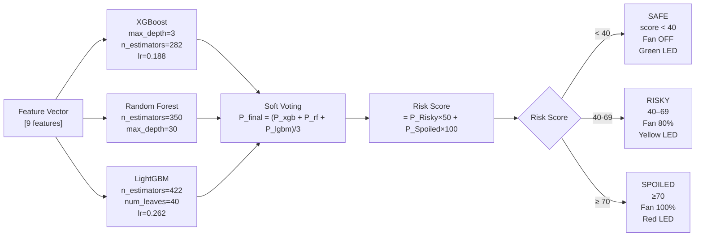

### 4.2 9 Feature Vector — Sources & Current Gaps

| # | Feature | Source | Grain-Safe Range (Wheat) | Current Gap |
|---|---|---|---|---|
| 1 | Temperature | BME680 + avg(DHT11×2) | ≤ 25°C | ✅ Real sensor |
| 2 | Humidity | BME680 + avg(DHT11×2) | ≤ 65% RH | ✅ Real sensor |
| 3 | Storage_Days | `now() - batch.intake_date` | 0–365 | ✅ Computed from DB |
| 4 | Airflow | `fan_duty_cycle / 100` | 0–1 | ✅ From actuator state |
| 5 | Dew_Point | `T - ((100-RH)/5)` Magnus | Keep < grain T - 3°C | ⚠️ Not computed in Supabase |
| 6 | Ambient_Light | LDR → `mapFloat(0,4095,0,100)` | 0–100% | ✅ Real sensor |
| 7 | Pest_Presence | **PLACEHOLDER = 0.0 always** | 0–1 | ❌ No sensor — use VOC proxy |
| 8 | Grain_Moisture | Soil probe → `mapFloat(0,100,8,25)` | 10–13.5% | ⚠️ Proxy only — needs calibration |
| 9 | Rainfall | **Weather API — placeholder 0.0** | 0–50mm | ❌ Not wired |

### 4.3 Trained Performance (Rice Ensemble — from model_metadata.json)

| Model | Accuracy | F1-Score | CV Mean | CV Std |
|---|---|---|---|---|
| XGBoost | 98.68% | 98.68% | 98.57% | ±0.32% |
| Random Forest | 96.20% | 96.18% | 96.23% | ±0.41% |
| LightGBM | **99.15%** | **99.15%** | 98.57% | ±0.13% |
| **Ensemble (soft vote)** | **98.68%** | **98.68%** | **98.36%** | ±0.24% |

> ⚠️ **Real-world accuracy caveat**: All figures are on synthetic test data from [ml/generate_per_grain.py](file:///c:/Users/Nexgen/Downloads/FYP/Grainhero/farmHomeBackend-main/ml/generate_per_grain.py). Expected real-world accuracy: **70–85%** (distribution shift).

### 4.4 Feature Importance (From model_metadata.json)

| Rank | Feature | Importance | SHAP Weight |
|---|---|---|---|
| 1 | Temperature | 417.4 | 20.5% |
| 2 | Grain_Moisture | 413.8 | 20.3% |
| 3 | Humidity | 363.4 | 17.8% |
| 4 | Storage_Days | 344.8 | 16.9% |
| 5 | Dew_Point | 327.4 | 16.1% |
| 6 | Airflow | 215.4 | 10.6% |
| 7 | Pest_Presence | 156.4 | 7.7% |
| 8 | Ambient_Light | 151.7 | 7.4% |
| 9 | Rainfall | 123.5 | 6.1% |

### 4.5 Known ML Issues (from GRAINHERO_COMPLETE_CONTEXT.md)

| Issue | Location | Impact |
|---|---|---|
| Synthetic bias — model reverse-engineers generator math | [ml/generate_per_grain.py](file:///c:/Users/Nexgen/Downloads/FYP/Grainhero/farmHomeBackend-main/ml/generate_per_grain.py) | 97% accuracy is misleading |
| FastAPI vector mismatch — SmartBin expects 4 features, ensemble needs 9 | [SmartBin-RiceSpoilage-main/](file:///c:/Users/Nexgen/Downloads/FYP/Grainhero/SmartBin-RiceSpoilage-main/) vs [ml/smartbin_predict.py](file:///c:/Users/Nexgen/Downloads/FYP/Grainhero/farmHomeBackend-main/ml/smartbin_predict.py) | Two incompatible APIs |
| Static weather defaults — Grain_Moisture=12.0, Pest_Presence=0 hardcoded | [services/mlDataCollectionService.js](file:///c:/Users/Nexgen/Downloads/FYP/Grainhero/farmHomeBackend-main/services/) | Corrupts training data |
| Validation pipeline unused — all predictions stay `pending` forever | [models/SpoilagePrediction.js](file:///c:/Users/Nexgen/Downloads/FYP/Grainhero/farmHomeBackend-main/models/SpoilagePrediction.js) | No closed-loop feedback |
| SHAP never called in production | [ml/shap_explain.py](file:///c:/Users/Nexgen/Downloads/FYP/Grainhero/farmHomeBackend-main/ml/shap_explain.py) | No explainability in UI |

---

## Part 5 — Migration Roadmap

### 5.1 Sprint Overview

```mermaid
gantt
    title GrainHero Migration Roadmap
    dateFormat DD
    axisFormat Day %d

    section Sprint 0 · Setup
    Fix current_stock_kg bug           :crit, done, s0a, 01, 1d
    Local Supabase + Edge Fn setup     :crit, s0b, 01, 1d

    section Sprint 1 · IoT Ingest
    Edge Function /ingest (raw)        :crit, s1a, 02, 2d
    Dew point + VOC + airflow compute  :s1b, 04, 1d
    MQTT bridge microservice           :s1c, 04, 2d
    Verify data in sensor_readings     :s1d, 06, 1d

    section Sprint 2 · Python ML
    FastAPI ml_service/main.py         :crit, s2a, 07, 2d
    Deploy to Render/Fly.io            :s2b, 09, 1d
    Wire Edge Fn → ML → DB update     :s2c, 10, 2d
    Test all 5 grain types             :s2d, 12, 1d

    section Sprint 3 · Alerts + Control
    PostgreSQL threshold trigger       :crit, s3a, 13, 2d
    Fan actuator MQTT command return   :s3b, 15, 1d
    pg_cron heartbeat watchdog         :s3c, 15, 1d
    FCM push Edge Function             :s3d, 16, 2d

    section Sprint 4 · Business
    Missing schema tables migration    :s4a, 18, 1d
    PDF Edge Function (pdf-lib)        :s4b, 19, 2d
    Weather API cron                   :s4c, 21, 1d
    QR code generation                 :s4d, 22, 1d

    section Sprint 5 · Launch
    End-to-end integration test        :s5a, 23, 2d
    RLS penetration test               :s5b, 25, 1d
    Production Supabase project        :s5c, 26, 1d
```

### 5.2 Files to Create (New)

| File to Create | Sprint | Purpose |
|---|---|---|
| `supabase/functions/ingest/index.ts` | 1 | IoT sensor data ingest endpoint |
| `mqtt_bridge.js` (root or separate service) | 1 | MQTT → Edge Function bridge |
| `ml_service/main.py` | 2 | FastAPI wrapper for all 5 .pkl models |
| `ml_service/requirements.txt` | 2 | `fastapi uvicorn joblib xgboost lightgbm scikit-learn` |
| `ml_service/Dockerfile` | 2 | For Fly.io deployment |
| `supabase/functions/notify/index.ts` | 3 | FCM push on grain_alerts INSERT |
| `supabase/functions/generate-pdf/index.ts` | 4 | PDF generation using pdf-lib |
| `supabase/functions/fetch-weather/index.ts` | 4 | OpenWeather API cron |
| `supabase/migrations/20260711_missing_tables.sql` | 4 | activity_logs, ml_predictions_history, etc. |

### 5.3 Files to Modify (Existing)

| File | Change | Sprint |
|---|---|---|
| [analytics.functions.ts L209](file:///c:/Users/Nexgen/Downloads/FYP/Grainhero/grainhero-main%20(Supabase)/grainhero-main/src/lib/analytics.functions.ts) | `current_stock_kg` → `current_occupancy_kg` | 0 |
| [grainhero_main_final.ino L36](file:///c:/Users/Nexgen/Downloads/FYP/Grainhero/grainhero_main_final.ino) | Add HTTP POST to Edge Function alongside Firebase | 1 |
| [operations.functions.ts](file:///c:/Users/Nexgen/Downloads/FYP/Grainhero/grainhero-main%20(Supabase)/grainhero-main/src/lib/operations.functions.ts) | Add manual fan control → MQTT publish path | 3 |

---

## Part 6 — IoT Architecture

### 6.1 Current Hardware

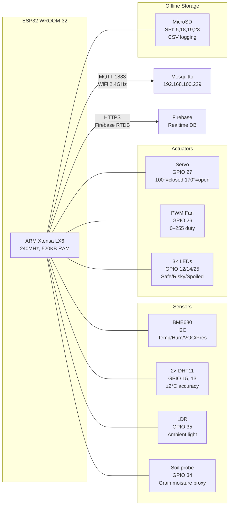

### 6.2 Target: LoRaWAN Floating Pod

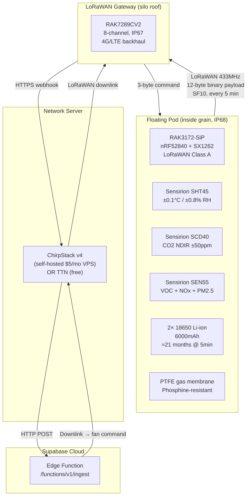

### 6.3 Battery Life Calculation

| Interval | Daily Cycles | Energy/day | Battery Life (6000mAh) |
|---|---|---|---|
| 5 minutes | 288 | 8.0 mAh | **21 months** |
| 10 minutes | 144 | 4.0 mAh | **42 months** |
| 15 minutes | 96 | 2.7 mAh | **60 months** |

---

## Part 7 — Silo Engineering

### 7.1 100-Tonne Pilot Silo Geometry

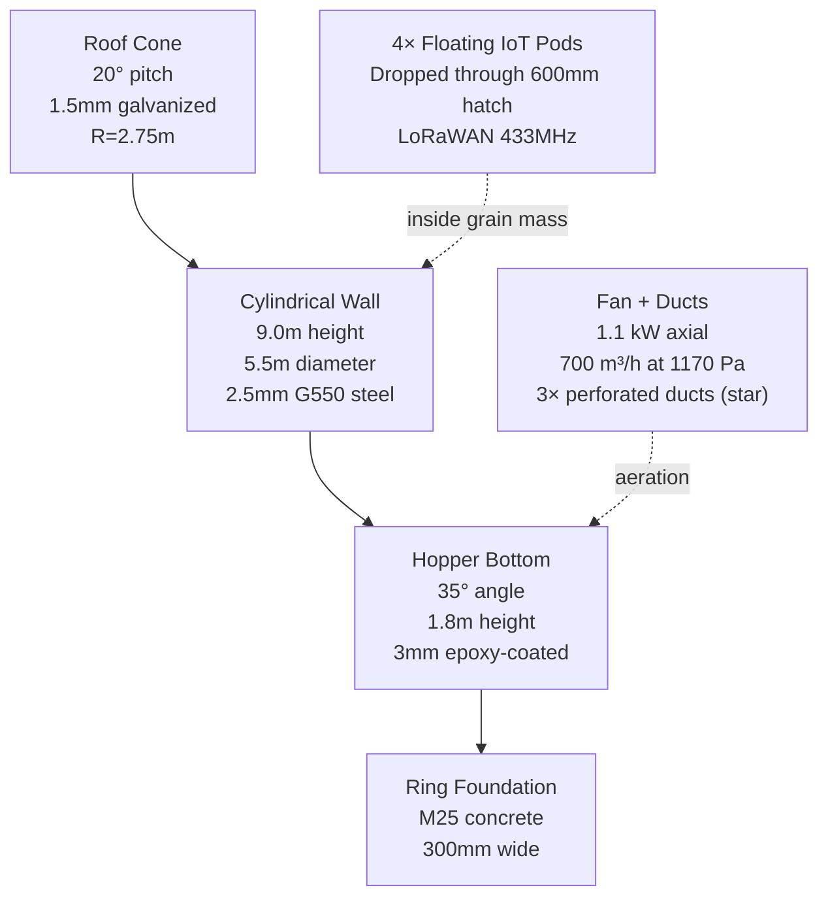

### 7.2 Bill of Materials Summary

| Category | Items | Cost (Rs.) | Cost (USD) |
|---|---|---|---|
| Silo structure (panels, roof, hopper, foundation) | 14 line items | ~581,000 | ~$2,075 |
| IoT equipment (pods × 4, gateway, relay, UPS) | 5 line items | ~130,000 | ~$464 |
| Installation labor | 3 line items | ~90,000 | ~$321 |
| **Grand Total** | | **~801,000** | **~$2,861** |

### 7.3 Aeration Safety Formula

```
Safe to aerate only when ALL conditions true:
  1. dew_point_outside = T_outside - ((100 - RH_outside) / 5)
  2. dew_point_outside < (grain_temperature - 3°C)
  3. is_raining == FALSE
  4. outside_humidity < 80%
  5. ml_risk IN ('Risky', 'Spoiled')

Best window in Pakistan summer: 02:00–06:00 local time
```

---

## Part 8 — Business Feasibility

### 8.1 Market Sizing

| Market | Sites | ARPU | SAM | SOM Year 3 |
|---|---|---|---|---|
| Pakistan | 2,500 modern | $1,200/yr | $3.0M | $225K ARR |
| Middle East | 5,000 sites | $8,000/yr | $40M | $400K ARR |
| Africa | 50,000 sites | $800/yr | $40M | $240K ARR |

### 8.2 Competitive Position

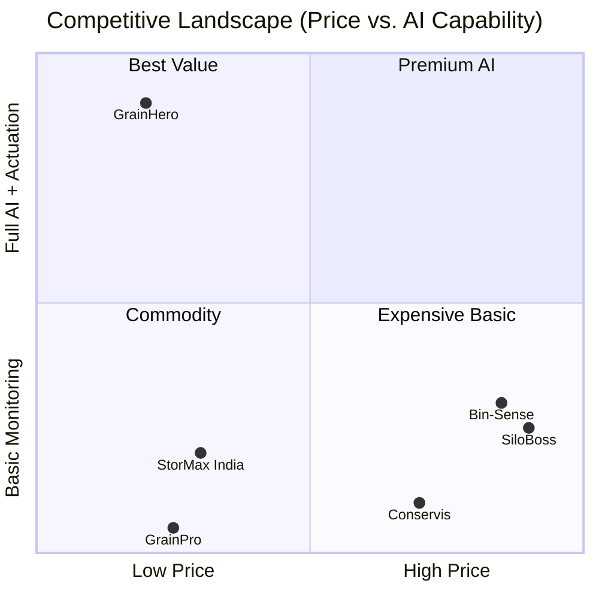

### 8.3 Unit Economics

| Metric | Value |
|---|---|
| ARPU Professional | $99/month → $1,188/year |
| Hardware COGS (4 pods + gateway) | ~$150 one-time |
| Cloud cost per customer/month | $3–5 |
| **Gross margin (at scale)** | **~82%** |
| CAC (Pakistan direct sales) | $150–400 |
| LTV (3-year, 85% retention) | $3,018 |
| LTV / CAC ratio | 7–20× |
| **Break-even customers** | **11** |

---

## Part 9 — Risk Analysis

### 9.1 Top 10 Risks by Severity

| Rank | Risk | Probability | Impact | Score | Fix |
|---|---|---|---|---|---|
| 1 | IoT → Supabase: no data path | Very High | Critical | **25** | Sprint 1: `/ingest` Edge Function |
| 2 | Schema bug `current_stock_kg` crashes analytics | Very High | High | **20** | Sprint 0: 1-line fix |
| 3 | Model distribution shift (synthetic → real data) | Very High | High | **20** | Collect real data from pilot silo |
| 4 | Render free tier ML service sleeping (30s cold start) | High | High | **16** | Fly.io $7/mo or Render paid |
| 5 | Wet grain intake (>14% moisture) not enforced | High | Critical | **20** | UI intake gate + DB constraint |
| 6 | Condensation on silo walls | High | Critical | **20** | Aeration timing formula |
| 7 | Operator ignores AI alert | High | High | **16** | 30-min escalation to manager |
| 8 | Pest_Presence always 0 (no sensor) | Very High | Medium | **15** | VOC proxy or acoustic sensor |
| 9 | Key engineer leaves (bus factor) | Medium | Critical | **15** | This document + pair programming |
| 10 | False negative: Spoiled classified as Safe | Medium | Critical | **15** | Rule-based fallback + human confirm |

---

## Part 10 — Effort Estimation

### 10.1 Sprint Breakdown

| Sprint | Days | Engineers | Key Deliverables |
|---|---|---|---|
| 0 — Setup + schema fix | 1 | 1 | Schema bug fixed; local Supabase working |
| 1 — IoT ingest + MQTT bridge | 4 | 2 | Arduino data in `sensor_readings` table |
| 2 — Python ML microservice | 4 | 2 | Real ML in `ml_risk_class`, `ml_risk_score` |
| 3 — Alerts + fan control + FCM | 4 | 2 | Alerts auto-fire; fan responds to ML; phone notifications |
| 4 — Business features | 5 | 1 | PDF, weather API, QR, missing tables |
| 5 — Testing + production | 3 | 2 | E2E test pass; Fly.io ML deployed |
| **Total** | **21 days** | **2** | **Full P0+P1 parity** |

### 10.2 Minimum Viable Demo (3 Days)

For a working investor demo in 3 days:
1. **Day 1**: Fix schema bug + create `/ingest` Edge Function (raw data only)
2. **Day 2**: Wire MQTT bridge → live data on dashboard via Realtime
3. **Day 3**: Add JS heuristic alert trigger → show live sensor + alert on phone

**Result**: Live sensors → Supabase → Dashboard → Alert. No real ML yet. Sufficient for demo.

---

## Part 11 — Dataset Catalog

### 11.1 Training Data — Currently In Use

| File | Location | Rows | Notes |
|---|---|---|---|
| `rice_spoilage_10k.csv` | [ml/](file:///c:/Users/Nexgen/Downloads/FYP/Grainhero/farmHomeBackend-main/ml/) | 10,644 | **Synthetic** — generated by `generate_per_grain.py` |
| `wheat_spoilage_10k.csv` | [ml/](file:///c:/Users/Nexgen/Downloads/FYP/Grainhero/farmHomeBackend-main/ml/) | ~10,000 | **Synthetic** |
| `maize_spoilage_10k.csv` | [ml/](file:///c:/Users/Nexgen/Downloads/FYP/Grainhero/farmHomeBackend-main/ml/) | ~10,000 | **Synthetic** |
| `sorghum_spoilage_10k.csv` | [ml/](file:///c:/Users/Nexgen/Downloads/FYP/Grainhero/farmHomeBackend-main/ml/) | ~10,000 | **Synthetic** |
| `barley_spoilage_10k.csv` | [ml/](file:///c:/Users/Nexgen/Downloads/FYP/Grainhero/farmHomeBackend-main/ml/) | ~10,000 | **Synthetic** |
| `smartbin_rice_storage_data_enhanced.csv` | [SmartBin-RiceSpoilage-main/](file:///c:/Users/Nexgen/Downloads/FYP/Grainhero/SmartBin-RiceSpoilage-main/) | **320** | Original legacy dataset (4-feature, real) |

### 11.2 External Datasets — Directly Applicable

#### Tabular / Sensor Data (for ML training augmentation)

| Dataset | Source | Features | Rows | Access | Relevance to GrainHero |
|---|---|---|---|---|---|
| Smart Agriculture Dataset | [Kaggle: sankha1998/smart-agriculture-dataset](https://www.kaggle.com/datasets/sankha1998/smart-agriculture-dataset) | Temp, humidity, moisture index (MOI) | 16,000+ | Free | Drop-in features for ensemble retraining |
| Multi-Param Fruit Spoilage (Mendeley) | [doi: 10.17632/v6998c7674.1](https://doi.org/10.17632/v6998c7674.1) | Temp, humidity, light, CO2 → class | ~5,000 | Free | Feature engineering reference |
| Grain Granary Temp/Moisture (MDPI 2024) | [MDPI Agronomy 2024](https://www.mdpi.com/2073-4395/15/3/305) | Temp, moisture, time series | 186,000+ | Open-access | Time-series training for temporal model |
| Rice Storage Conditions | [Zenodo — search "grain storage monitoring"](https://zenodo.org/) | Temp, humidity, CO2, moisture | Varies | Open | Supplements synthetic rice data |
| IoT Food Environment Dataset | [Google Dataset Search](https://datasetsearch.research.google.com/) | Multi-sensor time series | Varies | Free | General IoT sensor baseline |

#### Post-Harvest Loss Data (for business & market validation)

| Dataset | Source | Type | Use |
|---|---|---|---|
| FAOSTAT — SDG 12.3.1a Food Loss | [fao.org/faostat](https://www.fao.org/faostat/en/) | CSV export | Pakistan wheat/rice loss % by year |
| FAO Food Loss & Waste Database | [fao.org/data](https://www.fao.org/data/en/) | Query interface + CSV | Loss rates by country, commodity, stage |
| Pakistan Crop Information Portal | [cropinformationportal.pk](https://cropinformationportal.pk/) | Agro-meteo + production | Weather + crop yield data for Pakistan |
| USDA FAS GAIN Reports — Pakistan | [gain.fas.usda.gov](https://gain.fas.usda.gov/) | PDF + table exports | Pakistan grain trade, storage capacity |
| Open Data Pakistan | [opendata.com.pk](https://opendata.com.pk/) | CSV | Historical grain prices, production stats |

#### Acoustic Insect Detection (for Pest_Presence feature)

| Dataset | Source | Species | Access | Use |
|---|---|---|---|---|
| **SPID (Stored Product Insect Dataset)** | [Kaggle: A-SPIDS](https://www.kaggle.com/) | Cowpea beetle, flour beetle, mealworm | Free | Train CNN on ESP32 TFLite Micro |
| USDA Acoustic Grain Pest Dataset | [usda.gov — ARS research](https://www.ars.usda.gov/) | Rhyzopertha dominica, Tribolium castaneum, Sitophilus zeamais | Request | Gold standard for weevil detection |
| InsectSound1000 | [openagrar.de](https://www.openagrar.de/) | 12 insect species, 165,000+ files | Open | Pre-training acoustic CNN |

#### Weather Data (for Rainfall & Dew Point features)

| Source | API | Free Tier | Use |
|---|---|---|---|
| OpenWeatherMap | `api.openweathermap.org/data/2.5/weather` | 60 calls/min | Rainfall, outside temp/humidity for aeration decision |
| Open-Meteo | `api.open-meteo.com/v1/forecast` | Unlimited (CC license) | Free historical + forecast; no API key |
| Pakistan Met Dept | [pmd.gov.pk](http://www.pmd.gov.pk/) | Manual download | Historical Lahore/Karachi/Multan climate data |

#### Aflatoxin / Mycotoxin Data (future roadmap)

| Dataset | Source | Features | Use |
|---|---|---|---|
| Aflatoxin VOC marker study | NIH PubMed (search "aflatoxin VOC grain") | VOC compounds, HPLC aflatoxin B1 | Train VOC fingerprinting model |
| Kenya Aflatoxin Database | [CIMMYT research](https://www.cimmyt.org/) | Maize T/H/moisture + aflatoxin ppm | Africa market model |
| EU Rapid Alert System (RASFF) | [ec.europa.eu/food/safety/rasff](https://ec.europa.eu/food/safety/rasff_en) | Grain rejections + aflatoxin levels | Export compliance training data |

### 11.3 How to Use These Datasets

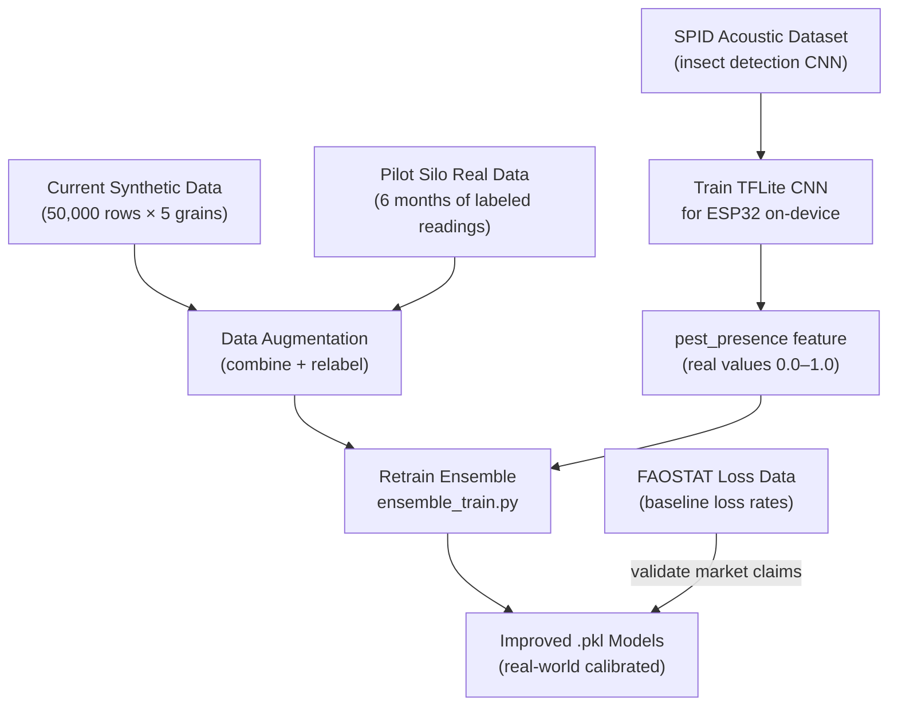

### 11.4 Recommended Dataset Priority

| Priority | Dataset | Action | Timeline |
|---|---|---|---|
| **P0** | Pilot silo real sensor readings | Instrument first silo, log every 5 min, label weekly | Month 1–6 |
| **P1** | Kaggle Smart Agriculture (16K rows) | Download and merge with synthetic data | Week 1 |
| **P1** | OpenWeather API | Wire to `fetch-weather` Edge Function | Sprint 4 |
| **P2** | FAOSTAT Pakistan loss data | Use for ROI calculation in sales materials | Month 1 |
| **P2** | SPID acoustic dataset | Train insect detection CNN for ESP32 | Month 3–4 |
| **P3** | USDA acoustic grain pest data | Improve CNN species coverage | Month 6+ |
| **P3** | Aflatoxin VOC marker data | Enable mycotoxin early warning | Year 2 |

---

## Part 12 — Open Questions (Decision Required Before Implementation)

| # | Question | Options | Recommendation |
|---|---|---|---|
| 1 | Where to host Python ML service? | Render ($7/mo) vs. Fly.io ($5–10/mo) vs. self-hosted | **Fly.io** — lower cold-start latency, easy scaling |
| 2 | LoRaWAN network server? | ChirpStack (self-host) vs. TTN (community free) | **ChirpStack on VPS** — full control over data |
| 3 | Supabase Cloud vs. self-hosted? | Cloud ($25/mo Pro) vs. Docker self-host | **Supabase Cloud** until 100+ customers |
| 4 | First pilot customer type? | Flour mill vs. cooperative vs. government | **Flour mill** — fastest decision, highest WTP |
| 5 | Mobile app strategy? | Rebuild PWA for Supabase vs. keep Flutter/Firebase | **PWA first** — no app store friction |
| 6 | Real training data source? | PARC partnership vs. instrument pilot silo | **Instrument pilot silo first** — own the data |
| 7 | Hermetic bag variant? | Build now vs. post-launch | **Proof-of-concept** with current pods (no O2 sensor) |
| 8 | Flutter app (mobile)? | Connect to Supabase vs. keep Firebase | Needs decision — Firebase approach diverges from Supabase |

---

*Generated 2026-07-10 from complete reading of both codebases, Arduino firmware, ML pipeline, 12 research papers, and business documents.*  
*No code was modified during this analysis.*  
*This document supersedes all prior docs in `GrainHero_Docs/` and `docs/` folders.*
