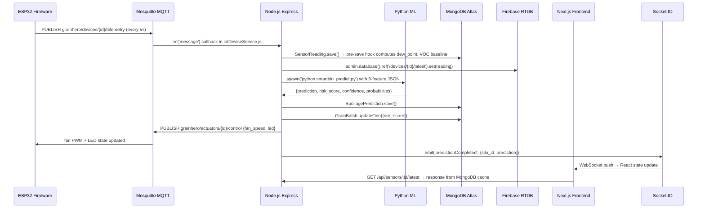
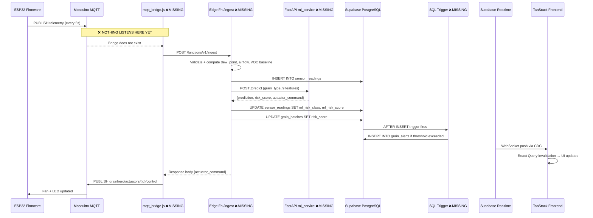
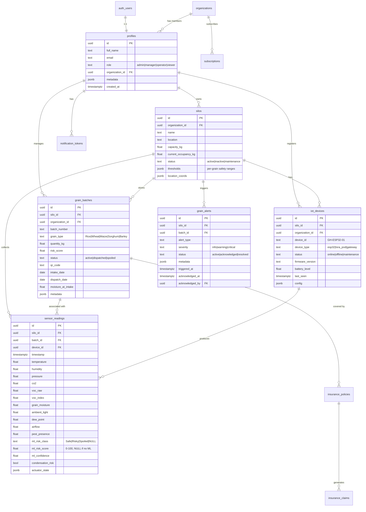
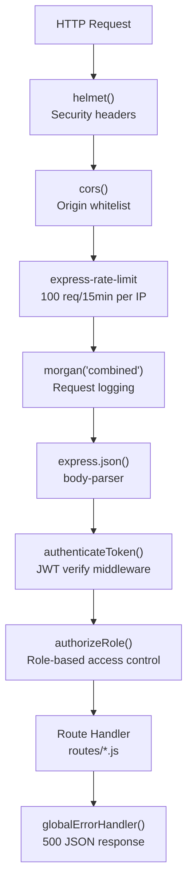
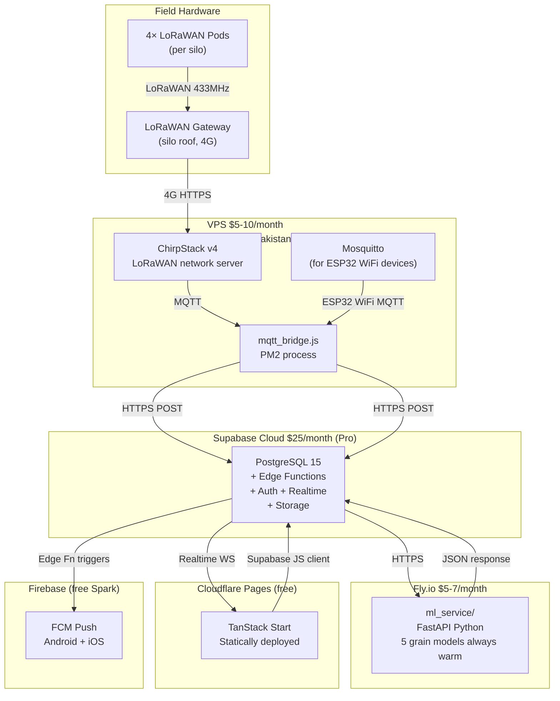
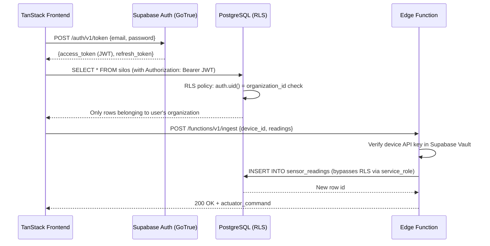

# GrainHero — Full Architecture Overview
## Both Stacks: Data Flow · Service Map · Schema · Middleware · Environment Vars

> **Status**: Discovery only — no code modified  
> **Reference**: [00_MASTER_ANALYSIS.md](file:///c:/Users/Nexgen/Downloads/FYP/Grainhero/docs/00_MASTER_ANALYSIS.md)

---

## 1. Full System Data Flow (Original Stack — Working)



---

## 2. Full System Data Flow (Supabase Stack — Target, Partially Broken)



---

## 3. Folder Structure — Both Stacks

```
Grainhero/                          ← Workspace root
│
├── grainhero_main_final.ino        ← ESP32 firmware (1,871 lines, 57 KB)
│
├── farmHomeBackend-main/           ← Original Node.js API ✅ WORKING
│   ├── server.js                   ← Express app + MQTT + background services
│   ├── routes/                     ← 18 route files
│   │   ├── aiSpoilage.js           ← 1,990 lines — ML prediction + fan control + SHAP
│   │   ├── iot.js                  ← MQTT bridge + Firebase sync (805 lines)
│   │   ├── grainBatches.js         ← Grain batch CRUD + dispatch + spoilage events
│   │   ├── silos.js                ← Silo CRUD + thresholds
│   │   ├── alerts.js               ← Alert acknowledge/resolve
│   │   ├── insurance.js            ← Policies + claims + payments
│   │   └── ...
│   ├── models/                     ← 18 Mongoose schemas
│   │   ├── SensorReading.js        ← Pre-save hook: dew_point, VOC baseline, airflow
│   │   ├── SpoilagePrediction.js   ← ML result with validation_status
│   │   ├── GrainBatch.js           ← Batch lifecycle + spoilage events
│   │   └── ...
│   ├── services/                   ← Background services (all always-on)
│   │   ├── iotDeviceService.js     ← MQTT subscriber loop
│   │   ├── aiSpoilageService.js    ← Python subprocess orchestration
│   │   ├── alertService.js         ← Threshold monitoring + auto-create
│   │   ├── deviceHealthService.js  ← Heartbeat watchdog (cron every 2 min)
│   │   ├── notificationService.js  ← Email/SMS/FCM dispatch
│   │   ├── pdfService.js           ← PDF generation (puppeteer/jsPDF)
│   │   ├── weatherService.js       ← OpenWeather API cron (every 5 min)
│   │   └── mlDataCollectionService.js ← Training sample accumulation
│   ├── ml/                         ← All Python ML code
│   │   ├── smartbin_predict.py     ← Inference runner (9-feature, 5 grains)
│   │   ├── ensemble_train.py       ← XGB+RF+LGBM training with Optuna
│   │   ├── generate_per_grain.py   ← Synthetic dataset generator
│   │   ├── shap_explain.py         ← SHAP explainability (never called in prod)
│   │   ├── *.pkl                   ← 15 trained model files (5 grains × 3 algos)
│   │   ├── *_10k.csv               ← 5 synthetic training datasets
│   │   └── *_metadata.json         ← Hyperparameters + feature importances
│   └── configs/
│       └── risk-thresholds.js      ← Per-grain threshold config
│
├── farmHomeFrontend-main/          ← Original Next.js frontend ✅ WORKING
│
├── grainhero-main (Supabase)/
│   └── grainhero-main/             ← Supabase target stack ⚠️ INCOMPLETE
│       ├── src/
│       │   ├── lib/
│       │   │   ├── analytics.functions.ts    ← BUG L209: current_stock_kg
│       │   │   ├── operations.functions.ts   ← CRUD for all entities
│       │   │   ├── monitoring.functions.ts   ← Alerts, incidents
│       │   │   ├── ai-insights.functions.ts  ← Gemini LLM advisory
│       │   │   ├── firebase-admin.server.ts  ← FCM skeleton (never sends)
│       │   │   └── stripe.server.ts          ← Stripe webhook handler ✅
│       │   ├── hooks/
│       │   │   ├── useFirebaseSensor.ts      ← Firebase RTDB browser read (read-only)
│       │   │   └── useRealtimeInvalidate.ts  ← React Query cache invalidation
│       │   └── routes/                       ← TanStack Start page routes
│       ├── supabase/
│       │   ├── migrations/                   ← 16-table schema + RLS ✅
│       │   └── functions/                    ← Edge Functions (none for IoT yet)
│       └── package.json
│
├── SmartBin-RiceSpoilage-main/     ← Legacy FastAPI ⚠️ DEPRECATED
│   └── app.py                      ← 4-feature, rice-only — do not use
│
├── awen files/                     ← Analysis docs (moved from root)
│   ├── GRAINHERO_COMPLETE_CONTEXT.md
│   ├── implementation_plan.md
│   └── ...
│
└── docs/                           ← This documentation folder
    ├── 00_EXECUTIVE_OVERVIEW.md
    ├── 00_MASTER_ANALYSIS.md       ← START HERE
    └── ...
```

---

## 4. Supabase Database Schema (16 Tables)



---

## 5. Environment Variables Reference

### Original Backend ([farmHomeBackend-main/.env](file:///c:/Users/Nexgen/Downloads/FYP/Grainhero/farmHomeBackend-main/.env))

| Variable | Purpose | Example |
|---|---|---|
| `MONGODB_URI` | MongoDB Atlas connection string | `mongodb+srv://...` |
| `JWT_SECRET` | JWT signing secret | 64-char random string |
| `MQTT_BROKER_URL` | Mosquitto broker address | `mqtt://192.168.100.229:1883` |
| `FIREBASE_PROJECT_ID` | Firebase project | `smart-silo-8ce12` |
| `FIREBASE_PRIVATE_KEY` | Firebase Admin SDK key | Base64 PEM |
| `FIREBASE_CLIENT_EMAIL` | Firebase service account | `firebase-adminsdk@...` |
| `STRIPE_SECRET_KEY` | Stripe API key | `sk_live_...` |
| `OPENWEATHER_API_KEY` | Weather data API | `abc123...` |
| `RESEND_API_KEY` | Email service | `re_...` |
| `TWILIO_ACCOUNT_SID` | SMS service | `ACxxxx...` |
| `PYTHON_PATH` | Path to Python binary | `/usr/bin/python3` |

### Supabase Stack ([.env.local](file:///c:/Users/Nexgen/Downloads/FYP/Grainhero/grainhero-main%20(Supabase)/grainhero-main/.env.local))

| Variable | Purpose | Where Used |
|---|---|---|
| `VITE_SUPABASE_URL` | Supabase project URL | All client-side Supabase calls |
| `VITE_SUPABASE_ANON_KEY` | Supabase anon/public key | Client Supabase init |
| `SUPABASE_SERVICE_ROLE_KEY` | Admin operations | Edge Functions (server-only) |
| `VITE_GEMINI_API_KEY` | Gemini LLM advisory | [ai-insights.functions.ts](file:///c:/Users/Nexgen/Downloads/FYP/Grainhero/grainhero-main%20(Supabase)/grainhero-main/src/lib/ai-insights.functions.ts) |
| `VITE_STRIPE_PUBLISHABLE_KEY` | Stripe client-side | Checkout components |
| `STRIPE_SECRET_KEY` | Stripe webhooks | [stripe.server.ts](file:///c:/Users/Nexgen/Downloads/FYP/Grainhero/grainhero-main%20(Supabase)/grainhero-main/src/lib/) |
| `VITE_FIREBASE_API_KEY` | Firebase config | [useFirebaseSensor.ts](file:///c:/Users/Nexgen/Downloads/FYP/Grainhero/grainhero-main%20(Supabase)/grainhero-main/src/hooks/useFirebaseSensor.ts) |
| `ML_SERVICE_URL` | FastAPI endpoint | Edge Function /ingest (to add) |
| `ML_SERVICE_API_KEY` | ML service auth | Edge Function /ingest (to add) |
| `OPEN_METEO_BASE_URL` | Weather (no key needed) | Edge Function fetch-weather (to add) |

---

## 6. Middleware Stack — Original Backend



---

## 7. Real-Time Architecture Comparison

| Mechanism | Original Stack | Supabase Stack |
|---|---|---|
| Protocol | Socket.IO (WebSocket + polling fallback) | Supabase Realtime (PostgreSQL CDC) |
| Trigger | `emit()` from Node.js service after DB write | Postgres `AFTER INSERT` via logical replication |
| Client hook | `useSocket()` in Next.js | [useRealtimeInvalidate.ts](file:///c:/Users/Nexgen/Downloads/FYP/Grainhero/grainhero-main%20(Supabase)/grainhero-main/src/hooks/useRealtimeInvalidate.ts) + React Query |
| Latency | ~100ms | ~200–500ms |
| Offline support | Socket.IO reconnect | Supabase client auto-reconnect |
| Channel auth | JWT verification | Supabase RLS on channel subscription |
| **Current status** | ✅ Working | ⚠️ Connected but no DB inserts from IoT |

---

## 8. Deployment Architecture (Target Production)



**Total infrastructure cost: ~$37–47/month** (2 VPS + Fly.io + Supabase Pro + Cloudflare)

---

## 9. API Authentication Flow



---

## 10. Open Architecture Decisions

| Decision | Current State | Recommendation |
|---|---|---|
| MQTT bridge hosting | Runs on local PC | Move to VPS with PM2 for production |
| ML service hosting | Not deployed | Fly.io Hobby ($5–7/mo) — fastest cold start |
| LoRaWAN network server | Not deployed | ChirpStack on same VPS as MQTT bridge |
| Supabase project | Dev project | Create Production project (Pro tier, $25/mo) |
| Firebase dependency | Both stacks depend on Firebase | Supabase stack should eventually drop Firebase RTDB and use Supabase Storage/Realtime only |
| Edge Function cold start | ~200ms warm / ~2s cold | Keep Edge Functions warm with dummy cron call |
| Multi-tenant isolation | RLS policies exist | Verify with penetration test in Sprint 5 |

---

*Generated 2026-07-10. Architecture based on complete reading of both codebases, firmware, and Supabase migrations.*
