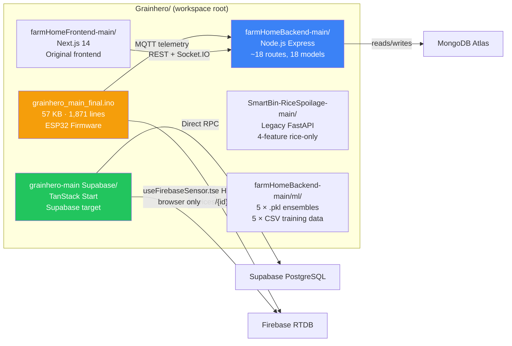
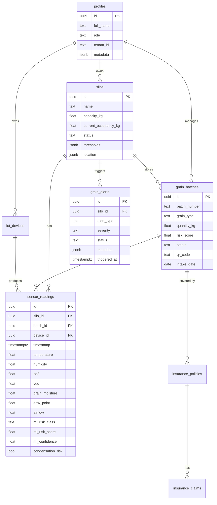
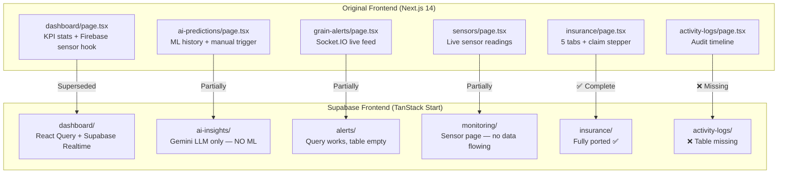

# GrainHero — Repository Comparison
## File-by-File Map: Original → Supabase Stack

> **Status**: Discovery only — no code modified  
> **Reference doc**: [00_MASTER_ANALYSIS.md](file:///c:/Users/Nexgen/Downloads/FYP/Grainhero/docs/00_MASTER_ANALYSIS.md)

---

## 1. Codebase Topology

---

## 2. Backend API Routes — Original → Supabase Mapping

### 2.1 Auth Routes

| Original Route | File | Supabase Equivalent | Status |
|---|---|---|---|
| `POST /api/auth/register` | [routes/auth.js](file:///c:/Users/Nexgen/Downloads/FYP/Grainhero/farmHomeBackend-main/routes/auth.js) | `supabase.auth.signUp()` | ✅ Ported via GoTrue |
| `POST /api/auth/login` | [routes/auth.js](file:///c:/Users/Nexgen/Downloads/FYP/Grainhero/farmHomeBackend-main/routes/auth.js) | `supabase.auth.signInWithPassword()` | ✅ Ported |
| `POST /api/auth/logout` | [routes/auth.js](file:///c:/Users/Nexgen/Downloads/FYP/Grainhero/farmHomeBackend-main/routes/auth.js) | `supabase.auth.signOut()` | ✅ Ported |
| `GET /api/auth/profile` | [routes/auth.js](file:///c:/Users/Nexgen/Downloads/FYP/Grainhero/farmHomeBackend-main/routes/auth.js) | `getProfile()` in operations.functions.ts | ✅ Ported |
| `POST /api/auth/forgot-password` | [routes/auth.js](file:///c:/Users/Nexgen/Downloads/FYP/Grainhero/farmHomeBackend-main/routes/auth.js) | `supabase.auth.resetPasswordForEmail()` | ✅ Ported |
| `POST /api/auth/2fa/setup` | [routes/auth.js](file:///c:/Users/Nexgen/Downloads/FYP/Grainhero/farmHomeBackend-main/routes/auth.js) | Not implemented | ❌ Missing |

### 2.2 IoT / Sensor Routes

| Original Route | File | Supabase Equivalent | Status |
|---|---|---|---|
| `POST /api/sensors/ingest` | [routes/sensors.js](file:///c:/Users/Nexgen/Downloads/FYP/Grainhero/farmHomeBackend-main/routes/sensors.js) | `supabase/functions/ingest/` | ❌ **P0 — Does not exist** |
| `GET /api/sensors/:silo_id/latest` | [routes/sensors.js](file:///c:/Users/Nexgen/Downloads/FYP/Grainhero/farmHomeBackend-main/routes/sensors.js) | `SELECT * FROM sensor_readings ORDER BY timestamp DESC LIMIT 1` | ⚠️ Query works, but table never populated |
| `GET /api/sensors/:silo_id/history` | [routes/sensors.js](file:///c:/Users/Nexgen/Downloads/FYP/Grainhero/farmHomeBackend-main/routes/sensors.js) | [monitoring.functions.ts](file:///c:/Users/Nexgen/Downloads/FYP/Grainhero/grainhero-main%20(Supabase)/grainhero-main/src/lib/monitoring.functions.ts) | ⚠️ Function exists but no data |
| `POST /api/iot/mqtt-bridge` | [routes/iot.js](file:///c:/Users/Nexgen/Downloads/FYP/Grainhero/farmHomeBackend-main/routes/iot.js) | — | ❌ Needs standalone `mqtt_bridge.js` service |
| `GET /api/iot/device-status` | [routes/iot.js](file:///c:/Users/Nexgen/Downloads/FYP/Grainhero/farmHomeBackend-main/routes/iot.js) | `device_status` view in Supabase | ❌ View not created |
| `POST /api/iot/actuator-control` | [routes/iot.js](file:///c:/Users/Nexgen/Downloads/FYP/Grainhero/farmHomeBackend-main/routes/iot.js) | Return from `/ingest` response body | ❌ Not wired |
| `GET /api/iot/offline-buffer` | [routes/iot.js](file:///c:/Users/Nexgen/Downloads/FYP/Grainhero/farmHomeBackend-main/routes/iot.js) | `offline_buffer` table + replay Edge Fn | ❌ Table missing |

### 2.3 AI / ML Routes

| Original Route | File | Supabase Equivalent | Status |
|---|---|---|---|
| `POST /api/ai/predict` | [routes/aiSpoilage.js](file:///c:/Users/Nexgen/Downloads/FYP/Grainhero/farmHomeBackend-main/routes/aiSpoilage.js) | Called from `/ingest` Edge Function | ❌ **P0 — ML never runs** |
| `GET /api/ai/predictions/:batch_id` | [routes/aiSpoilage.js](file:///c:/Users/Nexgen/Downloads/FYP/Grainhero/farmHomeBackend-main/routes/aiSpoilage.js) | Query `ml_predictions_history` | ❌ Table missing |
| `GET /api/ai/advisories` | [routes/aiSpoilage.js](file:///c:/Users/Nexgen/Downloads/FYP/Grainhero/farmHomeBackend-main/routes/aiSpoilage.js) | Gemini LLM via `ai-insights.functions.ts` | ⚠️ LLM only — no ML |
| `POST /api/ai/retrain` | [routes/aiSpoilage.js](file:///c:/Users/Nexgen/Downloads/FYP/Grainhero/farmHomeBackend-main/routes/aiSpoilage.js) | Manual trigger `ensemble_train.py` | ❌ Not ported |
| `GET /api/ai/shap/:prediction_id` | [routes/aiSpoilage.js](file:///c:/Users/Nexgen/Downloads/FYP/Grainhero/farmHomeBackend-main/routes/aiSpoilage.js) | — | ❌ SHAP never wired |

### 2.4 Grain Batch Routes

| Original Route | File | Supabase Equivalent | Status |
|---|---|---|---|
| `POST /api/batches` | [routes/grainBatches.js](file:///c:/Users/Nexgen/Downloads/FYP/Grainhero/farmHomeBackend-main/routes/grainBatches.js) | `createGrainBatch()` in operations.functions.ts | ✅ Ported |
| `GET /api/batches` | [routes/grainBatches.js](file:///c:/Users/Nexgen/Downloads/FYP/Grainhero/farmHomeBackend-main/routes/grainBatches.js) | `getGrainBatches()` | ✅ Ported |
| `PUT /api/batches/:id` | [routes/grainBatches.js](file:///c:/Users/Nexgen/Downloads/FYP/Grainhero/farmHomeBackend-main/routes/grainBatches.js) | `updateGrainBatch()` | ✅ Ported |
| `DELETE /api/batches/:id` | [routes/grainBatches.js](file:///c:/Users/Nexgen/Downloads/FYP/Grainhero/farmHomeBackend-main/routes/grainBatches.js) | `deleteGrainBatch()` | ✅ Ported |
| `POST /api/batches/:id/dispatch` | [routes/grainBatches.js](file:///c:/Users/Nexgen/Downloads/FYP/Grainhero/farmHomeBackend-main/routes/grainBatches.js) | `dispatchGrainBatch()` | ✅ Ported |
| `GET /api/batches/:id/qr` | [routes/grainBatches.js](file:///c:/Users/Nexgen/Downloads/FYP/Grainhero/farmHomeBackend-main/routes/grainBatches.js) | `qr_code` field in schema | ⚠️ Field exists, QR generation not implemented |
| `POST /api/batches/:id/spoilage-event` | [routes/grainBatches.js](file:///c:/Users/Nexgen/Downloads/FYP/Grainhero/farmHomeBackend-main/routes/grainBatches.js) | — | ❌ Not ported |

### 2.5 Silo Routes

| Original Route | File | Supabase Equivalent | Status |
|---|---|---|---|
| `POST /api/silos` | [routes/silos.js](file:///c:/Users/Nexgen/Downloads/FYP/Grainhero/farmHomeBackend-main/routes/silos.js) | `createSilo()` | ✅ Ported |
| `GET /api/silos` | [routes/silos.js](file:///c:/Users/Nexgen/Downloads/FYP/Grainhero/farmHomeBackend-main/routes/silos.js) | `getSilos()` | ✅ Ported |
| `PUT /api/silos/:id/thresholds` | [routes/silos.js](file:///c:/Users/Nexgen/Downloads/FYP/Grainhero/farmHomeBackend-main/routes/silos.js) | `updateSiloThresholds()` | ✅ Ported |
| `POST /api/silos/:id/pod-assignment` | [routes/silos.js](file:///c:/Users/Nexgen/Downloads/FYP/Grainhero/farmHomeBackend-main/routes/silos.js) | `iot_devices` table | ⚠️ Schema exists, UI incomplete |

### 2.6 Alerts Routes

| Original Route | File | Supabase Equivalent | Status |
|---|---|---|---|
| `GET /api/alerts` | [routes/alerts.js](file:///c:/Users/Nexgen/Downloads/FYP/Grainhero/farmHomeBackend-main/routes/alerts.js) | `getAlerts()` in monitoring.functions.ts | ⚠️ Query works, alerts never auto-created |
| `POST /api/alerts/acknowledge/:id` | [routes/alerts.js](file:///c:/Users/Nexgen/Downloads/FYP/Grainhero/farmHomeBackend-main/routes/alerts.js) | `acknowledgeAlert()` | ✅ Ported |
| `POST /api/alerts/resolve/:id` | [routes/alerts.js](file:///c:/Users/Nexgen/Downloads/FYP/Grainhero/farmHomeBackend-main/routes/alerts.js) | `resolveAlert()` | ✅ Ported |
| **Auto-create from threshold** | [services/alertService.js](file:///c:/Users/Nexgen/Downloads/FYP/Grainhero/farmHomeBackend-main/services/alertService.js) | `check_sensor_thresholds()` SQL trigger | ❌ **Trigger not created** |

### 2.7 Insurance Routes

| Original Route | File | Status |
|---|---|---|
| `POST /api/insurance/policies` | [routes/insurance.js](file:///c:/Users/Nexgen/Downloads/FYP/Grainhero/farmHomeBackend-main/routes/insurance.js) | ✅ Ported |
| `POST /api/insurance/claims` | [routes/insurance.js](file:///c:/Users/Nexgen/Downloads/FYP/Grainhero/farmHomeBackend-main/routes/insurance.js) | ✅ Ported |
| `PUT /api/insurance/claims/:id/status` | [routes/insurance.js](file:///c:/Users/Nexgen/Downloads/FYP/Grainhero/farmHomeBackend-main/routes/insurance.js) | ✅ Ported |
| `POST /api/insurance/claims/:id/payment` | [routes/insurance.js](file:///c:/Users/Nexgen/Downloads/FYP/Grainhero/farmHomeBackend-main/routes/insurance.js) | ✅ Ported |

### 2.8 Reports / PDF / QR

| Original Route | File | Status |
|---|---|---|
| `GET /api/reports/batch/:id/pdf` | [services/pdfService.js](file:///c:/Users/Nexgen/Downloads/FYP/Grainhero/farmHomeBackend-main/services/) | ❌ Not ported to Edge Function |
| `GET /api/reports/analytics` | [routes/analytics.js](file:///c:/Users/Nexgen/Downloads/FYP/Grainhero/farmHomeBackend-main/routes/) | ⚠️ [analytics.functions.ts](file:///c:/Users/Nexgen/Downloads/FYP/Grainhero/grainhero-main%20(Supabase)/grainhero-main/src/lib/analytics.functions.ts) — bug on L209 |
| `GET /api/qr/:batch_id` | [routes/grainBatches.js](file:///c:/Users/Nexgen/Downloads/FYP/Grainhero/farmHomeBackend-main/routes/grainBatches.js) | ❌ QR generation not implemented |
| `GET /api/activity-logs` | [routes/activityLogs.js](file:///c:/Users/Nexgen/Downloads/FYP/Grainhero/farmHomeBackend-main/routes/) | ❌ Table missing from Supabase |

---

## 3. Database Schema — MongoDB → Supabase PostgreSQL

### 3.1 MongoDB Model → PostgreSQL Table Map

| Mongoose Model | File | PostgreSQL Table | Notes |
|---|---|---|---|
| `User` | [models/User.js](file:///c:/Users/Nexgen/Downloads/FYP/Grainhero/farmHomeBackend-main/models/User.js) | `profiles` (via auth.users) | Auth merged with profile |
| `SensorReading` | [models/SensorReading.js](file:///c:/Users/Nexgen/Downloads/FYP/Grainhero/farmHomeBackend-main/models/SensorReading.js) | `sensor_readings` | Pre-save hook (dew_point, VOC) missing |
| `GrainBatch` | [models/GrainBatch.js](file:///c:/Users/Nexgen/Downloads/FYP/Grainhero/farmHomeBackend-main/models/GrainBatch.js) | `grain_batches` | `spoilage_events` array → separate table |
| `Silo` | [models/Silo.js](file:///c:/Users/Nexgen/Downloads/FYP/Grainhero/farmHomeBackend-main/models/Silo.js) | `silos` | `thresholds` → JSONB |
| `SpoilagePrediction` | [models/SpoilagePrediction.js](file:///c:/Users/Nexgen/Downloads/FYP/Grainhero/farmHomeBackend-main/models/SpoilagePrediction.js) | `sensor_readings.ml_*` cols + `ml_predictions_history` | History table missing |
| `GrainAlert` | [models/GrainAlert.js](file:///c:/Users/Nexgen/Downloads/FYP/Grainhero/farmHomeBackend-main/models/GrainAlert.js) | `grain_alerts` | Auto-create trigger missing |
| `InsurancePolicy` | [models/InsurancePolicy.js](file:///c:/Users/Nexgen/Downloads/FYP/Grainhero/farmHomeBackend-main/models/InsurancePolicy.js) | `insurance_policies` | ✅ Complete |
| `InsuranceClaim` | [models/InsuranceClaim.js](file:///c:/Users/Nexgen/Downloads/FYP/Grainhero/farmHomeBackend-main/models/InsuranceClaim.js) | `insurance_claims` | ✅ Complete |
| `ActivityLog` | [models/ActivityLog.js](file:///c:/Users/Nexgen/Downloads/FYP/Grainhero/farmHomeBackend-main/models/ActivityLog.js) | ❌ **MISSING** from Supabase | New migration needed |
| `IoTDevice` | [models/IoTDevice.js](file:///c:/Users/Nexgen/Downloads/FYP/Grainhero/farmHomeBackend-main/models/IoTDevice.js) | `iot_devices` | ✅ Present |
| `Notification` | [models/Notification.js](file:///c:/Users/Nexgen/Downloads/FYP/Grainhero/farmHomeBackend-main/models/Notification.js) | ❌ **MISSING** notification_log | New migration needed |
| `Order` | [models/Order.js](file:///c:/Users/Nexgen/Downloads/FYP/Grainhero/farmHomeBackend-main/models/Order.js) | ❌ **MISSING** orders table | New migration needed |
| `Subscription` | [models/Subscription.js](file:///c:/Users/Nexgen/Downloads/FYP/Grainhero/farmHomeBackend-main/models/Subscription.js) | `subscriptions` | ✅ Present (Stripe integrated) |
| `Tenant` | [models/Tenant.js](file:///c:/Users/Nexgen/Downloads/FYP/Grainhero/farmHomeBackend-main/models/Tenant.js) | `organizations` | ✅ Present |
| `WeatherReading` | [services/mlDataCollectionService.js](file:///c:/Users/Nexgen/Downloads/FYP/Grainhero/farmHomeBackend-main/services/) | ❌ **MISSING** weather_readings | New migration needed |
| `TrainingSample` | [services/mlDataCollectionService.js](file:///c:/Users/Nexgen/Downloads/FYP/Grainhero/farmHomeBackend-main/services/) | ❌ **MISSING** training_samples | New migration needed |

---

## 4. Frontend Component Comparison

---

## 5. Background Services Comparison

| Original Service | File | Frequency | Supabase Equivalent | Status |
|---|---|---|---|---|
| MQTT subscriber loop | [services/iotDeviceService.js](file:///c:/Users/Nexgen/Downloads/FYP/Grainhero/farmHomeBackend-main/services/iotDeviceService.js) | Always-on | `mqtt_bridge.js` → Edge Fn | ❌ Missing |
| ML prediction on every reading | [services/aiSpoilageService.js](file:///c:/Users/Nexgen/Downloads/FYP/Grainhero/farmHomeBackend-main/services/aiSpoilageService.js) | Every 5 sec | Edge Fn → FastAPI | ❌ Missing |
| Weather + AQI collect | [services/mlDataCollectionService.js](file:///c:/Users/Nexgen/Downloads/FYP/Grainhero/farmHomeBackend-main/services/) | Every 5 min | `pg_cron` → weather Edge Fn | ❌ Missing |
| Device heartbeat watchdog | [services/deviceHealthService.js](file:///c:/Users/Nexgen/Downloads/FYP/Grainhero/farmHomeBackend-main/services/) | Every 2 min | `pg_cron` → status check | ❌ Missing |
| Batch risk monitor | [services/realTimePredictionService.js](file:///c:/Users/Nexgen/Downloads/FYP/Grainhero/farmHomeBackend-main/services/) | Every 15 min | `pg_cron` + ML Edge Fn | ❌ Missing |
| Email / SMS notifications | [services/notificationService.js](file:///c:/Users/Nexgen/Downloads/FYP/Grainhero/farmHomeBackend-main/services/) | On demand | Resend API + Edge Fn | ❌ Missing |
| PDF generation | [services/pdfService.js](file:///c:/Users/Nexgen/Downloads/FYP/Grainhero/farmHomeBackend-main/services/) | On demand | pdf-lib Deno Edge Fn | ❌ Missing |
| Training data export | [services/trainingDataService.js](file:///c:/Users/Nexgen/Downloads/FYP/Grainhero/farmHomeBackend-main/services/) | On demand | — | ❌ Not planned |
| Stripe webhook handler | [server.js](file:///c:/Users/Nexgen/Downloads/FYP/Grainhero/farmHomeBackend-main/server.js) | Event-driven | Supabase Stripe webhook Edge Fn | ✅ Ported |

---

## 6. Known Bug Map (Exact Locations)

| Bug | File | Line(s) | Description | Fix |
|---|---|---|---|---|
| **Schema crash** | [analytics.functions.ts](file:///c:/Users/Nexgen/Downloads/FYP/Grainhero/grainhero-main%20(Supabase)/grainhero-main/src/lib/analytics.functions.ts) | L209 | `current_stock_kg` column does not exist | Rename to `current_occupancy_kg` |
| **Pest_Presence always 0** | [grainhero_main_final.ino](file:///c:/Users/Nexgen/Downloads/FYP/Grainhero/grainhero_main_final.ino) | L~400 | `pest_presence = 0` hardcoded | Add VOC proxy calculation |
| **Rainfall always 0** | [services/mlDataCollectionService.js](file:///c:/Users/Nexgen/Downloads/FYP/Grainhero/farmHomeBackend-main/services/) | — | Weather API not wired to ML feature | Wire OpenWeather `rain.1h` field |
| **SHAP never called** | [services/aiSpoilageService.js](file:///c:/Users/Nexgen/Downloads/FYP/Grainhero/farmHomeBackend-main/services/aiSpoilageService.js) | — | `shap_explain.py` imported but never executed | Call after every prediction |
| **Validation always `pending`** | [models/SpoilagePrediction.js](file:///c:/Users/Nexgen/Downloads/FYP/Grainhero/farmHomeBackend-main/models/SpoilagePrediction.js) | — | No closed-loop update | Wire spoilage_event → validation_status |
| **4-feature vs 9-feature mismatch** | [SmartBin-RiceSpoilage-main/app.py](file:///c:/Users/Nexgen/Downloads/FYP/Grainhero/SmartBin-RiceSpoilage-main/) vs [ml/smartbin_predict.py](file:///c:/Users/Nexgen/Downloads/FYP/Grainhero/farmHomeBackend-main/ml/smartbin_predict.py) | — | Incompatible prediction APIs | Use `ml/smartbin_predict.py` exclusively |
| **Human override never resets (on crash)** | [grainhero_main_final.ino](file:///c:/Users/Nexgen/Downloads/FYP/Grainhero/grainhero_main_final.ino) | L~70 | `humanOverrideActive` lost on reboot | Store in EEPROM or NVS |

---

*Document generated 2026-07-10. All file links are clickable in VS Code.*
