# GrainHero — Feature Gap Analysis

## Every Missing Feature · Exact File Locations · Exact SQL/Code to Write

> **Status**: Discovery only — no code modified  
> **Reference**: [00_MASTER_ANALYSIS.md](file:///c:/Users/Nexgen/Downloads/FYP/Grainhero/docs/00_MASTER_ANALYSIS.md)  
> **Bug map**: [02_REPOSITORY_COMPARISON.md](file:///c:/Users/Nexgen/Downloads/FYP/Grainhero/docs/02_REPOSITORY_COMPARISON.md)

---

## 1. Gap Overview

```mermaid
graph LR
    subgraph ORIGINAL["Original Stack — 100% Working"]
        O1["IoT Ingest ✅"]
        O2["MQTT Bridge ✅"]
        O3["ML Predictions ✅"]
        O4["Alert Auto-Create ✅"]
        O5["Fan Control ✅"]
        O6["FCM Push ✅"]
        O7["PDF Reports ✅"]
        O8["Device Watchdog ✅"]
        O9["Weather API ✅"]
        O10["Dew Point Compute ✅"]
        O11["VOC Baseline ✅"]
        O12["SHAP Explain ✅"]
        O13["Activity Logs ✅"]
        O14["QR Generation ✅"]
        O15["Offline SD Buffer ✅"]
    end

    subgraph SUPABASE["Supabase Stack — 40% Working"]
        S1["IoT Ingest ❌"]
        S2["MQTT Bridge ❌"]
        S3["ML Predictions ❌"]
        S4["Alert Auto-Create ❌"]
        S5["Fan Control ❌"]
        S6["FCM Push ❌"]
        S7["PDF Reports ❌"]
        S8["Device Watchdog ❌"]
        S9["Weather API ❌"]
        S10["Dew Point Compute ❌"]
        S11["VOC Baseline ❌"]
        S12["SHAP Explain ❌"]
        S13["Activity Logs ❌ (table missing)"]
        S14["QR Generation ⚠️ (field exists)"]
        S15["Offline SD Buffer ❌"]
        S16["Auth ✅"]
        S17["Grain CRUD ✅"]
        S18["Insurance ✅"]
        S19["Stripe Billing ✅"]
        S20["Gemini LLM ✅"]
    end
```



---

## 2. P0 Gaps — System Non-Functional Without These

### GAP-P0-01: No IoT Ingest Edge Function

**What the original does:**  
[services/iotDeviceService.js](file:///c:/Users/Nexgen/Downloads/FYP/Grainhero/farmHomeBackend-main/services/iotDeviceService.js) subscribes to MQTT, receives ESP32 telemetry, calls `SensorReading.save()` which has a pre-save hook computing derived fields, then triggers ML prediction.

**What Supabase has:**  
Nothing. `supabase/functions/` directory has zero IoT-related functions.

**What needs to be created:**

```typescript
// supabase/functions/ingest/index.ts  [CREATE NEW]
import { serve } from "https://deno.land/std@0.168.0/http/server.ts";
import { createClient } from "https://esm.sh/@supabase/supabase-js@2";

serve(async (req: Request) => {
  const body = await req.json();

  // 1. Validate device_id, auth header
  // 2. Compute derived features
  const dew_point = body.temperature - (100 - body.humidity) / 5;
  const airflow = body.fan_speed / 100;

  // 3. INSERT into sensor_readings
  // 4. POST to ml_service → get prediction
  // 5. UPDATE sensor_readings with ML result
  // 6. UPDATE grain_batches.risk_score
  // 7. Return actuator_command in response
});
```

**Original code to port from:**

- [models/SensorReading.js](file:///c:/Users/Nexgen/Downloads/FYP/Grainhero/farmHomeBackend-main/models/SensorReading.js) — pre-save hook (dew point, VOC, airflow computation)
- [services/iotDeviceService.js](file:///c:/Users/Nexgen/Downloads/FYP/Grainhero/farmHomeBackend-main/services/iotDeviceService.js) — MQTT subscriber → save flow

---

### GAP-P0-02: No MQTT Bridge

**What the original does:**  
[routes/iot.js](file:///c:/Users/Nexgen/Downloads/FYP/Grainhero/farmHomeBackend-main/routes/iot.js) includes MQTT client setup inside the Node.js process.

**What needs to be created:**

```javascript
// mqtt_bridge.js  [CREATE NEW — root or separate service]
const mqtt = require("mqtt");
const fetch = require("node-fetch");

const mqttClient = mqtt.connect("mqtt://192.168.100.229:1883");
const EDGE_FN_URL = process.env.SUPABASE_URL + "/functions/v1/ingest";

mqttClient.on("message", async (topic, message) => {
  // POST to /ingest Edge Function
  const response = await fetch(EDGE_FN_URL, {
    method: "POST",
    body: message.toString(),
    headers: { Authorization: "Bearer " + process.env.DEVICE_API_KEY },
  });
  const { actuator_command } = await response.json();

  // Publish actuator command back to ESP32
  if (actuator_command) {
    mqttClient.publish(
      `grainhero/actuators/${device_id}/control`,
      JSON.stringify(actuator_command),
    );
  }
});
```

**Depends on**: GAP-P0-01 (Edge Function URL)

---

### GAP-P0-03: Schema Bug — `current_stock_kg`

**File**: [analytics.functions.ts](<file:///c:/Users/Nexgen/Downloads/FYP/Grainhero/grainhero-main%20(Supabase)/grainhero-main/src/lib/analytics.functions.ts>)  
**Line**: **209**  
**Exact fix**:

```typescript
// BEFORE (broken):
.select('current_stock_kg')

// AFTER (fix):
.select('current_occupancy_kg')
```

**Impact**: Dashboard analytics query crashes — main dashboard non-functional.

---

### GAP-P0-04: Python ML Service Not Deployed

**What the original does:**  
[services/aiSpoilageService.js](file:///c:/Users/Nexgen/Downloads/FYP/Grainhero/farmHomeBackend-main/services/aiSpoilageService.js) spawns `python smartbin_predict.py` as a subprocess for every prediction.

**What needs to be created:**

```python
# ml_service/main.py  [CREATE NEW]
from fastapi import FastAPI
import joblib, json

app = FastAPI()
models = {
    'Rice': joblib.load('../farmHomeBackend-main/ml/rice_ensemble.pkl'),
    'Wheat': joblib.load('../farmHomeBackend-main/ml/wheat_ensemble.pkl'),
    # ... Maize, Sorghum, Barley
}

@app.post("/predict")
def predict(body: dict):
    grain_type = body['grain_type']
    features = body['features']
    feature_vector = [[
        features['Temperature'], features['Humidity'],
        features['Storage_Days'], features['Airflow'],
        features['Dew_Point'], features['Ambient_Light'],
        features['Pest_Presence'], features['Grain_Moisture'],
        features['Rainfall']
    ]]
    model = models[grain_type]
    prediction = model.predict(feature_vector)[0]
    probabilities = dict(zip(['Safe','Risky','Spoiled'],
                              model.predict_proba(feature_vector)[0]))
    risk_score = probabilities['Risky']*50 + probabilities['Spoiled']*100

    fan_speed = 0 if prediction=='Safe' else (80 if prediction=='Risky' else 100)
    led = 'green' if prediction=='Safe' else ('yellow' if prediction=='Risky' else 'red')

    return {
        'prediction': prediction,
        'risk_score': round(risk_score, 2),
        'confidence': max(probabilities.values()),
        'probabilities': probabilities,
        'actuator_command': {'fan_speed': fan_speed, 'led': led}
    }
```

**Existing files to use**: [ml/smartbin_predict.py](file:///c:/Users/Nexgen/Downloads/FYP/Grainhero/farmHomeBackend-main/ml/smartbin_predict.py), [ml/\*.pkl](file:///c:/Users/Nexgen/Downloads/FYP/Grainhero/farmHomeBackend-main/ml/)

---

## 3. P1 Gaps — Core Feature Parity

### GAP-P1-01: Alert Auto-Create Trigger

**What the original does:**  
[services/alertService.js](file:///c:/Users/Nexgen/Downloads/FYP/Grainhero/farmHomeBackend-main/services/alertService.js) runs every 30 seconds, queries recent sensor readings, compares against thresholds in [configs/risk-thresholds.js](file:///c:/Users/Nexgen/Downloads/FYP/Grainhero/farmHomeBackend-main/configs/risk-thresholds.js), and calls `GrainAlert.create()`.

**What needs to be created (PostgreSQL trigger):**

```sql
-- supabase/migrations/XXXX_sensor_alert_trigger.sql  [CREATE NEW]
CREATE OR REPLACE FUNCTION check_sensor_thresholds()
RETURNS TRIGGER AS $$
DECLARE
  silo_thresholds JSONB;
  grain_type TEXT;
BEGIN
  -- Get silo thresholds
  SELECT s.thresholds, gb.grain_type
  INTO silo_thresholds, grain_type
  FROM silos s
  JOIN grain_batches gb ON gb.silo_id = s.id AND gb.status = 'active'
  WHERE s.id = NEW.silo_id
  LIMIT 1;

  -- Temperature threshold
  IF NEW.temperature > COALESCE((silo_thresholds->>'max_temp')::float, 30.0) THEN
    INSERT INTO grain_alerts (silo_id, batch_id, alert_type, severity, metadata)
    VALUES (NEW.silo_id, NEW.batch_id, 'temperature_high', 'warning',
            jsonb_build_object('value', NEW.temperature, 'threshold',
            (silo_thresholds->>'max_temp')::float));
  END IF;

  -- Humidity threshold
  IF NEW.humidity > COALESCE((silo_thresholds->>'max_humidity')::float, 75.0) THEN
    INSERT INTO grain_alerts (silo_id, batch_id, alert_type, severity, metadata)
    VALUES (NEW.silo_id, NEW.batch_id, 'humidity_high', 'warning',
            jsonb_build_object('value', NEW.humidity));
  END IF;

  -- ML spoilage detection
  IF NEW.ml_risk_class = 'Spoiled' THEN
    INSERT INTO grain_alerts (silo_id, batch_id, alert_type, severity, metadata)
    VALUES (NEW.silo_id, NEW.batch_id, 'ml_spoilage_detected', 'critical',
            jsonb_build_object('risk_score', NEW.ml_risk_score,
                               'confidence', NEW.ml_confidence));
  END IF;

  -- Condensation risk
  IF NEW.condensation_risk = TRUE THEN
    INSERT INTO grain_alerts (silo_id, batch_id, alert_type, severity, metadata)
    VALUES (NEW.silo_id, NEW.batch_id, 'condensation_risk', 'warning', '{}'::jsonb);
  END IF;

  RETURN NEW;
END;
$$ LANGUAGE plpgsql;

CREATE TRIGGER sensor_alert_trigger
  AFTER INSERT ON sensor_readings
  FOR EACH ROW EXECUTE FUNCTION check_sensor_thresholds();
```

---

### GAP-P1-02: Device Heartbeat Watchdog

**What the original does:**  
[services/deviceHealthService.js](file:///c:/Users/Nexgen/Downloads/FYP/Grainhero/farmHomeBackend-main/services/deviceHealthService.js) uses `node-cron` to check every 2 minutes if any device hasn't published in 5 minutes → sets `status='offline'`.

**Supabase equivalent:**

```sql
-- Enable pg_cron extension (Supabase Pro only)
SELECT cron.schedule(
  'device-heartbeat-check',
  '*/5 * * * *',  -- every 5 minutes
  $$
    UPDATE iot_devices
    SET status = 'offline'
    WHERE last_seen < NOW() - INTERVAL '10 minutes'
      AND status = 'online';
  $$
);
```

---

### GAP-P1-03: FCM Push Notification Edge Function

**What the original does:**  
[services/notificationService.js](file:///c:/Users/Nexgen/Downloads/FYP/Grainhero/farmHomeBackend-main/services/notificationService.js) uses Firebase Admin SDK to send FCM notifications.

**What needs to be created:**

```typescript
// supabase/functions/notify/index.ts  [CREATE NEW]
// Triggered by grain_alerts INSERT via Supabase webhook or Realtime
import { serve } from "https://deno.land/std@0.168.0/http/server.ts";

serve(async (req) => {
  const { record } = await req.json(); // grain_alerts INSERT record

  // Get FCM tokens for organization members
  // POST to https://fcm.googleapis.com/fcm/send
  const fcmResponse = await fetch("https://fcm.googleapis.com/fcm/send", {
    method: "POST",
    headers: {
      Authorization: `key=${Deno.env.get("FCM_SERVER_KEY")}`,
      "Content-Type": "application/json",
    },
    body: JSON.stringify({
      registration_ids: fcmTokens,
      notification: {
        title: `GrainHero Alert: ${record.alert_type}`,
        body: `Silo ${record.silo_id}: ${record.severity} alert detected`,
      },
    }),
  });
});
```

**Existing skeleton**: [firebase-admin.server.ts](<file:///c:/Users/Nexgen/Downloads/FYP/Grainhero/grainhero-main%20(Supabase)/grainhero-main/src/lib/firebase-admin.server.ts>) — FCM tokens stored but never sent to.

---

### GAP-P1-04: VOC Rolling Baseline

**What the original does:**  
[models/SensorReading.js](file:///c:/Users/Nexgen/Downloads/FYP/Grainhero/farmHomeBackend-main/models/SensorReading.js) pre-save hook computes a 24-hour rolling average VOC baseline to normalize individual readings.

**Supabase equivalent (PostgreSQL function):**

```sql
-- supabase/migrations/XXXX_voc_baseline.sql  [CREATE NEW]
CREATE OR REPLACE FUNCTION compute_voc_baseline(
  p_silo_id UUID,
  p_hours INT DEFAULT 24
)
RETURNS FLOAT AS $$
  SELECT AVG(voc_raw)
  FROM sensor_readings
  WHERE silo_id = p_silo_id
    AND timestamp > NOW() - make_interval(hours => p_hours)
$$ LANGUAGE sql STABLE;
```

---

### GAP-P1-05: PDF Generation Edge Function

**What the original does:**  
[services/pdfService.js](file:///c:/Users/Nexgen/Downloads/FYP/Grainhero/farmHomeBackend-main/services/) uses Puppeteer or jsPDF to generate batch storage reports.

**Supabase equivalent**: Deno-compatible `pdf-lib` package in Edge Function.

```typescript
// supabase/functions/generate-pdf/index.ts  [CREATE NEW]
import { PDFDocument, StandardFonts, rgb } from "https://cdn.skypack.dev/pdf-lib";

// Generate batch report: intake date, readings history, ML predictions, alerts
```

---

### GAP-P1-06: Wet Grain Intake Gate

**What the original does:**  
No explicit gate — but [routes/grainBatches.js](file:///c:/Users/Nexgen/Downloads/FYP/Grainhero/farmHomeBackend-main/routes/grainBatches.js) could receive any moisture value.

**What needs to be added (Supabase):**

```sql
-- Add check constraint to grain_batches  [ADD TO MIGRATION]
ALTER TABLE grain_batches ADD CONSTRAINT moisture_at_intake_safe
  CHECK (
    grain_type != 'Wheat' OR moisture_at_intake <= 14.0
  );
-- Add similar constraints for Rice (13.5%), Maize (13.5%), Sorghum (13%), Barley (14.5%)
```

**And in [operations.functions.ts](<file:///c:/Users/Nexgen/Downloads/FYP/Grainhero/grainhero-main%20(Supabase)/grainhero-main/src/lib/operations.functions.ts>):** Validate before INSERT and return clear user-facing error if exceeded.

---

## 4. P1 Missing Database Tables

### Tables to Create (New Migration)

```sql
-- supabase/migrations/XXXX_missing_tables.sql  [CREATE NEW]

-- 1. Activity Logs (replaces models/ActivityLog.js)
CREATE TABLE activity_logs (
  id UUID PRIMARY KEY DEFAULT gen_random_uuid(),
  organization_id UUID REFERENCES organizations(id),
  user_id UUID REFERENCES profiles(id),
  action TEXT NOT NULL,           -- 'batch_created', 'alert_acknowledged', etc.
  entity_type TEXT NOT NULL,      -- 'grain_batch', 'silo', 'iot_device', etc.
  entity_id UUID,
  metadata JSONB DEFAULT '{}',
  created_at TIMESTAMPTZ DEFAULT NOW()
);
-- Append-only: no UPDATE or DELETE allowed (RLS policy)

-- 2. ML Predictions History (replaces models/SpoilagePrediction.js)
CREATE TABLE ml_predictions_history (
  id UUID PRIMARY KEY DEFAULT gen_random_uuid(),
  sensor_reading_id UUID REFERENCES sensor_readings(id),
  batch_id UUID REFERENCES grain_batches(id),
  silo_id UUID REFERENCES silos(id),
  grain_type TEXT NOT NULL,
  features JSONB NOT NULL,        -- All 9 input features
  prediction TEXT NOT NULL,       -- Safe | Risky | Spoiled
  risk_score FLOAT NOT NULL,
  confidence FLOAT NOT NULL,
  probabilities JSONB,
  model_version TEXT,             -- 'v2.1.0' — for drift tracking
  validation_status TEXT DEFAULT 'pending',  -- pending | confirmed | rejected
  validated_at TIMESTAMPTZ,
  validated_by UUID REFERENCES profiles(id),
  created_at TIMESTAMPTZ DEFAULT NOW()
);

-- 3. Weather Readings (replaces services/weatherService.js data)
CREATE TABLE weather_readings (
  id UUID PRIMARY KEY DEFAULT gen_random_uuid(),
  silo_id UUID REFERENCES silos(id),
  timestamp TIMESTAMPTZ DEFAULT NOW(),
  outside_temperature FLOAT,
  outside_humidity FLOAT,
  outside_dew_point FLOAT,
  rainfall_1h FLOAT DEFAULT 0,
  is_raining BOOLEAN DEFAULT false,
  wind_speed FLOAT,
  weather_source TEXT DEFAULT 'open-meteo'
);

-- 4. Notification Log
CREATE TABLE notification_log (
  id UUID PRIMARY KEY DEFAULT gen_random_uuid(),
  alert_id UUID REFERENCES grain_alerts(id),
  recipient_id UUID REFERENCES profiles(id),
  channel TEXT,                   -- 'fcm' | 'email' | 'sms'
  status TEXT DEFAULT 'sent',    -- 'sent' | 'delivered' | 'failed'
  sent_at TIMESTAMPTZ DEFAULT NOW(),
  error_message TEXT
);

-- 5. Training Samples (for real data accumulation)
CREATE TABLE training_samples (
  id UUID PRIMARY KEY DEFAULT gen_random_uuid(),
  sensor_reading_id UUID REFERENCES sensor_readings(id),
  grain_type TEXT NOT NULL,
  features JSONB NOT NULL,
  label TEXT,                     -- Filled when spoilage_event confirmed
  label_source TEXT,              -- 'ml_prediction' | 'human_confirmed' | 'lab_test'
  created_at TIMESTAMPTZ DEFAULT NOW()
);
```

---

## 5. P2 Gaps — Enhancement Features

| Gap                       | Original File                                                                                                         | Supabase Action                                                 | Sprint  |
| ------------------------- | --------------------------------------------------------------------------------------------------------------------- | --------------------------------------------------------------- | ------- |
| SHAP explainability       | [ml/shap_explain.py](file:///c:/Users/Nexgen/Downloads/FYP/Grainhero/farmHomeBackend-main/ml/shap_explain.py)         | Call from `ml_service/main.py`, return SHAP values              | 4       |
| QR code generation        | [routes/grainBatches.js](file:///c:/Users/Nexgen/Downloads/FYP/Grainhero/farmHomeBackend-main/routes/grainBatches.js) | Edge Function using `qrcode` Deno package                       | 4       |
| Offline SD card replay    | [routes/iot.js](file:///c:/Users/Nexgen/Downloads/FYP/Grainhero/farmHomeBackend-main/routes/iot.js)                   | MQTT bridge detects `offline_buffer` topic → replays to Edge Fn | 4       |
| Aeration decision display | [routes/aiSpoilage.js](file:///c:/Users/Nexgen/Downloads/FYP/Grainhero/farmHomeBackend-main/routes/aiSpoilage.js)     | Compute from weather_readings in Edge Fn; display in dashboard  | 4       |
| Bulk batch import (CSV)   | Not in original                                                                                                       | New Edge Fn for CSV parse + batch INSERT                        | Backlog |
| Manual fan override UI    | [routes/iot.js](file:///c:/Users/Nexgen/Downloads/FYP/Grainhero/farmHomeBackend-main/routes/iot.js)                   | Button in TanStack UI → MQTT bridge → publish control topic     | 3       |
| 2FA TOTP                  | Not in original                                                                                                       | Supabase GoTrue has built-in TOTP                               | Backlog |
| Order management          | [routes/orders.js](file:///c:/Users/Nexgen/Downloads/FYP/Grainhero/farmHomeBackend-main/routes/)                      | New `orders` table migration + CRUD                             | Backlog |
| Maintenance records       | [routes/maintenance.js](file:///c:/Users/Nexgen/Downloads/FYP/Grainhero/farmHomeBackend-main/routes/)                 | New `maintenance_records` table + UI                            | Backlog |
| Training data export      | [services/trainingDataService.js](file:///c:/Users/Nexgen/Downloads/FYP/Grainhero/farmHomeBackend-main/services/)     | Edge Fn: SELECT training_samples → CSV download                 | Backlog |

---

## 6. Firmware Gaps (Arduino)

| Gap                                  | Current State                          | File                                                                                                       | Fix                                                                  |
| ------------------------------------ | -------------------------------------- | ---------------------------------------------------------------------------------------------------------- | -------------------------------------------------------------------- |
| No direct Supabase write             | Writes only to Firebase                | [grainhero_main_final.ino](file:///c:/Users/Nexgen/Downloads/FYP/Grainhero/grainhero_main_final.ino)       | Add HTTP POST to `/ingest` Edge Fn alongside Firebase                |
| `humanOverrideActive` lost on reboot | Stored in RAM only                     | [grainhero_main_final.ino ~L70](file:///c:/Users/Nexgen/Downloads/FYP/Grainhero/grainhero_main_final.ino)  | Use `Preferences` library (NVS)                                      |
| MQTT broker IP hardcoded             | `192.168.100.229` in source            | [grainhero_main_final.ino L36](file:///c:/Users/Nexgen/Downloads/FYP/Grainhero/grainhero_main_final.ino)   | Store in SPIFFS `config.json`                                        |
| WiFi credentials in source           | `ssid`, `password` hardcoded           | [grainhero_main_final.ino](file:///c:/Users/Nexgen/Downloads/FYP/Grainhero/grainhero_main_final.ino)       | Store in SPIFFS `config.json`                                        |
| No MEMS microphone                   | `pest_presence` always 0               | Hardware                                                                                                   | Add SPH0645 on I2S GPIO 32/33/25 in v2                               |
| SD card circular buffer              | Overwrites when full — no notification | [grainhero_main_final.ino ~L750](file:///c:/Users/Nexgen/Downloads/FYP/Grainhero/grainhero_main_final.ino) | Publish `storage_full` MQTT alert                                    |
| `fumigation_active` not blocked      | Fan can run during fumigation          | Both firmware + backend                                                                                    | Add MQTT message `{fumigation: true}` → firmware skips all actuation |

---

## 7. Complete Gap Count Summary

| Priority           | Count  | Status                       |
| ------------------ | ------ | ---------------------------- |
| P0 — System broken | **4**  | Fix before any demo          |
| P1 — Core missing  | **12** | Fix before commercial launch |
| P2 — Enhancements  | **10** | Post-parity enhancements     |
| Firmware gaps      | **7**  | Mix of P0–P2                 |
| **Total gaps**     | **33** | —                            |

---

_Generated 2026-07-10. All file links are clickable in VS Code._  
_No code modified during this analysis — this is a discovery document._
