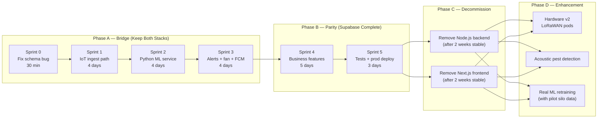
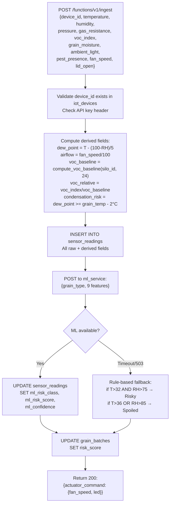
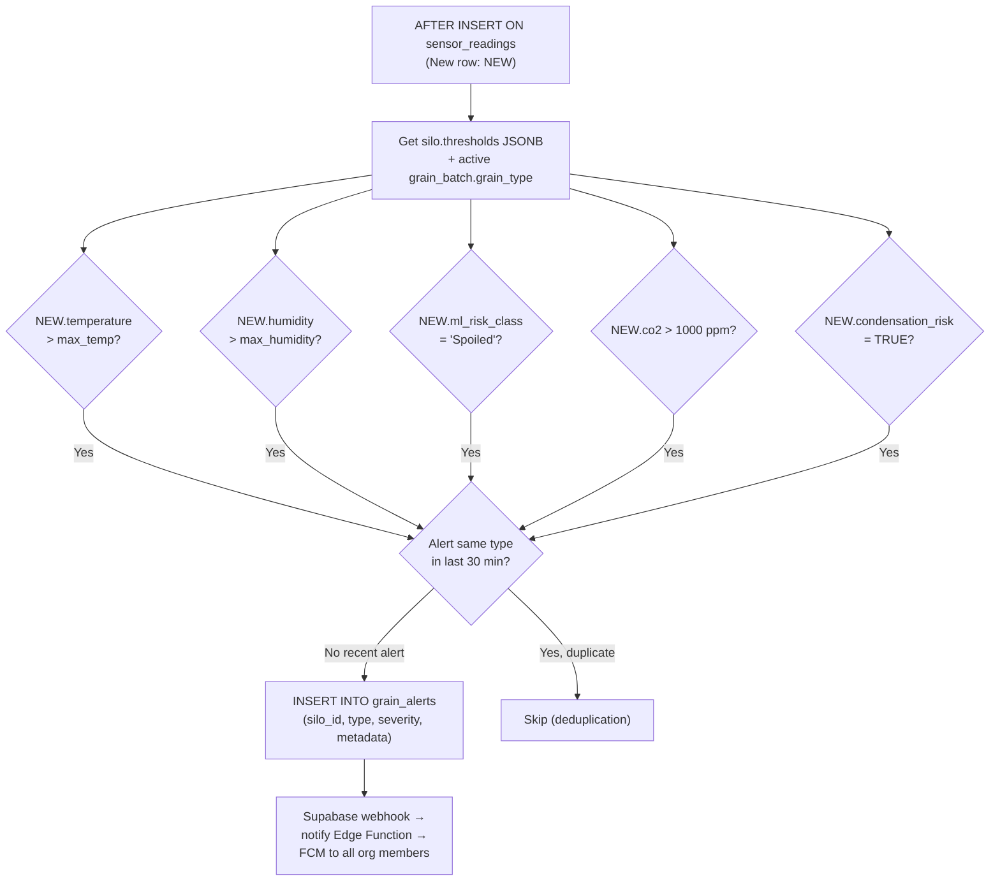

# GrainHero — Migration Roadmap

## Sprint-by-Sprint Plan · Code to Write · Files to Touch · Done Definition

> **Status**: Discovery only — no code modified  
> **Gaps**: [03_FEATURE_GAP_ANALYSIS.md](file:///c:/Users/Nexgen/Downloads/FYP/Grainhero/docs/03_FEATURE_GAP_ANALYSIS.md)  
> **Effort**: [11_EFFORT_ESTIMATION.md](file:///c:/Users/Nexgen/Downloads/FYP/Grainhero/docs/11_EFFORT_ESTIMATION.md)

---

## 1. Migration Strategy



---

## 2. Sprint 0 — Critical Bug Fix (Day 1)

### Objective

Fix the one-line schema bug so the analytics dashboard doesn't crash.

### Files to Modify

| File                                                                                                                                                  | Change                                      | Line     |
| ----------------------------------------------------------------------------------------------------------------------------------------------------- | ------------------------------------------- | -------- |
| [analytics.functions.ts](<file:///c:/Users/Nexgen/Downloads/FYP/Grainhero/grainhero-main%20(Supabase)/grainhero-main/src/lib/analytics.functions.ts>) | `current_stock_kg` → `current_occupancy_kg` | **L209** |

### Done Definition

- Analytics page loads without a query error
- KPI cards show correct silo occupancy data

---

## 3. Sprint 1 — IoT Ingest Path (Days 2–5)

### Objective

Arduino telemetry flows continuously into `sensor_readings`. Dashboard shows live data.

### Files to Create

| File                                           | Purpose                                                                        |
| ---------------------------------------------- | ------------------------------------------------------------------------------ |
| `supabase/functions/ingest/index.ts`           | Edge Function: validate → compute → INSERT → call ML → return actuator command |
| `mqtt_bridge.js`                               | Node.js: MQTT subscribe → HTTP POST to Edge Fn → publish actuator response     |
| `supabase/migrations/XXXX_voc_baseline_fn.sql` | PostgreSQL function `compute_voc_baseline(silo_id, hours)`                     |

### Files to Modify

| File                                                                                                                                    | Change                                                     |
| --------------------------------------------------------------------------------------------------------------------------------------- | ---------------------------------------------------------- |
| [grainhero_main_final.ino](file:///c:/Users/Nexgen/Downloads/FYP/Grainhero/grainhero_main_final.ino)                                    | Add `httpPostToEdgeFn()` alongside existing Firebase write |
| [supabase/functions/](<file:///c:/Users/Nexgen/Downloads/FYP/Grainhero/grainhero-main%20(Supabase)/grainhero-main/supabase/functions/>) | Add `ingest/` subdirectory with `index.ts`                 |

### Edge Function Logic Flow



### Done Definition

- `SELECT COUNT(*) FROM sensor_readings` returns > 0 after Arduino runs for 30 seconds
- Dashboard monitoring page shows live sensor values
- Supabase Realtime pushes to TanStack frontend on each new row

---

## 4. Sprint 2 — Python ML Microservice (Days 6–9)

### Objective

Real ML predictions appear in `sensor_readings.ml_risk_class`. Risk scores update in `grain_batches`.

### Files to Create

| File                          | Purpose                                                             |
| ----------------------------- | ------------------------------------------------------------------- |
| `ml_service/main.py`          | FastAPI app loading all 5 grain `.pkl` models                       |
| `ml_service/requirements.txt` | `fastapi uvicorn joblib xgboost lightgbm scikit-learn numpy pandas` |
| `ml_service/Dockerfile`       | For Fly.io deployment                                               |
| `ml_service/test_predict.py`  | Unit tests for all 5 grain types + edge cases                       |

### Existing ML Files (Reference)

| File                                                                                                                  | Use                                |
| --------------------------------------------------------------------------------------------------------------------- | ---------------------------------- |
| [ml/smartbin_predict.py](file:///c:/Users/Nexgen/Downloads/FYP/Grainhero/farmHomeBackend-main/ml/smartbin_predict.py) | Port prediction logic into FastAPI |
| [ml/rice_ensemble.pkl](file:///c:/Users/Nexgen/Downloads/FYP/Grainhero/farmHomeBackend-main/ml/)                      | Load in `ml_service/main.py`       |
| [ml/wheat_ensemble.pkl](file:///c:/Users/Nexgen/Downloads/FYP/Grainhero/farmHomeBackend-main/ml/)                     | Load in `ml_service/main.py`       |
| [ml/maize_ensemble.pkl](file:///c:/Users/Nexgen/Downloads/FYP/Grainhero/farmHomeBackend-main/ml/)                     | Load in `ml_service/main.py`       |
| [ml/sorghum_ensemble.pkl](file:///c:/Users/Nexgen/Downloads/FYP/Grainhero/farmHomeBackend-main/ml/)                   | Load in `ml_service/main.py`       |
| [ml/barley_ensemble.pkl](file:///c:/Users/Nexgen/Downloads/FYP/Grainhero/farmHomeBackend-main/ml/)                    | Load in `ml_service/main.py`       |
| [ml/rice_model_metadata.json](file:///c:/Users/Nexgen/Downloads/FYP/Grainhero/farmHomeBackend-main/ml/)               | Feature names, thresholds          |

### Deploy Command

```bash
# Deploy to Fly.io
fly launch --dockerfile ml_service/Dockerfile --name grainhero-ml
fly deploy
fly scale count 1 --max-per-region 1

# Verify latency
curl -X POST https://grainhero-ml.fly.dev/predict \
  -H "Content-Type: application/json" \
  -d '{"grain_type":"Rice","features":{"Temperature":28.4,"Humidity":62.1,"Storage_Days":45,"Airflow":0.0,"Dew_Point":20.5,"Ambient_Light":35.2,"Pest_Presence":0.0,"Grain_Moisture":13.8,"Rainfall":0.0}}'
```

### Done Definition

- `SELECT ml_risk_class FROM sensor_readings ORDER BY timestamp DESC LIMIT 1` returns `Safe`, `Risky`, or `Spoiled` (not NULL)
- All 5 grain types tested end-to-end
- P95 ML service latency < 2 seconds from Edge Function

---

## 5. Sprint 3 — Alert Engine + Fan Control + FCM (Days 10–13)

### Objective

Alerts auto-fire on threshold breach. Fan physically responds to ML prediction. Phone gets FCM push.

### Files to Create

| File                                            | Purpose                                          |
| ----------------------------------------------- | ------------------------------------------------ |
| `supabase/migrations/XXXX_alert_trigger.sql`    | `check_sensor_thresholds()` AFTER INSERT trigger |
| `supabase/migrations/XXXX_pg_cron_watchdog.sql` | Device heartbeat cron job                        |
| `supabase/functions/notify/index.ts`            | FCM push Edge Function                           |

### Files to Modify

| File                                                                                                                                                      | Change                                                            |
| --------------------------------------------------------------------------------------------------------------------------------------------------------- | ----------------------------------------------------------------- |
| `supabase/functions/ingest/index.ts`                                                                                                                      | Add `actuator_command` computation + return in response           |
| `mqtt_bridge.js`                                                                                                                                          | Read `actuator_command` from response → publish to actuator topic |
| [monitoring.functions.ts](<file:///c:/Users/Nexgen/Downloads/FYP/Grainhero/grainhero-main%20(Supabase)/grainhero-main/src/lib/monitoring.functions.ts>)   | Connect alert acknowledgment to actual DB records                 |
| [firebase-admin.server.ts](<file:///c:/Users/Nexgen/Downloads/FYP/Grainhero/grainhero-main%20(Supabase)/grainhero-main/src/lib/firebase-admin.server.ts>) | Complete FCM token-based notification sending                     |

### Alert Trigger Logic



### Done Definition

- Manually insert a sensor reading with `temperature = 45.0` → `grain_alerts` gets a new row within 1 second
- FCM push notification received on test phone within 5 seconds of alert creation
- ESP32 fan spins up to 100% within 10 seconds of `ml_risk_class = 'Spoiled'` insert

---

## 6. Sprint 4 — Business Features (Days 14–18)

### Objective

Complete remaining business logic: missing tables, PDF, weather API, QR, activity logs.

### Files to Create

| File                                               | Purpose                                                                                               | Reference                                                                                                                  |
| -------------------------------------------------- | ----------------------------------------------------------------------------------------------------- | -------------------------------------------------------------------------------------------------------------------------- |
| `supabase/migrations/XXXX_missing_tables.sql`      | `activity_logs`, `notification_log`, `ml_predictions_history`, `weather_readings`, `training_samples` | [models/ActivityLog.js](file:///c:/Users/Nexgen/Downloads/FYP/Grainhero/farmHomeBackend-main/models/ActivityLog.js) et al. |
| `supabase/functions/generate-pdf/index.ts`         | PDF generation using `pdf-lib` (Deno-compatible)                                                      | [services/pdfService.js](file:///c:/Users/Nexgen/Downloads/FYP/Grainhero/farmHomeBackend-main/services/)                   |
| `supabase/functions/fetch-weather/index.ts`        | Open-Meteo API → INSERT into `weather_readings`                                                       | [services/weatherService.js](file:///c:/Users/Nexgen/Downloads/FYP/Grainhero/farmHomeBackend-main/services/)               |
| `supabase/functions/generate-qr/index.ts`          | QR code generation for grain batches                                                                  | [routes/grainBatches.js](file:///c:/Users/Nexgen/Downloads/FYP/Grainhero/farmHomeBackend-main/routes/grainBatches.js)      |
| `supabase/migrations/XXXX_weather_cron.sql`        | `pg_cron` job: weather every 30 min                                                                   | —                                                                                                                          |
| `supabase/migrations/XXXX_moisture_constraint.sql` | Wet grain intake gate per grain type                                                                  | —                                                                                                                          |

### Files to Modify

| File                                                                                                                                                      | Change                                                 |
| --------------------------------------------------------------------------------------------------------------------------------------------------------- | ------------------------------------------------------ |
| `supabase/functions/ingest/index.ts`                                                                                                                      | Wire aeration decision from `weather_readings` table   |
| [operations.functions.ts](<file:///c:/Users/Nexgen/Downloads/FYP/Grainhero/grainhero-main%20(Supabase)/grainhero-main/src/lib/operations.functions.ts>)   | Add activity log INSERT after every significant action |
| [ai-insights.functions.ts](<file:///c:/Users/Nexgen/Downloads/FYP/Grainhero/grainhero-main%20(Supabase)/grainhero-main/src/lib/ai-insights.functions.ts>) | Feed real ML data into Gemini prompt context           |

### Weather Cron Setup

```sql
-- Run every 30 minutes for all active silos
SELECT cron.schedule(
  'fetch-weather',
  '*/30 * * * *',
  $$
    SELECT net.http_post(
      url := current_setting('app.supabase_url') || '/functions/v1/fetch-weather',
      headers := '{"Authorization": "Bearer " || current_setting(''app.service_role_key'')}'::jsonb
    );
  $$
);
```

---

## 7. Sprint 5 — Testing & Production Deployment (Days 19–21)

### Objective

Full end-to-end validation + production environment running.

### Test Checklist

```
□ Arduino powers on → MQTT connects → data flows to sensor_readings (< 30s)
□ All 5 grain types return valid ML prediction from Fly.io service
□ Temperature 45°C insert → alert in grain_alerts → FCM on phone (< 10s)
□ ESP32 receives MQTT actuator command → fan spins up within 5s
□ Analytics dashboard KPIs all correct (no NULL crashes)
□ Grain batch CRUD (create/dispatch/delete) all work
□ Insurance policy + claim flow end-to-end
□ PDF generation for a batch with 100+ sensor readings
□ QR code scan → correct batch data
□ Offline buffer: disconnect WiFi for 5 min, reconnect → SD readings sync

□ RLS isolation: user in org A cannot see org B data
□ Admin can see all orgs (super-admin check)
□ Rate limiting: 200 req/min per device ID (Edge Function protection)
□ ML service cold start: first request < 30s (Fly.io warm machine < 2s)
```

### Production Infrastructure Checklist

```
□ Production Supabase project (Pro tier: $25/mo)
□ Apply all migrations to production DB
□ Set all Edge Function secrets in Supabase Vault (not .env)
□ Fly.io ML service deployed + auto-scaling configured
□ VPS MQTT bridge running under PM2 with auto-restart
□ Domain + SSL via Cloudflare ($10/year)
□ Monitoring: Supabase dashboard + Fly.io metrics
□ Backup: Supabase Pro automated daily backups
□ Alert: UptimeRobot for ML service + MQTT bridge health
```

---

## 8. What NOT to Change During Migration

| Component                                                                                                                                                      | Keep As-Is                         | Reason                                  |
| -------------------------------------------------------------------------------------------------------------------------------------------------------------- | ---------------------------------- | --------------------------------------- |
| [grainhero_main_final.ino](file:///c:/Users/Nexgen/Downloads/FYP/Grainhero/grainhero_main_final.ino) — sensor readings                                         | Keep existing pins + reading logic | Hardware working correctly              |
| [grainhero_main_final.ino](file:///c:/Users/Nexgen/Downloads/FYP/Grainhero/grainhero_main_final.ino) — state machine                                           | Keep LidFanState machine           | Logic is correct                        |
| [ml/\*.pkl](file:///c:/Users/Nexgen/Downloads/FYP/Grainhero/farmHomeBackend-main/ml/)                                                                          | Keep existing trained models       | Don't retrain until real data collected |
| [supabase/migrations/](<file:///c:/Users/Nexgen/Downloads/FYP/Grainhero/grainhero-main%20(Supabase)/grainhero-main/supabase/migrations/>)                      | Keep existing schema               | 16-table schema is correct              |
| [operations.functions.ts](<file:///c:/Users/Nexgen/Downloads/FYP/Grainhero/grainhero-main%20(Supabase)/grainhero-main/src/lib/operations.functions.ts>) — CRUD | Keep existing CRUD logic           | Working correctly                       |
| Stripe integration                                                                                                                                             | Keep as-is                         | Working subscription billing            |
| Gemini LLM advisory                                                                                                                                            | Keep as-is                         | Good value-add even without real ML     |
| Firebase RTDB read hook                                                                                                                                        | Keep for now                       | Provides current live sensor display    |

---

## 9. Decommission Plan (Phase C — 2 Weeks After Sprint 5)

| Action                                        | When    | Condition                                  |
| --------------------------------------------- | ------- | ------------------------------------------ |
| Stop Node.js backend server                   | Week 3  | Zero errors in Supabase for 2 weeks        |
| Disable MongoDB Atlas cluster                 | Week 4  | All data confirmed in Supabase             |
| Archive `farmHomeBackend-main/`               | Month 2 | Document ML code location before archiving |
| Remove Next.js frontend from hosting          | Week 3  | All users migrated to TanStack             |
| Mark `SmartBin-RiceSpoilage-main/` deprecated | Now     | Add `README.md` deprecation notice         |
| Remove Firebase RTDB writes from firmware     | Month 3 | After Supabase ingest path proven stable   |

---

_Document generated 2026-07-10. All file links are clickable in VS Code._
