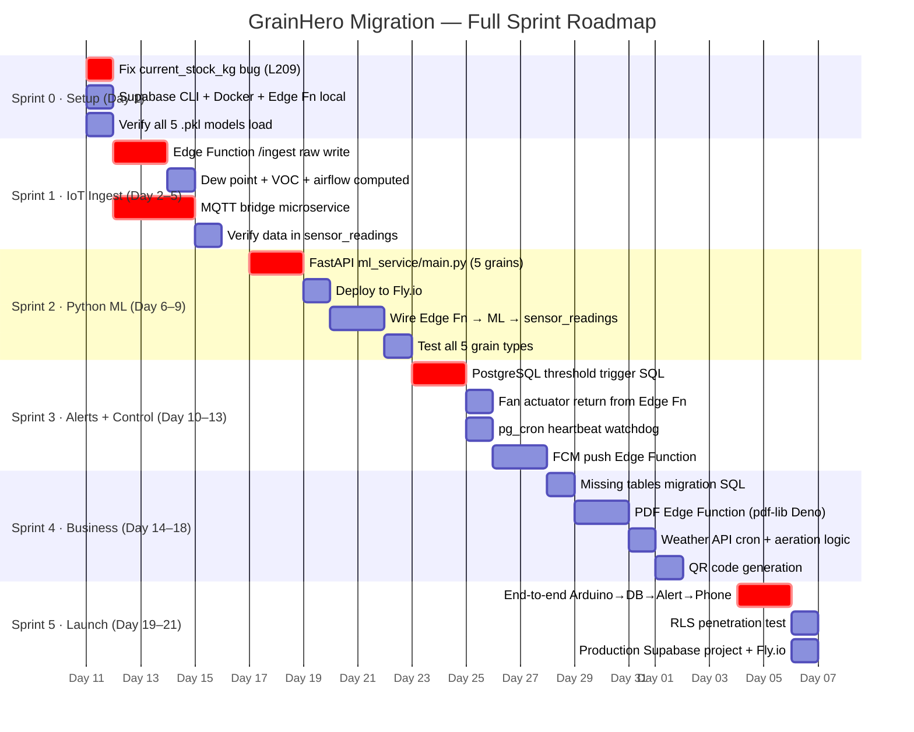
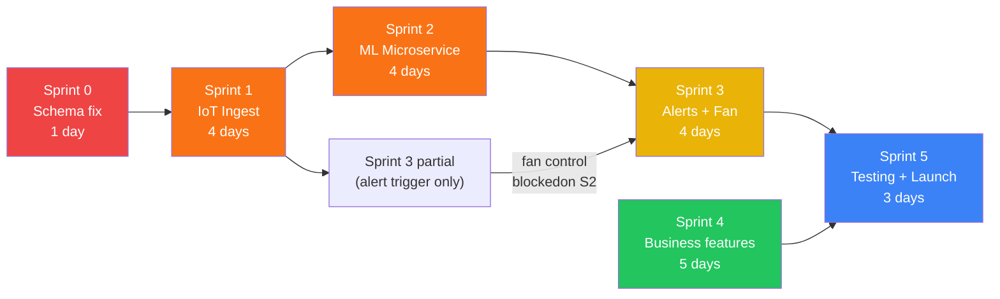

# GrainHero — Sprint Effort Estimation

## Task-Level Hour Breakdown · Critical Path · 3-Day MVP Demo

> **Status**: Discovery only — no code modified  
> **Reference**: [00_MASTER_ANALYSIS.md](file:///c:/Users/Nexgen/Downloads/FYP/Grainhero/docs/00_MASTER_ANALYSIS.md)

---

## 1. Summary Overview



---

## 2. Sprint 0 — Setup & Critical Bug Fix (1 Day)

**Prerequisites before any dev work begins:**

| Task                                                           | Owner       | Hours  | Files Touched                                                                                                                                              |
| -------------------------------------------------------------- | ----------- | ------ | ---------------------------------------------------------------------------------------------------------------------------------------------------------- |
| Install Supabase CLI, Docker, Deno                             | Full-stack  | 1h     | —                                                                                                                                                          |
| Apply migration to local DB, verify schema                     | Full-stack  | 1h     | `supabase/migrations/*.sql`                                                                                                                                |
| **Fix `current_stock_kg` → `current_occupancy_kg` bug**        | Full-stack  | 0.5h   | [analytics.functions.ts L209](<file:///c:/Users/Nexgen/Downloads/FYP/Grainhero/grainhero-main%20(Supabase)/grainhero-main/src/lib/analytics.functions.ts>) |
| Test analytics page no longer crashes                          | Full-stack  | 0.5h   | Same file                                                                                                                                                  |
| Set up Python venv, verify all 5 .pkl load                     | ML engineer | 2h     | [ml/smartbin_predict.py](file:///c:/Users/Nexgen/Downloads/FYP/Grainhero/farmHomeBackend-main/ml/smartbin_predict.py)                                      |
| Verify Edge Functions run locally (`supabase functions serve`) | Full-stack  | 1h     | —                                                                                                                                                          |
| **Sprint 0 Total**                                             |             | **6h** |                                                                                                                                                            |

---

## 3. Sprint 1 — IoT Ingest Path (4 Days)

**Goal: Arduino telemetry flows into Supabase `sensor_readings` table.**

| #    | Task                                                                     | Hours   | Files Created / Modified                                                                                                                                    |
| ---- | ------------------------------------------------------------------------ | ------- | ----------------------------------------------------------------------------------------------------------------------------------------------------------- |
| 1.1  | Design `/ingest` Edge Function API (schema, auth header, Zod validation) | 4h      | `supabase/functions/ingest/index.ts` [NEW]                                                                                                                  |
| 1.2  | Implement raw sensor write to `sensor_readings`                          | 4h      | Same file                                                                                                                                                   |
| 1.3  | Compute dew_point: `T - ((100-RH)/5)`                                    | 2h      | Same file                                                                                                                                                   |
| 1.4  | Compute grain_moisture from soil_pct: `mapFloat(soil%, 0,100, 8,25)`     | 1h      | Same file                                                                                                                                                   |
| 1.5  | Compute airflow from actuator state: `fan_speed / 100`                   | 1h      | Same file                                                                                                                                                   |
| 1.6  | Postgres `compute_voc_baseline(silo_id, hours)` function                 | 4h      | New SQL migration                                                                                                                                           |
| 1.7  | Compute `voc_relative`, `voc_rate_5min` fields                           | 2h      | Same migration                                                                                                                                              |
| 1.8  | `mqtt_bridge.js` — MQTT subscriber → HTTP POST to Edge Function          | 8h      | `mqtt_bridge.js` [NEW]                                                                                                                                      |
| 1.9  | Test Arduino → MQTT → bridge → Edge Fn → DB end-to-end                   | 4h      | —                                                                                                                                                           |
| 1.10 | Update Arduino firmware: add HTTP POST path alongside Firebase           | 4h      | [grainhero_main_final.ino](file:///c:/Users/Nexgen/Downloads/FYP/Grainhero/grainhero_main_final.ino)                                                        |
| 1.11 | Verify Supabase Realtime pushes to dashboard on new row                  | 2h      | [useRealtimeInvalidate.ts](<file:///c:/Users/Nexgen/Downloads/FYP/Grainhero/grainhero-main%20(Supabase)/grainhero-main/src/hooks/useRealtimeInvalidate.ts>) |
|      | **Sprint 1 Total**                                                       | **36h** | 2 engineers × 2 days + buffer                                                                                                                               |

---

## 4. Sprint 2 — Python ML Microservice (4 Days)

**Goal: Real ML predictions populate `sensor_readings.ml_risk_class` and `grain_batches.risk_score`.**

| #    | Task                                                                            | Hours     | Files Created / Modified                                                                                                                               |
| ---- | ------------------------------------------------------------------------------- | --------- | ------------------------------------------------------------------------------------------------------------------------------------------------------ |
| 2.1  | Write `ml_service/main.py` — FastAPI app, all 5 grain models                    | 8h        | `ml_service/main.py` [NEW]                                                                                                                             |
| 2.2  | Write `ml_service/requirements.txt`                                             | 0.5h      | `ml_service/requirements.txt` [NEW]                                                                                                                    |
| 2.3  | Write `ml_service/Dockerfile` for Fly.io                                        | 1h        | `ml_service/Dockerfile` [NEW]                                                                                                                          |
| 2.4  | Unit tests: all 5 grain types, edge cases                                       | 4h        | `ml_service/test_predict.py` [NEW]                                                                                                                     |
| 2.5  | Deploy to Fly.io (`fly deploy`), test latency (target P95 < 2s)                 | 4h        | —                                                                                                                                                      |
| 2.6  | Add ML call to `/ingest` Edge Function: POST `/predict` to Fly.io               | 4h        | [supabase/functions/ingest/index.ts](<file:///c:/Users/Nexgen/Downloads/FYP/Grainhero/grainhero-main%20(Supabase)/grainhero-main/supabase/functions/>) |
| 2.7  | Update `sensor_readings` with `ml_risk_class`, `ml_risk_score`, `ml_confidence` | 2h        | Same Edge Function                                                                                                                                     |
| 2.8  | Update `grain_batches.risk_score` after each prediction                         | 2h        | Same Edge Function                                                                                                                                     |
| 2.9  | Rule-based fallback when ML service unavailable                                 | 2h        | Same Edge Function                                                                                                                                     |
| 2.10 | Test all 5 grain types: Rice, Wheat, Maize, Sorghum, Barley                     | 4h        | —                                                                                                                                                      |
|      | **Sprint 2 Total**                                                              | **31.5h** | 2 engineers × 2 days + buffer                                                                                                                          |

**FastAPI endpoint specification (for Sprint 2):**

```
POST /predict
Body: {
  "grain_type": "Rice" | "Wheat" | "Maize" | "Sorghum" | "Barley",
  "features": {
    "Temperature": 28.4,
    "Humidity": 62.1,
    "Storage_Days": 45,
    "Airflow": 0.0,
    "Dew_Point": 20.5,
    "Ambient_Light": 35.2,
    "Pest_Presence": 0.0,
    "Grain_Moisture": 13.8,
    "Rainfall": 0.0
  }
}
Response: {
  "prediction": "Safe" | "Risky" | "Spoiled",
  "risk_score": 0–100,
  "confidence": 0.0–1.0,
  "probabilities": {"Safe": 0.82, "Risky": 0.15, "Spoiled": 0.03},
  "actuator_command": {"fan_speed": 0, "led": "green"}
}
```

---

## 5. Sprint 3 — Alert Engine + Fan Control + FCM (4 Days)

**Goal: Alerts auto-fire on threshold breach; fan physically responds to ML; phone gets push.**

| #    | Task                                                                           | Hours   | Files Created / Modified                                                                                                                                  |
| ---- | ------------------------------------------------------------------------------ | ------- | --------------------------------------------------------------------------------------------------------------------------------------------------------- |
| 3.1  | Write `check_sensor_thresholds()` PostgreSQL trigger function                  | 8h      | New SQL migration                                                                                                                                         |
| 3.2  | Temperature alert threshold rule                                               | 1h      | Same migration                                                                                                                                            |
| 3.3  | Humidity alert threshold rule                                                  | 1h      | Same migration                                                                                                                                            |
| 3.4  | CO2 alert threshold rule (>1000 ppm)                                           | 1h      | Same migration                                                                                                                                            |
| 3.5  | VOC spike alert (`voc_relative > 0.5`)                                         | 1h      | Same migration                                                                                                                                            |
| 3.6  | ML spoilage alert (`ml_risk_class = 'Spoiled'`)                                | 1h      | Same migration                                                                                                                                            |
| 3.7  | Condensation risk alert (`condensation_risk = true`)                           | 1h      | Same migration                                                                                                                                            |
| 3.8  | Duplicate suppression (don't re-alert same type within 30 min)                 | 2h      | Same migration                                                                                                                                            |
| 3.9  | Return `actuator_command` from `/ingest` Edge Function response                | 2h      | [supabase/functions/ingest/index.ts](<file:///c:/Users/Nexgen/Downloads/FYP/Grainhero/grainhero-main%20(Supabase)/grainhero-main/supabase/functions/>)    |
| 3.10 | MQTT bridge reads response, publishes to `grainhero/actuators/{id}/control`    | 3h      | `mqtt_bridge.js`                                                                                                                                          |
| 3.11 | Test: ML Spoiled → Edge Fn response → bridge → ESP32 fan 100% + red LED        | 4h      | [grainhero_main_final.ino](file:///c:/Users/Nexgen/Downloads/FYP/Grainhero/grainhero_main_final.ino)                                                      |
| 3.12 | `pg_cron` heartbeat watchdog (5 min check, set device offline if no telemetry) | 4h      | New SQL migration                                                                                                                                         |
| 3.13 | FCM push Edge Function triggered by `grain_alerts` INSERT                      | 6h      | `supabase/functions/notify/index.ts` [NEW]                                                                                                                |
| 3.14 | Test FCM delivery to real phone (Android + iOS)                                | 4h      | [firebase-admin.server.ts](<file:///c:/Users/Nexgen/Downloads/FYP/Grainhero/grainhero-main%20(Supabase)/grainhero-main/src/lib/firebase-admin.server.ts>) |
|      | **Sprint 3 Total**                                                             | **39h** | 2 engineers × 2.5 days + buffer                                                                                                                           |

---

## 6. Sprint 4 — Business Features (5 Days)

**Goal: Missing tables, PDF generation, weather API, QR codes, activity logs.**

| #    | Task                                                                                  | Hours   | Files Created / Modified                                                                                                                               |
| ---- | ------------------------------------------------------------------------------------- | ------- | ------------------------------------------------------------------------------------------------------------------------------------------------------ |
| 4.1  | New migration: `activity_logs` table (append-only, no delete)                         | 2h      | New SQL migration                                                                                                                                      |
| 4.2  | New migration: `notification_log` table                                               | 1h      | Same migration                                                                                                                                         |
| 4.3  | New migration: `ml_predictions_history` table                                         | 2h      | Same migration                                                                                                                                         |
| 4.4  | New migration: `weather_readings` table                                               | 1h      | Same migration                                                                                                                                         |
| 4.5  | New migration: `training_samples` table                                               | 1h      | Same migration                                                                                                                                         |
| 4.6  | Log ML predictions to `ml_predictions_history` on every Edge Fn call                  | 2h      | [supabase/functions/ingest/index.ts](<file:///c:/Users/Nexgen/Downloads/FYP/Grainhero/grainhero-main%20(Supabase)/grainhero-main/supabase/functions/>) |
| 4.7  | `fetch-weather` Edge Function (Open-Meteo, no API key needed)                         | 4h      | `supabase/functions/fetch-weather/index.ts` [NEW]                                                                                                      |
| 4.8  | `pg_cron` schedule: weather every 30 min                                              | 1h      | New SQL cron migration                                                                                                                                 |
| 4.9  | Aeration decision logic: `safe_to_aerate(grain_T, outside_T, outside_RH, is_raining)` | 4h      | [supabase/functions/ingest/index.ts](<file:///c:/Users/Nexgen/Downloads/FYP/Grainhero/grainhero-main%20(Supabase)/grainhero-main/supabase/functions/>) |
| 4.10 | PDF Edge Function using `pdf-lib` (Deno-compatible)                                   | 10h     | `supabase/functions/generate-pdf/index.ts` [NEW]                                                                                                       |
| 4.11 | QR code generation for batch intake                                                   | 4h      | `supabase/functions/generate-qr/index.ts` [NEW]                                                                                                        |
| 4.12 | Activity log UI component in TanStack frontend                                        | 4h      | New page in TanStack                                                                                                                                   |
| 4.13 | Wire Resend API for email notifications                                               | 4h      | `supabase/functions/notify/index.ts`                                                                                                                   |
|      | **Sprint 4 Total**                                                                    | **40h** | 1 engineer × 5 days                                                                                                                                    |

---

## 7. Sprint 5 — Testing & Production Launch (3 Days)

| #   | Task                                                                           | Hours   | Notes                                           |
| --- | ------------------------------------------------------------------------------ | ------- | ----------------------------------------------- |
| 5.1 | Full end-to-end test: Arduino → MQTT → Edge Fn → ML → DB → Alert → FCM → Phone | 8h      | All 5 grain types                               |
| 5.2 | RLS penetration test: verify cross-tenant data isolation                       | 6h      | Use 2 test accounts in different orgs           |
| 5.3 | Load test: 100 concurrent sensor inserts                                       | 4h      | `k6` or `autocannon`                            |
| 5.4 | ML service latency profiling (P50/P95/P99)                                     | 2h      | Fly.io metrics dashboard                        |
| 5.5 | Production Supabase project setup (Pro tier)                                   | 4h      | New project, apply all migrations               |
| 5.6 | Deploy Fly.io ML service with all 5 models                                     | 2h      | `fly deploy --dockerfile ml_service/Dockerfile` |
| 5.7 | Deploy MQTT bridge to VPS or Raspberry Pi                                      | 4h      | PM2 process manager                             |
| 5.8 | Environment variables audit (no keys in code)                                  | 2h      | Supabase Vault secrets                          |
|     | **Sprint 5 Total**                                                             | **32h** | 2 engineers × 2 days                            |

---

## 8. Cumulative Totals

| Sprint           | Person-Hours | Calendar Days (2 eng) | Cumulative Days |
| ---------------- | ------------ | --------------------- | --------------- |
| Sprint 0         | 6h           | 1                     | 1               |
| Sprint 1         | 36h          | 3                     | 4               |
| Sprint 2         | 31.5h        | 3                     | 7               |
| Sprint 3         | 39h          | 3                     | 10              |
| Sprint 4         | 40h          | 5                     | 15              |
| Sprint 5         | 32h          | 2                     | **17**          |
| **+ 20% buffer** |              | **+4**                | **21**          |
| **Total**        | **~185h**    | **21 days**           |                 |

---

## 9. 3-Day Investor Demo Plan

If you need a live working demo for investors/IGNITE grant application **within 3 days**:

```mermaid
gantt
    title 3-Day MVP Demo Sprint
    dateFormat DD
    axisFormat Day %d

    section Day 1
    Fix schema bug (L209)                 :crit, done, d1a, 01, 2h
    Create /ingest Edge Function (bare)   :crit, d1b, 01, 6h
    Test HTTP POST from curl to Edge Fn   :d1c, 01, 2h

    section Day 2
    mqtt_bridge.js stub (sub + POST)      :d2a, 02, 4h
    Test Arduino → MQTT → bridge → DB     :crit, d2b, 02, 4h
    Verify dashboard shows live readings  :d2c, 02, 2h

    section Day 3
    Add JS heuristic alert trigger        :d3a, 03, 4h
    Test FCM push on threshold breach     :d3b, 03, 2h
    Demo prep: clean UI + real silo data  :d3c, 03, 2h
```



**Demo result**: Live sensor data flowing → Supabase → Dashboard updates in real-time → Alert fires to phone. No real ML prediction. Sufficient for investor/grant demo.

---

## 10. Critical Path (Blocking Dependencies)



> **Sprint 4 is independent** — can run in parallel with Sprint 2–3 if second engineer is available.  
> **Critical path**: S0 → S1 → S2 → S3 → S5 (16 days minimum with 2 engineers)

---

## 11. P3 Backlog (Post-Parity, Optional Enhancements)

| Feature                                        | Est. Days | Value                            |
| ---------------------------------------------- | --------- | -------------------------------- |
| SHAP explainability display in UI              | 2         | High — trust building            |
| Temporal feature engineering (rolling windows) | 3         | High — better ML                 |
| Acoustic insect detection (MEMS + TFLite)      | 5         | Medium — fills Pest_Presence gap |
| Offline-first PWA (Service Worker)             | 3         | Medium — loadshedding resilience |
| Multi-language UI (Urdu, Arabic)               | 5         | High for Pakistan/ME markets     |
| 2FA (TOTP) for Supabase                        | 2         | Medium — enterprise requirement  |
| Marketplace (grain buyer listings)             | 3         | Low                              |
| Federated learning with Flower                 | 10        | Long-term research               |
| RL fan control (DQN policy)                    | 15        | Long-term research               |

---

_Effort estimates assume senior engineer velocity (8 productive hours/day). For junior engineers, multiply all estimates by 1.5–2×._  
_Generated 2026-07-10._
