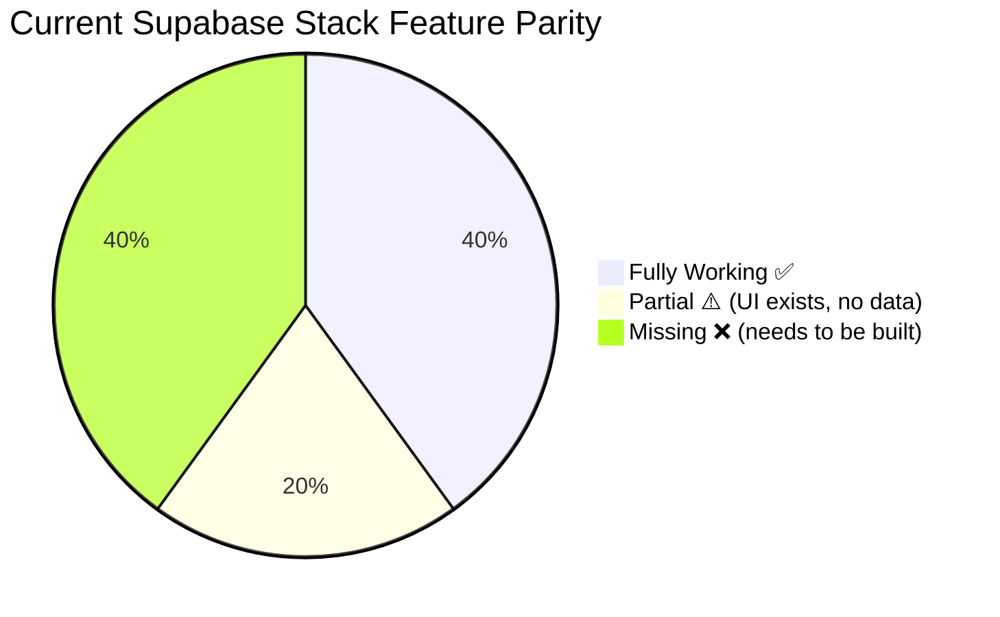
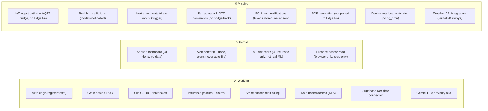
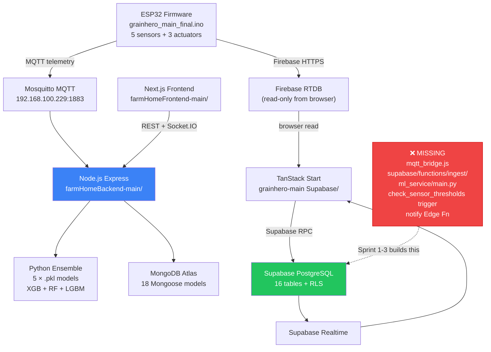

# GrainHero — Executive Overview

## One-Page Summary · Problem · Solution · Stack · Blockers · Next Steps

> **Status**: Discovery only — no code modified  
> **Full analysis**: [00_MASTER_ANALYSIS.md](file:///c:/Users/Nexgen/Downloads/FYP/Grainhero/docs/00_MASTER_ANALYSIS.md)

---

## 1. What GrainHero Is

GrainHero is a **commercial grain storage intelligence platform** consisting of:

| Layer                 | Description                                                 | Current Status                           |
| --------------------- | ----------------------------------------------------------- | ---------------------------------------- |
| **IoT Hardware**      | ESP32 with BME680 + DHT11 + soil probe; fan/servo actuation | ✅ Working prototype                     |
| **MQTT Broker**       | Mosquitto on local LAN — receives ESP32 telemetry           | ✅ Running                               |
| **Original Backend**  | Node.js Express + MongoDB Atlas + Python ensemble ML        | ✅ Fully working                         |
| **Original Frontend** | Next.js 14 dashboard with Socket.IO real-time updates       | ✅ Working                               |
| **Supabase Backend**  | PostgreSQL + Edge Functions + GoTrue Auth + Realtime        | ⚠️ Schema done; core services missing    |
| **Supabase Frontend** | TanStack Start + React Query + Gemini LLM                   | ⚠️ UI done; no live IoT data             |
| **Python ML**         | XGBoost + Random Forest + LightGBM ensemble (5 grains)      | ✅ Trained; ❌ not deployed for Supabase |

---

## 2. The Core Problem (Single Sentence)

> **ESP32 → MQTT → Mosquitto → Node.js → MongoDB is fully working, but the Supabase stack has no bridge from the IoT hardware into the database — so `sensor_readings` is always empty, ML never runs, and alerts never fire.**

---

## 3. System Health Summary

### Feature Status at a Glance

---

## 4. Architecture in One Diagram

---

## 5. P0 Blockers (Fix These First, in This Order)

| #   | Blocker                                             | File(s)                                                                                                                                                    | Sprint | Effort     |
| --- | --------------------------------------------------- | ---------------------------------------------------------------------------------------------------------------------------------------------------------- | ------ | ---------- |
| 1   | **`current_stock_kg` schema bug crashes analytics** | [analytics.functions.ts L209](<file:///c:/Users/Nexgen/Downloads/FYP/Grainhero/grainhero-main%20(Supabase)/grainhero-main/src/lib/analytics.functions.ts>) | 0      | **30 min** |
| 2   | **No IoT ingest Edge Function**                     | `supabase/functions/ingest/` (create)                                                                                                                      | 1      | 36h        |
| 3   | **No MQTT bridge**                                  | `mqtt_bridge.js` (create)                                                                                                                                  | 1      | 8h         |
| 4   | **Python ML not called**                            | `ml_service/main.py` (create)                                                                                                                              | 2      | 32h        |
| 5   | **No alert auto-create trigger**                    | New SQL migration                                                                                                                                          | 3      | 12h        |

---

## 6. Technology Stack Quick Reference

| Layer                  | Technology                                               | Version            | Config File                                                                                                                                                       |
| ---------------------- | -------------------------------------------------------- | ------------------ | ----------------------------------------------------------------------------------------------------------------------------------------------------------------- |
| IoT firmware           | Arduino C++                                              | ESP32 Arduino Core | [grainhero_main_final.ino](file:///c:/Users/Nexgen/Downloads/FYP/Grainhero/grainhero_main_final.ino)                                                              |
| MQTT broker            | Mosquitto                                                | v2.x               | [mosquitto.conf](file:///c:/Users/Nexgen/Downloads/FYP/Grainhero/mosquitto.conf)                                                                                  |
| Original API           | Node.js + Express 4                                      | Node 18            | [farmHomeBackend-main/server.js](file:///c:/Users/Nexgen/Downloads/FYP/Grainhero/farmHomeBackend-main/server.js)                                                  |
| Original DB            | MongoDB via Mongoose                                     | MongoDB 7          | [farmHomeBackend-main/.env](file:///c:/Users/Nexgen/Downloads/FYP/Grainhero/farmHomeBackend-main/.env)                                                            |
| ML engine              | Python 3.11, scikit-learn 1.4, XGBoost 2.0, LightGBM 4.3 | —                  | [ml/requirements.txt](file:///c:/Users/Nexgen/Downloads/FYP/Grainhero/farmHomeBackend-main/ml/)                                                                   |
| Target DB              | PostgreSQL 15 via Supabase                               | Supabase v2        | [supabase/migrations/](<file:///c:/Users/Nexgen/Downloads/FYP/Grainhero/grainhero-main%20(Supabase)/grainhero-main/supabase/migrations/>)                         |
| Target API             | Supabase Edge Functions (Deno)                           | Deno 1.x           | `supabase/functions/`                                                                                                                                             |
| Target frontend        | TanStack Start + React Query                             | React 18           | [grainhero-main Supabase/package.json](<file:///c:/Users/Nexgen/Downloads/FYP/Grainhero/grainhero-main%20(Supabase)/grainhero-main/package.json>)                 |
| Auth                   | Supabase GoTrue (JWT)                                    | —                  | Supabase dashboard                                                                                                                                                |
| Payments               | Stripe via Supabase webhook                              | Stripe v3 API      | [src/lib/stripe.server.ts](<file:///c:/Users/Nexgen/Downloads/FYP/Grainhero/grainhero-main%20(Supabase)/grainhero-main/src/lib/>)                                 |
| Push notifications     | Firebase Cloud Messaging                                 | Firebase 9         | [src/lib/firebase-admin.server.ts](<file:///c:/Users/Nexgen/Downloads/FYP/Grainhero/grainhero-main%20(Supabase)/grainhero-main/src/lib/firebase-admin.server.ts>) |
| LLM advisory           | Google Gemini 1.5 Flash                                  | GA                 | [src/lib/ai-insights.functions.ts](<file:///c:/Users/Nexgen/Downloads/FYP/Grainhero/grainhero-main%20(Supabase)/grainhero-main/src/lib/ai-insights.functions.ts>) |
| ML microservice target | FastAPI + Uvicorn on Fly.io                              | Python 3.11        | `ml_service/` (to be created)                                                                                                                                     |

---

## 7. Key Numbers

| Metric                         | Value                                                                                                       |
| ------------------------------ | ----------------------------------------------------------------------------------------------------------- |
| Codebase files (total)         | 400+                                                                                                        |
| Arduino firmware lines         | 1,871 lines                                                                                                 |
| Original backend routes        | ~18 route files                                                                                             |
| Mongoose models                | 18                                                                                                          |
| Supabase tables                | 16                                                                                                          |
| ML training data               | 50,320 rows synthetic + 320 real                                                                            |
| ML models                      | 5 × 3 = 15 `.pkl` files (5 grains × 3 algorithms)                                                           |
| ML features                    | 9 (Temperature, Humidity, Storage_Days, Airflow, Dew_Point, Light, Pest_Presence, Grain_Moisture, Rainfall) |
| Grain types supported          | 5 (Rice, Wheat, Maize, Sorghum, Barley)                                                                     |
| Best ML accuracy (synthetic)   | 99.15% (LightGBM rice)                                                                                      |
| Expected real-world accuracy   | 70–85%                                                                                                      |
| Hardware cost per pod (target) | ~$75 USD                                                                                                    |
| Break-even customers           | 11–19 (depending on cost basis)                                                                             |
| Pakistan TAM                   | $4.8M/year                                                                                                  |

---

## 8. Who Built What

| Codebase                      | Built By          | Status                      | Keep / Supersede                       |
| ----------------------------- | ----------------- | --------------------------- | -------------------------------------- |
| `farmHomeBackend-main/`       | Original team     | Complete, working           | **Reference** — port logic to Supabase |
| `farmHomeFrontend-main/`      | Original team     | Complete, working           | Superseded by TanStack                 |
| `SmartBin-RiceSpoilage-main/` | Legacy research   | 4-feature, rice only        | **Deprecated** — use ensemble instead  |
| `grainhero-main (Supabase)/`  | Lovable AI + team | Incomplete — IoT/ML missing | **Target** — extend this               |
| `grainhero_main_final.ino`    | Hardware team     | Working prototype           | **Keep** — add LoRaWAN in v2           |
| `farmHomeBackend-main/ml/`    | ML team           | 5-grain ensemble, trained   | **Keep** — wrap in FastAPI             |

---

_Generated 2026-07-10. This document is the entry point to all other docs._
